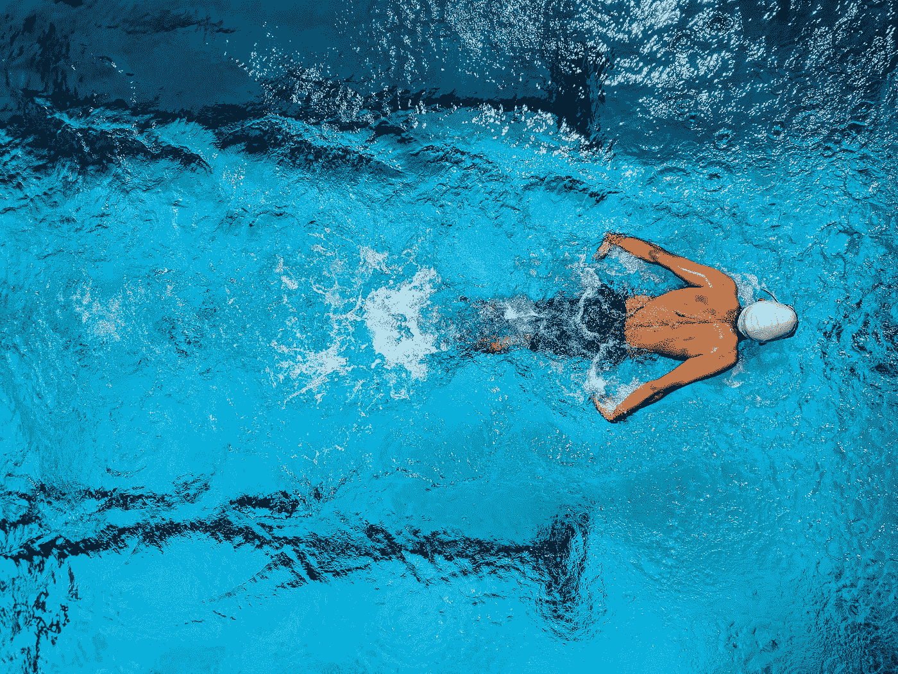

# 我从运动员身上学到的关于企业家精神的 5 个直言不讳的教训

> 原文：<https://medium.com/swlh/5-blunt-lessons-about-entrepreneurship-that-i-learned-from-athletes-c94b5d03558>

Photo by [Ajar Bhargav Guduru](https://www.pexels.com/de/@ajay-bhargav-guduru-295195) on [Pexels](https://www.pexels.com/de/)

> 做你喜欢的事。投入时间。从你的错误中学习。团队合作。勇气。

在这一点上，将体育比作商业和管理的陈词滥调和时间一样古老。

是的，所有领域的高绩效者，无论是首席执行官还是超级碗四分卫，都有一些共同的职业特征、性格特征、习惯、生活方式和措辞。他们经常用不同的语言说同样的事情，所以消耗他们的洞察力会觉得多余。

然而，作为一名力量和体能教练，当运动员们没有面对媒体时，我会花很多时间在他们身边。

也就是说，我可以看到高水平运动员在疲劳、受伤、表现不佳时的真实面孔和状态，也可以看到他们恢复、进步和获胜时的真实面孔和状态。

从和我的运动员在一起的那些时刻，我学到了一些关于创业之旅的残酷而诚实的教训。

## **1。你不会经常有上进心。准备好。**

有一个普遍的误解是，如果 1)你做你喜欢做的事情和/或 2)你做这件事赚了 7 位数以上，你每天都会有动力。没有。

竞技运动员的生活可能是一场平衡的噩梦。每周训练计划。团队会议。旅行时间表。游戏日。媒体。粉丝和社区义务。公众的期望。所有这些都必须与一些半合理的睡眠和食物量相平衡，才能发挥远程功能。上帝禁止运动员同时承担家庭、工作或学校的责任。

把所有这些因素加起来，你很可能就是一个疲惫的运动员。当你精疲力尽的时候，很难仅仅因为你对这项运动的热爱而保持动力。

这在商界引起了共鸣；虽然你可能没有严格的体育锻炼计划，但你可能会在公司内出差、制定战略、销售、生产和建设，以及管理员工。你也可能有非工作的义务。当你真的需要睡觉的时候，你可能已经熬过了那个不情愿的下班后电话会议。

接受这样一个事实很重要，那就是一直没有动力是完全正常的。减弱的动力并不会降低你的领导能力或对工作的投入。让你周围的人和你一起讨论变化，帮助你重新调整自己的期望，以及在你最需要的时候给你鼓劲的人在一起。注意你的动机是如何变化的，调整你能控制的任何环境。

## 2.自我评估是关键。学会如何调整和提高。

> "为了理解这个世界，一个人有时不得不离开它。"—阿尔贝·加缪，《西西弗斯的神话》

反馈不应完全来自单一来源。虽然运动员应该认真考虑教练的表现评估，但她也会和朋友、队友、其他工作人员以及……自己一起回顾自己的表现。

同样，对于一个运动员来说，忽视所有外部反馈，仅仅依靠自我评估是不明智的。外界的观点非常有帮助；看台上的视野和球场上的不同。

运动员必须学会如何残酷地诚实面对自己，并适当地调节自己的情绪，以便在适当和有益的自我评价中取得成功。当他们能够诚实地面对并控制自己的感受时，他们就能处理自己适应他人反馈的能力。

在一个充满自助书籍和社交媒体大师的世界里，自我评估也是企业家世界的一把钥匙。学会对自己完全坦诚，知道何时寻求帮助，何时解雇你喜欢的人，何时申请贷款，何时搬到一个更好的地方，这一点至关重要。

精通自我评估还有助于提升一个人的自信和沟通技巧。你深深地了解了自己，你不断地清楚自己最深层的价值观，你的表现或地位，你的愿景和目标。然后你可以从那个诚实的(希望)真实的地方说话。它有益于你的公司文化和客户关系——它变得真诚、开放、适应性强、现实。

Photo by [Energepic](https://www.pexels.com/de/@energepic-com-27411) on [Pexels](https://www.pexels.com/de/foto/anstellung-anzug-arbeit-arbeiten-288477/)

## **3。你的团队中贡献最大的人可能是最安静的。**不要轻视任何人。

虽然公众可能会称赞某些球员的天赋、明星效应、惊人的进球和满满的奖杯柜，但任何球队的每个成员都知道谁是最大的贡献者。

“明星”往往因为精致、响亮而被人注意，但他们往往只是面孔。观察那些为你的团队奔驰提供动力的人。团队成员认为谁是他们在球场上的领袖？谁对提升团队士气贡献最大？谁总是做额外的工作，即使没有被要求？

寻找对你的团队投入最多的球员(员工)。保持并重视他们，不要把他们的安静或谦逊误认为软弱。这些人对你的机构来说是无价的。正如西蒙·西内克所说，“领导人最后吃饭”。

## 4.失败是必然的。和它交朋友。

> “只有一件事让梦想无法实现:害怕失败。”—炼金术士保罗·柯艾略

在高水平运动中，很少有人喜欢失败(这并不奇怪)。无论这意味着失败、受伤、表现不佳，还是仅仅是没有达到自己的期望，都可能是痛苦和令人沮丧的。

失败是可怕的，因为我们觉得我们会失去一些东西。也许你知道。也许是退役前职业生涯最后一个赛季的总冠军。也许你的公司今年真正需要保持盈利的是一个价值数百万美元的客户。

然而，正如布琳·布朗博士所说，如果你没有失败，你就没有真正出现。虽然你可能永远不会喜欢失败，但它不应该对你的身体、心理或职业造成永久性的伤害。也许永远不会变得容易。但是要学会把它当成一个答案，而不是死刑。

## **5。当你真正热爱“它”的时候，最好的作品就会出现。**

虽然这一点似乎与第一点相矛盾，但它们确实是同步的。因为你热爱金钱、地位和工作而玩或工作与因为你热爱 *it* 、真正玩或工作的体验而做是有显著区别的。

心理学家米哈里·契克森米哈将这种现象命名为“心流”，定义为完全专注于一项任务或活动，同时享受当下的感觉。一些运动员报告说，在心流体验中感觉自己是超人，他们的比赛毫不费力。

尽管现金流可能是商业世界中更受欢迎的流动方式，但这种现象仍然很有价值。当一个新的创业公司创始人真正享受他的技术创造时，或者当连续创业者在创业的过程中真正感到满足时，他们可以实现自己的最佳表现。

你全身心地投入其中。你感觉自己是超人，拥有永恒的耐力和对未来的激光视力。你不会让失败终结你。你从不放弃。在玩耍和创作的时候有太多的快乐。

这是你最好作品的滋生地，无论你脚下有一个球，还是你面前有一屋子的投资者。

**感谢阅读！我非常感谢你的反馈和回应，比你知道的还要多！——朱莉娅**

**更多关于教练，表演心理学，以及体育行业创业的规避，查看** [**狮子的鬃毛博客**](http://www.whitelionperformance.com/blog) **。**

## 这个故事发表在 [The Startup](https://medium.com/swlh) 上，这是 Medium 最大的创业刊物，拥有 309，392+人关注。

## 在这里订阅接收[我们的头条新闻](http://growthsupply.com/the-startup-newsletter/)。

