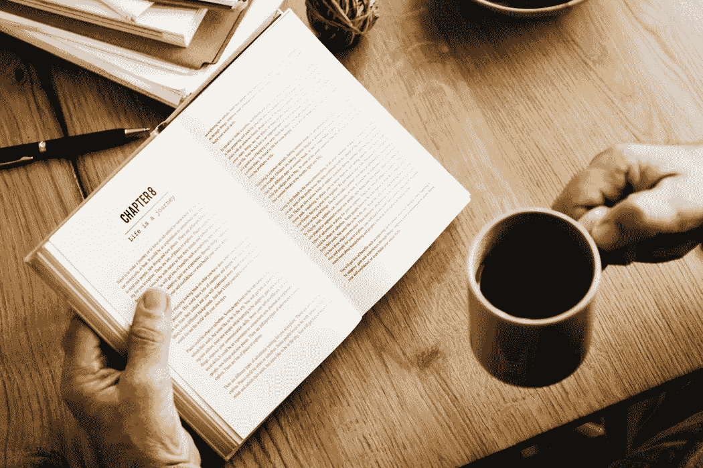

# 2018 年能改变你生活的 5 本书

> 原文：<https://medium.com/swlh/5-books-that-can-change-your-life-in-2018-75c36ba397e4>

Photo by [rawpixel.com](https://unsplash.com/photos/q7GJsXhDzng?utm_source=unsplash&utm_medium=referral&utm_content=creditCopyText) on [Unsplash](https://unsplash.com/?utm_source=unsplash&utm_medium=referral&utm_content=creditCopyText)

我们都听说过普通美国人每月阅读一本书的统计数据，但是首席执行官平均阅读 4-5X 那么多。

是巧合吗？大概不会。它给人们知识和新的视角。

例如，沃伦·巴菲特[花 80%的时间阅读](https://www.cnbc.com/2016/11/16/warren-buffetts-reading-routine-could-make-you-smarter-suggests-science.html)。格兰特·卡尔多内说，一本书可能只值 10-20 美元，但却能开启一个价值数百万的想法。

我不确定 2017 年我读了多少书，但我知道不是 52 本。但我愿意猜测，我在 2017 年读的书比之前 5 年的总和还要多。

以下是我今年读到的一些改变了我的观点的文章，以及为什么你应该在 2018 年给它们一个机会:

# 1) [世界上最伟大的推销员](https://www.amazon.com/Greatest-Salesman-World-Og-Mandino/dp/055327757X) —奥格·曼迪诺

> "如果我成功的决心足够坚定，失败就永远不会战胜我."

尽管书名很吸引人，但这绝不是一本传统的销售书籍。是的，这些原则当然可以转化为销售，但它们确实是人生的课程，可以让任何想要成功的人受益。故事讲述了一个贫穷的骆驼男孩渴望过上富足的生活，并通过遵循 10 条指导原则实现了这一目标。

注意这里的建议，你将是不可阻挡的。

# 2) [鞋狗](https://www.amazon.com/Shoe-Dog-Memoir-Creator-Nike/dp/1501135910/ref=sr_1_1?s=books&ie=UTF8&qid=1514317008&sr=1-1&keywords=shoe+dog) —菲尔·奈特

> “因此，在 1962 年的那个早晨，我告诉自己:让别人都称你的想法为疯狂吧……继续前进。别停下来。在到达那里之前，不要想着停下来，也不要过多考虑“那里”在哪里。不管发生什么，不要停下来。”

你有没有发现一本书，你简直不能放下你的生活？那就是*鞋狗*对我的意义。实际上，我是在秋天读到这本书的，我清楚地记得我放弃了计划，因为我无法停止阅读菲尔·奈特关于耐克崛起的回忆录。

对于任何对创业、国际商务、销售或体育感兴趣的人来说，这是一本必读的书。

# 3) [极端所有权:美国海军海豹突击队队员如何领导并赢得](https://www.amazon.com/Extreme-Ownership-U-S-Navy-SEALs/dp/1250067057/ref=sr_1_1_sspa?s=books&ie=UTF8&qid=1514317226&sr=1-1-spons&keywords=extreme+ownership&psc=1)——乔科·威林克，叶小开·巴宾

> “纪律等于自由。”

Jocko Willink 对我 2017 年的生活产生了重大影响，这本书是我通向他的大门。这本书讲述了乔科和叶小开在伊拉克拉马迪经历的教训，以及如何将其应用于任何团队、家庭或企业。主要的收获是，为了领导一个成功的团队，要遵守纪律，时刻保持自己的责任感。

如果你继续关注[乔科的播客](http://jockopodcast.com/)，将会获得更多奖励。

# 4) [泰坦们的工具](https://www.amazon.com/Tools-Titans-Billionaires-World-Class-Performers/dp/1328683788/ref=sr_1_1?s=books&ie=UTF8&qid=1514317530&sr=1-1&keywords=tools+of+titans)——蒂姆·费里斯

> "我们最害怕做的事情通常是我们最需要做的事情。"

很难称之为一本书，因为它实际上是数百名不同学科成功人士的百科全书。

这本书是蒂姆的[播客](https://tim.blog/podcast/)的续篇，让读者可以学到让这些人成功的秘诀、诀窍和策略。他把这本书分成三个主要部分:健康、财富和智慧。这本书可能会花去你一整年的时间来阅读，但它是非常值得的。

# 四项协议:个人自由实用指南

> “无论你周围发生什么，都不要往心里去……别人做的一切都不是因为你。是因为他们自己。”

乍一看，这似乎不是我的专长。这本书是基于古老的托尔特克智慧，关于剥夺我们快乐和制造不必要痛苦的自我限制信念的来源。

但是当我看到汤姆·布拉迪每年都读它时，我不得不试一试，我很高兴我这样做了。这是一本很有冲击力的小书，可以帮助你形成对周围生活的看法。

以下是我今年非常喜欢的几个例子。

[砂砾](https://www.amazon.com/Grit-Passion-Perseverance-Angela-Duckworth/dp/1501111108/ref=sr_1_1?s=books&ie=UTF8&qid=1514318259&sr=1-1&keywords=grit)

[10X 法则](https://www.amazon.com/10X-Rule-Difference-Between-Success/dp/0470627603/ref=sr_1_1?s=books&ie=UTF8&qid=1514318285&sr=1-1&keywords=10x+rule)

[十一环](https://www.amazon.com/Eleven-Rings-Success-Phil-Jackson/dp/0143125346/ref=sr_1_1?s=books&ie=UTF8&qid=1514318337&sr=1-1&keywords=11+rings+phil+jackson)

[方士](https://www.amazon.com/Alchemist-Paulo-Coelho/dp/0062315005/ref=sr_1_1?s=books&ie=UTF8&qid=1514318362&sr=1-1&keywords=the+alchemist)

[斯巴达 Up](https://www.amazon.com/Spartan-Take-No-Prisoners-Overcoming-Obstacles-Performance/dp/0544286170/ref=sr_1_1?s=books&ie=UTF8&qid=1514318387&sr=1-1&keywords=spartan+up)

不太爱读书？考虑看看我的播客，TR Talk。

我应该把哪些书加入我的 2018 书单？

**关于作者**

*汤姆·阿莱莫(*[*@托马莱莫 _TTGT*](https://twitter.com/TomAlaimo_TTGT) *)是* [*TR Talk 播客*](https://soundcloud.com/ryan-warner-799706255) *的联合主持人，他和瑞安·华纳在节目中采访了各自领域的领军人物，学习千禧一代如何快速跟踪个人发展。Tom 也是 TechTarget 的客户经理，住在旧金山。*

[*邮箱*](mailto:thomasalaimo7@gmail.com)*|*[*LinkedIn*](https://www.linkedin.com/in/tom-alaimo-573a1878/)*|*[*中型*](/@TomAlaimo_TTGT)*|*[*iTunes*](https://itunes.apple.com/us/podcast/tr-talk/id1294132895?mt=2%20#iTunes)

## 这个故事发表在 [The Startup](https://medium.com/swlh) 上，这是 Medium 最大的企业家出版物，拥有 293，189+人。

## 在这里订阅接收[我们的头条新闻](http://growthsupply.com/the-startup-newsletter/)。

