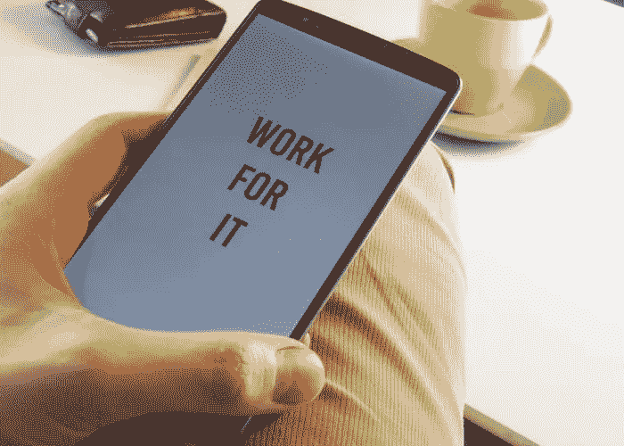
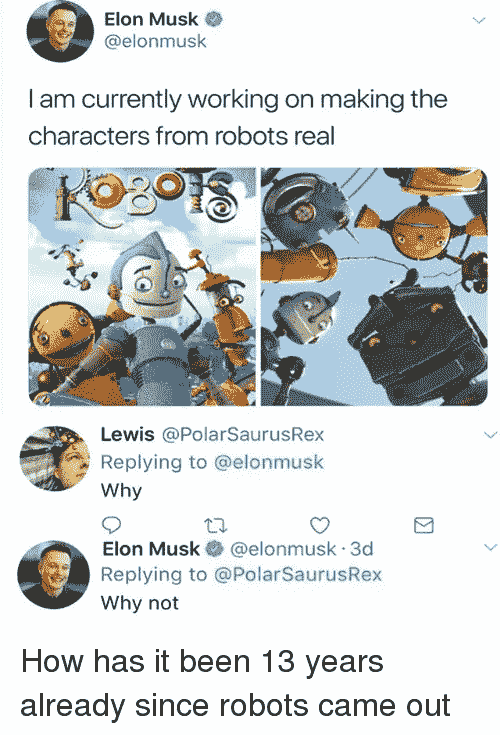

# 来自成功企业家的 5 条商业经验

> 原文：<https://medium.com/swlh/5-business-lessons-from-successful-entrepreneurs-360e83a487cb>

先说清楚一件事。大多数时候，成为一名企业家很难。它不仅仅是“挑战”或“要求”。成为一名创始人是令人沮丧的，它经常让你脱离舒适区，迫使你以超乎想象的速度思考和行动。简单地说，putー很难经营一家公司。

现在你可能认为我在夸大其词，试图让你感觉更好。我猜 whatーI 不是。怀疑？我让统计数据来说话:

*   根据 [Hustle](https://thehustle.co/depression-among-entrepreneurs-is-an-epidemic-nobody-is-talking-about) ，30%的企业家患有抑郁症。
*   小企业主[称](https://talkroute.com/16-startling-facts-statistics-for-entrepreneurs/)管理他们的企业比抚养孩子的压力大四倍。

感到气馁、孤独和焦虑是完全正常的。有时候，你只需要在正确的方向上轻轻一推。来自那些为自己或自己的公司出名的人的推动。

这就是为什么我决定向你展示成功人士的五条商业经验，它们会激励你，给你力量，让你继续经营自己的企业。

# 倾听你的心声

你还记得你的开始吗？你还记得你想出你的[商业想法](https://kolosek.com/home-based-business-ideas/)并下定决心将其转化为现实的那些日子吗？你觉得没有什么或没有人能够阻止你，你只是知道这是正确的事情，并决定追求这个想法。

在维持业务几个月(或几年)后，最初的热情消退是正常的，但尽管消退了，你也不应该停止相信自己和自己的想法。事实上，第一个故事会让你振作起来，提醒你为什么要永远跟着直觉走。

我们今天的第一个故事是关于松下幸之助的，他的生活由小生意的教训组成。

回到 1917 年，松下还只是大阪电灯公司的一名学徒。尽管他没有受过正规教育，而且相当年轻(只有 23 岁)，但他对细节很有眼光，并有工程思维方式。

> 事情是这样的:松下公司想出了一种改良版的电灯插座，但他的老板不感兴趣。尽管如此，Konosuke 从未放弃他的想法！他对此深信不疑，以至于决定在自己的地下室制作样品。后来，他继续扩大产品线。

现在，你知道我说的是哪家公司吗？嗯，确切地说，你可能知道它是松下电器或松下。

正如你所看到的，松下的创始人从未放弃自己和他的想法，尤其是在开始的时候，那是他自己最艰难的时候。他听从自己的直觉，慢慢创建了一家价值数百万美元的公司。

所以，下次你感到有点沮丧，不知道该做什么的时候，只要**听听你的胃告诉你的**，你就不会为你做出的任何决定后悔。

这是五节商业课中的第一节。它们中的每一个都同样重要，所以一定要记住它们！

# 总有办法达到目标

当你觉得时间已经不多了，你的员工没有能力做得足够多，你离实现你的目标和生活愿景还很远的时候，请记住这个故事。

我们的第二个故事是关于商业课程，希望能让你从一个新的角度看待商业和管理。故事讲的是 Zoomー的创始人[孙耀威](/thrive-global/the-inspiring-backstory-of-eric-s-yuan-founder-and-ceo-of-zoom-98b7fab8cacc)。

如果你没有听说过 **Zoom** ，那是一家提供视频会议软件的公司，该软件还包括移动合作和在线会议。如果你谷歌一下，你会看到该公司的总部在加州圣何塞，而其创始人来自中国。故事就从这里开始。

上世纪 90 年代中期，袁(音译)想去美国利用互联网的发展，当时互联网在中国还不太流行。他申请了八次签证，第九次终于拿到了 itーon。他不知道他人生中最重要的一堂商业课已经开始了。别搞错了，这不是一个关于坚持的故事。

经过两年的申请，当他最终到达美国时，只有一个 problemーhe 人不懂美国语言。那么，他做了什么？**他开始编码**。他一点也不知道自己很快会在 WebEx 找到一份工作，这是一家为用户提供协作和交流平台的公司。而且，正如通常发生的那样，Eric 看到了改进的空间，决定做一个新的交流平台。这个平台诞生于 2012 年，名为 Zoom。

为什么我选择将这个故事列入我们的商业课程清单？因为就在你认为你已经无计可施的时候，有一个在拐角处等着你。你只需要睁大你的眼睛，它们会带你走向你的目标。

# 你不能全靠自己

我相信你已经听说过很多生意伙伴一起取得巨大成功的故事。我想特别强调一个:一个众所周知的苹果故事，关于两个史蒂夫:ーsteve·乔布斯和史蒂夫·沃兹尼亚克。

别担心，这不是一个关于获得大量金钱的故事(二人组在二十几岁时成为百万富翁)。这是关于**成为团队成员**。正如你稍后会看到的，大多数商业课程都与做人有关，而不是致富。

这些年来，你可能已经注意到，人们已经开始评判乔布斯和他的技术知识，越来越多的人开始赞美沃兹尼亚克为**“运营之脑”**。这不是巧合。事实上，沃兹尼亚克在一开始负责构建产品(Apple I，然后是 Apple II)，而乔布斯则负责销售部分。尽管人们经常称乔布斯是一个难以相处的工作伙伴，但事实是，如果他们没有团结在一起，他们两人都不会成功。

> 拥有一只可以信赖和分享你的事业的右手看起来是个好主意，但前提是你要选择合适的人一起工作。如果你觉得你需要一个平等的合作伙伴来帮助你管理公司，你必须小心，并确保你足够信任这个人，让他在企业管理中发挥如此重要的作用。

记住，最重要的商业经验之一是，委派工作并不是承认你的无能，而是承认你的局限性。把 mistakesーafter 变成所有人没关系，你只是个人。这就引出了我们的下一课。

# 犯错是正常的

正如我上面提到的，即使你是一个忙碌的创始人，你犯错误也没关系。然而，你想做的是，从这些错误中吸取教训，并把它们变成有价值的商业经验。

为了了解我在思考什么样的错误，我要谈谈 Airbnb 的故事。

Airbnb**成立三年后，也就是 2011 年，一个人的博客上的负面评论有可能毁掉整个公司的声誉。准确地说，一个名叫 EJ 的女人在她的博客上留言说 Airbnb **的租房者摧毁了她的家**。当时，情况似乎已经很好了。此后很久，公司创始人之一布莱恩·切斯基发表公开声明，称公司会善待她。不过，这只是开始。**

这些女性认为 Airbnb 想要的只是让事情不了了之，并对答案不满意。当另一名房客抱怨冰毒使用者毁坏他的公寓时，情况变得更糟。

> 至此，切斯基本可以第二次做同样的事情，公开回应该男子。然而，他没有闲心让恶言传播，所以他用一条简单的推特承认公司犯了一个错误:我们搞砸了，我们很抱歉。这条推文还包括该公司博客的链接，标题是[我们对信任&安全](https://blog.atairbnb.com/our-commitment-to-trust-and-safety/)的承诺。

糟糕的企业家会认为这个错误是商业管理中的失败之一，但它实际上是成功人士最好的商业经验之一。

正如你所看到的，这个故事证明了你可以控制你的用户/顾客如何看待你的品牌。在这个过程中犯一些错误是完全可以理解的，只要你**坦承这些错误**，并让公众看到。如你所见，没有人是完美的，即使是像 Airbnb 这样价值数百万美元的公司。

# 不要满足于平均水平

我不得不承认这种说法听起来像是陈词滥调，但这是事实。一旦你达到了你的目标之一，不要停止 thereー **总是想得更大，努力做得更多**。如果你认为一篇包含成功人士商业经验的文章可以不提及埃隆马斯克，那你就大错特错了。

> 埃隆·马斯克。一位企业家，他为演员小罗伯特·唐尼扮演著名的钢铁侠提供了灵感。信不信由你，马斯克不仅仅是现实生活中的钢铁侠。他是一个背后有几家公司的人。

马斯克在 1995 年创办的第一家公司是一家名为 Zip2 的软件公司。马斯克和他的兄弟金巴尔一起创建了它，它成为报纸公司的在线城市指南，这些公司试图跟上这种称为互联网的新趋势。不涉及太多细节，就说一件事牵一发而动全身，四年后公司被卖掉了。马斯克获得了 2200 万美元。

下一个是 PayPal，它最终被卖给了易贝，然后是 Tesla Motors Inc，SolarCity，HyperLoop，最近是 Boring Company。

不得不承认，马斯克是一本商业教训的活百科全书。唉，不是每个人都能像埃隆·马斯克一样思考，但这个人是一个活生生的例子，他总是试图做更多的事情，改变这个世界。有**没必要安于一般或者想小**。勇敢一点，在每天的 basisーonce 中不断挑战自己。如果你开始这样做，伟大的事情就会发生。

# 一锤定音

企业家是现代的超人。他们拥有超凡的力量和高于平均水平的智力，这种智力只会随着他们成为创始人的时间而增长。

所以，下次你开始怀疑自己的时候，记住你不是唯一的一个，在你之前有很多人都经历过同样的情况，并最终成为赢家。抬起你的下巴，释放你内心的埃隆·马斯克！

*谢谢你把这篇文章读完。我希望这些商业课程对你有所帮助和启发。你还想在这份清单上增加其他商业经验吗？*

*原载于 2018 年 4 月 20 日*[*kolosek.com*](https://kolosek.com/5-business-lessons/)*。*

## 这篇文章发表在 [The Startup](https://medium.com/swlh) 上，这是 Medium 最大的创业刊物，有 320，131+人关注。

## 在此订阅接收[我们的头条新闻](http://growthsupply.com/the-startup-newsletter/)。

