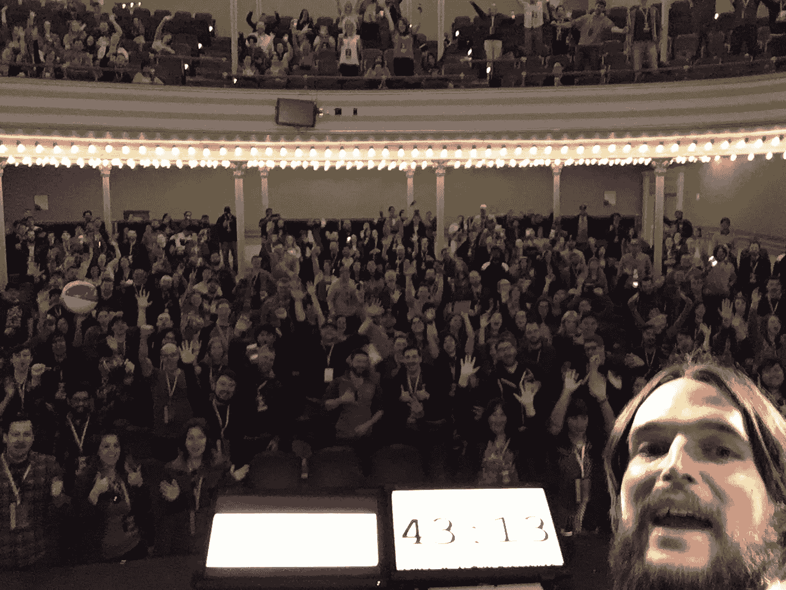
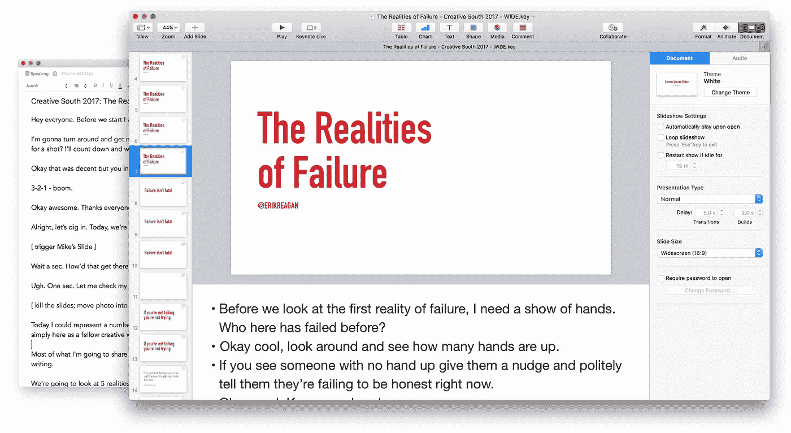

# 这位公众演说家的 5 个自白

> 原文：<https://medium.com/swlh/5-confessions-of-this-public-speaker-35ba26a81acc>

就在一周前，我在“创意南方”做了一次演讲，每年都有数百名来自世界各地的创意人士聚集在这里。我像一个经验丰富的专业人士一样指挥着舞台，分享了一个痛苦的失败故事，发自内心地进行教学，自信地走下舞台，知道我已经抓住了机会。

说到公开演讲，我是天生的。就这么简单。

好吧，这基本上是胡扯。

我肯定*不是天生的演说家。(不管那是什么。)而且我绝对没有走下舞台以为自己已经搞定了。但事实证明这是一些人的看法。事实上，上面的一些开篇段落来自创意南方的一个观众的评论。*

在与一些人交谈后，我意识到如果我稍微回顾一下我在公众演讲中的个人经历，可能会有所帮助——至少对一些人。另外，[我公司的核心标准之一](http://focuslabllc.com/standards)是**保持真实**，我想在这里尽我所能尊重这一点。

> 真理和勇气并不总是令人舒服的，但它们从来都不是弱点。
> 
> —布琳·布朗

就这样，我将直接进入我的忏悔。这应该很有趣。

# 表白 1:我的身体讨厌我

至少，当我说话的时候，我的身体感觉好像讨厌我。

大约在演讲前的 3-4 周，每当我想到实际上在舞台上，我的胃就会打结。随着日期的临近，情况变得更糟。我谈论的话题似乎会影响感情的强度。

举个例子，我花了很多年写代码，建网站。我做过的许多演讲本质上都是技术性的。准备一个技术性的演讲和准备一个非技术性的演讲对我来说是不同的体验。我在舞台上越脆弱，我的身体反应就越激烈。

最糟糕的一次发生在一年前，当时我在一个名为 Peers 的活动上发言(我可以补充一下，这是一个非常棒的活动)。我的演讲是当时我做过的最透明的一次。我感到有一种压力压在我的心上，要以一种前所未有的方式公开分享和鼓励他人。

前一天晚上太可怕了。

为了得到充分的休息，我尽量早点睡觉。但我的胃是一个残骸，我不能减缓我的大脑，睡眠无处可寻。

我现在已经对那个演讲做了几次修改。一次比一次容易。但我的身体还是讨厌我，在我上台前提醒我。

# 忏悔 2:我是谁，能站在这个舞台上？

具有讽刺意味的是，我上周演讲的一个话题是冒名顶替综合症。(这是你头脑中的声音，它告诉你不知道你在做什么——尽管你以前有过成功或经验。)但是能从一个舞台上说出来并不能让我对它免疫。我对自己想了很多次，“你是谁，竟然站在那里？你看到其他演讲者的阵容了吗？你听到昨天那个人的讲话了吗？你已经超出你的能力范围了，伙计。”

那是我每次说话都要关闭的内心声音。

每个。时间。

There’s nothin quite like a selfie with an audience

# 坦白 3:我带着一张错误清单走下讲台

我有一份全职工作，这是*而不是*公开演讲。我努力在上台前做好准备。这是我欠观众、组织者和其他演讲者的。但是即使我做了准备，我每次上台都会犯很多错误。

每次我走下讲台，我几乎马上就会记起我忘记做了什么，不想做什么，或者不记得我做得对不对的事情。

以《南方创意》为例，在离开舞台后的大约 90 秒内，我注意到了以下几点:

*   我意识到我犯了几个引用错误
*   我忘了*将*归功于我的一句名言/想法
*   我完全搞砸了其中一个段落，而这个段落本应该更有影响力——但是我忘记了它在演讲中出现的顺序，所以当我在笔记中注意到该是这个段落的时候，我不得不迅速改变语气，但这并没有奏效
*   我意识到我讲的其中一个故事有多糟糕(与练习时的感觉相比)

这是我第三次做这个演讲了！我第一次给你名单的时候你就应该看到了。

我总是努力做得更好。公众演讲也不例外。所以带着这些想法离开舞台对我来说没什么大不了的——在这一点上*。我把它们写下来，并承诺让下一次的演讲更精彩。*

# *表白 4:我需要笔记*

*这个很简单。我似乎记不住 30-45 分钟的演讲。我现在对此很满意。我过去的每一次演讲都是经过深思熟虑的。所以如果我没有笔记来提醒我接下来要做什么，我就会错过一些东西。你可以在上面忏悔 3 的列表中看到。*

**

*The written form of my talks live in Evernote. I include reminders or full statements in my slide notes as well.*

# *坦白 5:我是我自己最糟糕的批评家*

*我承认这不是一个新想法。这也不是公开演讲所独有的。但我在这里提到它主要是为了让其他演讲者，主要是那些刚刚登台的人，能够理解批评自己是多么正常。*

*在《忏悔 3》中，我谈到了当我走下舞台时脑海中闪过的东西。如果你不小心，这些想法可能是破坏性的，而不是建设性的。我经常对自己的演讲提出最严厉的批评，因为我经常是唯一一个知道我想说的话的人。但我不能让这影响到观众的实际感受。*

*演讲最有收获的事情之一就是之后与听众交流。我很珍惜有机会听到我的故事和经验教训是如何影响别人的。我很荣幸有机会被这样利用。当我成为自己最糟糕的批评家时，这正是我需要的药。*

# *我可以继续*

*但目前这可能已经足够了。*

*我写这篇文章的主要目的是鼓励那些刚开始公开演讲的人。我倾向于把很多想法藏在心里，藏在一小群亲密的朋友之间。虽然我以前分享过上面的所有东西，但没有一个是在任何人都可以一瞥的公共论坛上。就连我自己的商业伙伴也认为，这些天来，这样说话对我来说是一件相当冷静的事情。(没有！)希望这能帮助其他新的演讲者知道，如果他们分享我的一些忏悔，他们并不孤单。*

*在十几次演讲之后，我学到了很多经验教训，可以与刚入门的人分享。但是我还有很多要学。我正打算这么做。不断学习。*

*毕竟，有一天我可能会成为天生的演说家。*

**你可以在推特上抓我***如果那是你的事。我不时为我的时事通讯* *写这样的东西。***