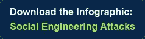

# 不可解雇员工的 5 个网络安全习惯

> 原文：<https://medium.com/swlh/5-cybersecurity-habits-of-unhackable-employees-7fba37b7c93b>

当企业成为数据泄露的受害者时，不一定是因为缺乏安全性，而更有可能是因为员工缺乏网络安全态势感知教育、不了解事件报告流程或不熟悉新出现的威胁。

**您的员工正在做出明智的安全决策吗？**他们知道如何识别恶意网络钓鱼电子邮件吗？此外，如果他们知道如何区分一个，他们会知道内部通知谁吗？

在最近的一份报告中，Intermedia 发现**93%的员工**从事至少一种形式的薄弱数据安全工作，而**23%的员工表示，如果以某种方式对他们有利，他们会从公司获取数据**。

下面的文章详细介绍了 5 个最有效的习惯，员工可以运用这些习惯来防止和[保护他们的公司](https://www.align.com/cybersecurity-services)免受网络相关事件的影响:

# 未经验证不要安装应用

恶意软件和计算机安全威胁使互联网成为一个充满风险的领域，并对您的公司构成风险。我们都见过这样的头条新闻:员工使用未经其雇主授权的软件，从而导致严重的恶意软件感染、声誉受损和经济损失。随着“影子 IT”的兴起，锁定系统以防止问题的旧方法已经适得其反

## 影子是什么？

这指的是由人类端点在组织内部进行的 IT 项目，并且没有得到组织的批准。例如，一名员工被禁止使用某个特定的应用程序，因此该员工找到了一个潜在风险更大的、不太为人所知的替代应用程序，并将其下载到他们的计算机上。

随着网络犯罪分子不断提出狡猾的攻击点，在公司网络上安装恶意软件的可能性始终存在。确保您计划下载的软件安全的关键是在安装前咨询您的 IT 团队，并确认该应用程序已被批准下载。

# 不要共享您的登录凭据

**您知道吗，近 50%的员工承认分享过他们的登录凭据？**

密码共享是当今影响企业的最重要的安全问题之一，但也是管理最少的安全风险之一。员工每天都在共享登录凭证，却没有意识到它所带来的危险。

您很可能监督或参与过这样一个场景，其中一位同事需要快速访问某些信息。问题是，大多数最终用户根本不会考虑抄近路和共享他们的凭据。许多雇主对这种不安全的做法视而不见，这让公司容易受到数据泄露的影响。

# 千万不要把公司文件上传到个人云存储

通过将文件存储在 Google Drive、Dropbox 或其他文件共享系统等受欢迎的服务中，员工可能会将雇主置于危险的境地，尽管他们的意图是好的。基于云的个人存储帐户通常缺乏强大的安全协议、审计和合规性功能，或者配置不当，这可能会导致[数据泄露事件和网络安全灾难](https://www.align.com/blog/biggest-cybersecurity-disasters-2017-that-make-you-wannacry)。不管一个基于云的文档管理平台说它有多安全，事实是你在授权其他人访问敏感的商业信息。

**你知道你的员工把商业文件存放在哪里吗？**如果您不希望员工利用个人云存储来保存敏感的业务数据，应该为员工提供明确定义的数据存储政策。

员工在工作场所使用自己的技术比以往任何时候都多。[自带设备(BYOD)](https://www.align.com/blog/byod-best-practices) 就是一个很好的例子。允许员工出于业务目的使用个人设备的公司需要定义和实施策略和程序来减少安全威胁。在个人设备上维护工作数据会带来风险；因此，需要更高的设备警惕性和主动的安全措施。

作为一种最佳实践，我们建议公司雇佣第三方 IT 合作伙伴，提供[声誉良好的网络安全咨询服务](https://www.align.com/cybersecurity-services)来构建定制的网络安全计划。这应包括政策、最佳实践、响应计划、网络安全事件记录、供应商证明和其他监管材料，包括投资者尽职调查问卷响应材料。

# [小心使用电子邮件](https://www.align.com/blog/spot-the-cybersecurity-flaws-in-this-email)

许多员工没有意识到与电子邮件技术相关的风险。员工每天都是欺诈邮件的目标。威瑞森报告称，30%的网络钓鱼通信是由目标受害者打开的，其中 12%的用户点击了恶意附件或链接。(*欲了解更多信息，请阅读* [*【常见钓鱼攻击载体】此处*](https://www.align.com/blog/common-phishing-attack-vectors) *)。*)

打开、点击和回复可疑邮件的坏习惯正在危及越来越多的专有或敏感商业数据。

## 电子邮件安全提示

*   查找超链接和发件人电子邮件地址中的拼写错误、语法错误、字体不一致、不匹配或不常见的域名。
*   当您通过未经请求的电子邮件收到附件，并且您不认识发件人时，请不要打开它，为了安全起见，请删除该电子邮件。
*   如果它看起来像是来自你认识的人，拿起电话，使用你知道有效的电话号码(不是可疑邮件本身的电话号码)，并验证这是否确实是他们发送的。
*   不要点击可疑链接。

[**这里有一个快速测验**](https://www.align.com/blog/spot-the-cybersecurity-flaws-in-this-email) **来测试你识别不安全或危险邮件迹象的能力。**

# 使用虚拟专用网络

如果你想最大限度地保护隐私，并让其他人更难监视你的在线行为，VPN(虚拟专用网络)是一个可行的选择，即使对临时网络用户也是如此。通常，当您连接到网络时，您的电脑会直接通过互联网提供不安全的通信，广播一个唯一的 IP 地址，该地址将该电脑及其物理位置标识为“您的”这种通信通常是不加密的，因此任何记录这种流量的人(如您的 ISP)都可以看到您访问的每个网站以及您在那里做的事情。简而言之，使用 VPN 服务中断了这种直接连接，因为它使用了一个服务器作为你的计算机和互联网之间的中间人。将 VPN 服务与浏览器的“匿名”模式结合起来，你就拥有了双倍的互联网隐私。

请记住，没有单一的方法可以完全避免黑客攻击或网络钓鱼攻击，但是使用额外的谨慎和练习这些良好的网络安全习惯将减少您的企业成为网络攻击受害者的机会。

**如果您担心您组织的漏洞，那么现在是招募值得信赖的 IT 合作伙伴来防范最新和未来威胁的最佳时机。** Align 的主题专家利用三十多年的经验，提供屡获殊荣的[托管 IT 服务](https://www.align.com/managed-services)和[网络安全风险管理解决方案](https://www.align.com/cybersecurity-services)。我们招募了一个由精英专业人士组成的多学科团队，他们具有独特的资格，可以从包括技术、IT、合规性、人力资源、治理和法律在内的各个角度提供网络安全咨询服务。我们独特的端到端网络安全解决方案和协作方法使我们能够在网络安全风险管理领域的几乎所有业务职能中检测风险和识别威胁点。

**有兴趣了解更多信息吗？**点击此处 下载我们的白皮书*基金经理网络安全 101*。

## 这个故事发表在 [The Startup](https://medium.com/swlh) 上，这是 Medium 最大的企业家出版物，拥有 343，876+人。

## 在这里订阅接收[我们的头条新闻](http://growthsupply.com/the-startup-newsletter/)。

