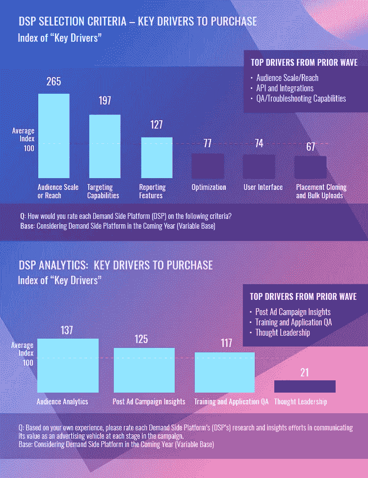

# 2019 年要实现的 5 个数字广告趋势

> 原文：<https://medium.com/swlh/5-digital-advertising-trends-to-implement-in-2019-237523f78ec2>

2018 年 12 月 28 日| 7 分钟阅读| Lina lugo va， [Epom DSP](https://market.epom.com/self-serve)

曾经有一段时间，数字广告商认为广告代理是摆脱媒体购买麻烦的最佳选择。但是那个时代已经过去了。在[的程序化领域](https://epom.com/news/what-is-programmatic-advertising)，越来越多的公司转向内部营销团队。

2019 年将是你必须突破白噪音，同时跟上积极的用户体验的一年。尽管事实上变化是营销人员的新的日常工作，这里有五个因素将最有可能影响你来年的营销策略。

# 机器学习、人工智能和聊天机器人

人工智能市场预计将在 2025 年超过[1000 亿美元](https://www.constellationr.com/)，许多广告商将在 2019 年的人工智能开发上投入大量预算。人工智能是什么时候从一种未来技术转变为一种新的便捷数字营销工具的？

人工智能技术对营销人员有非常明显的好处:它处理重复和无聊的任务，这些任务可能导致员工精疲力竭。据 Gartner 报道，像 IBM、尼尔森、Salesforce 这样的大公司都在完全依赖 AI。AI 和机器学习是相辅相成的:人工智能有助于智能地处理常规，而机器学习有助于以更高效的方式解决问题。机器学习是一种自我教育的技术，它在没有人类监督的情况下处理数据并不断改进。

毫无疑问，迄今为止最新的人工智能成就是聊天机器人。根据最近的一项研究，全球聊天机器人市场预计到 2025 年将达到 12.5 亿美元。

聊天机器人很久以前就出现在 WhatsApp 和 Facebook Messenger 中，在与品牌页面互动时为用户提供个性化的客户体验。当客户要求快速、准确的信息时，它们会有很大帮助。它们易于创建，还可以收集用户数据，这对进一步的用户细分非常有用。

[Smartinsights](https://www.smartinsights.com/) 创建了一个图表，展示机器学习、人工智能和聊天机器人如何在客户生命周期中应用于不同的客户:

# GDPR 时代的个性化

如今，公司必须抓住用户的注意力，为他们提供个人体验，同时保持适当的个性化水平。

Evergage 研究显示，55%的在线广告客户认为他们没有足够的数据和对受众的洞察来提供真正个性化的体验。与此同时，Salesforce 的一份报告显示，65%的用户认为个性化提高了他们的品牌忠诚度。

当考虑个性化时，数字营销人员会想到网飞或亚马逊的体验，并假设他们没有足够的数据、资源和分析团队来适当地处理它。从小处着手——在网站上找到 3-4 个用户意图明确的地方，并使用营销自动化技术，如机器学习或聊天机器人，以提供良好的营销体验。这些数据有助于创建人物角色，您可以在以后的电子邮件、通知等中处理这些人物角色。

在后 GDPR 时代，收集数据是一件大事:《选择加入法案》成为了一个真正的宝藏，因此营销人员不能假装个性化只是将个人姓名放在电子邮件的开头。

个性化[很重要](https://www.salesforce.com/blog/2017/05/14-retail-customer-experience-stats.html)，但是不要忘记隐私。谷歌或脸书等公司要求提供私人信息，以“提供更好、更个性化的用户体验”，这意味着他们提供关于用户的精确信息，以从广告中获利。然而，在 GDPR 之后，一些目标标准，如宗教，职位等，被从两个平台上删除。我们认为 [GDPR 不会减少个性化](https://themanifest.com/app-development/mobile-app-usage-statistics-2018)，这将成为 2019 年的持续趋势。

# 视频:最受欢迎的数字广告形式

今天，视频占所有消费者互联网流量的 69%。在[垂直视频在全球范围内受到欢迎](https://mashable.com/2017/12/28/vertical-video-mainstream-year/)以及数字营销人员看到用户的视频消费数量之后，它已经成为广告商的一个必须使用的渠道。

> 明年，实时视频将登上排行榜:数字营销人员可以分享更新，与客户互动，获得快速反馈和更好的可视性。

YouTube 为拥有超过 10，000 名订户的频道推出了类似 Instagram 的故事，这些故事会持续播放 7 天。这意味着，从 Snapchat 和 Instagram 上切下视频分享这块蛋糕的愿望甚至对巨头们来说也很诱人。然而，公司应该关注他们制作的视频内容的质量，而不是数量。相关和有用的内容总是胜过自发的内容，所以如果你没有资源来思考你的视频策略，坚持使用已知有效的视频广告形式:

# 程序化媒体购买:DSP 重新构想

越来越多的人转向建立内部团队，而不是依赖代理机构。在追求获得完全透明和控制媒体预算的过程中，广告商依赖[**【DSP】**](https://market.epom.com/blog/what-is-mobile-dsp)【需求方平台】。DSP 在程序化媒体购买中发挥着关键作用，允许广告商以最佳价格购买多家出版商的广告展示，而无需向中间商支付费用

然而，在过去的两年里，广告商已经将通过编程购买流量的需求方平台数量减少了 40%。他们不再使用不同的 DSP 来购买不同类型的流量，而是寻求更统一的 DSP 来将他们的广告活动保持在一个地方。

2019 年，[需求方平台](https://market.epom.com/self-serve)将变得更加重要[对于使用内部能力的广告商来说](https://market.epom.com/blog/why-dsp-should-be-in-your-marketing-strategy-2019)。

# 透明度、品牌安全和欺诈仍然存在

2019 年，广告客户将密切关注他们的广告在哪里结束，以及谁会看到它。根据 Emarketer 的报告，近 190 亿美元广告中的大部分将花在私人设置上。

营销人员将把他们的预算放在非匿名类型的程序化交易上，在这里你可以看到域名 URL:程序化担保、优先交易和私人市场(PMP)。尽管他们将不得不支付稍高的价格，但广告客户可以获得干净和品牌安全的流量。

品牌正在转向更有信誉的广告交易，以确保他们完全获得他们所支付的费用，供应方合作伙伴(ssp)与第三方流量安全供应商合作，如 Double Verify、WhiteOps 等。

如果你是出版商，还没有实现 ads.txt，现在是时候了。广告商更喜欢与授权卖家合作。

在线广告市场正在成熟，这使得骗子几乎没有生存的机会。广告商希望控制数字广告的各个方面，进一步推动数字进化。

你认为哪种趋势会主导 2019 年？在评论中分享你的预测吧！

*最初发表于*[T5【market.epom.com】](https://market.epom.com/blog/digital-advertising-trends-for-2019)*。*

## 这篇文章发表在 [The Startup](https://medium.com/swlh) 上，这是 Medium 最大的创业刊物，拥有+404，714 名读者。

## 在此订阅接收[我们的头条新闻](http://growthsupply.com/the-startup-newsletter/)。

