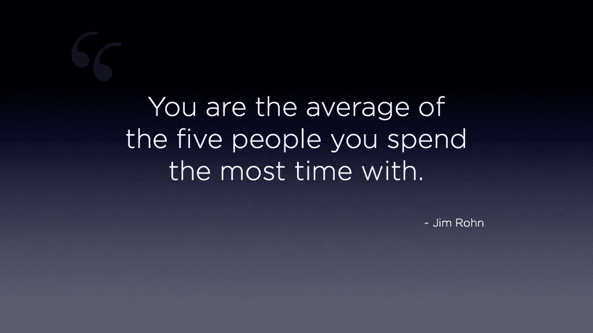

# 不冒犯任何人说不的 5 种有效方法

> 原文：<https://medium.com/swlh/5-effective-ways-to-say-no-without-offending-anyone-11766dcf468b>

## 你如何培养一项技能，让你分清轻重缓急

Photo by [Isaiah Rustad](https://unsplash.com/photos/HBABoZYH0yI?utm_source=unsplash&utm_medium=referral&utm_content=creditCopyText) on [Unsplash](https://unsplash.com/search/photos/no?utm_source=unsplash&utm_medium=referral&utm_content=creditCopyText)

在我之前的文章中，我分享了一个区分工作优先级的技巧，它非常有效。

这就是 ABCD 技术:

*A — Apna kaam(你自己的作品优先)*

*B —老板 ka kaam(你老板的下一步工作)*

*C —公司 ka kaam(公司工作第三)*

*D — Doosron ka kaam(其他人的作品之后的一切)*

但是很多人发现很难先做好自己的工作。事实上，他们一直在做别人的工作，而不是自己的工作。因为其他人不断向他们寻求“帮助”并破坏他们的计划。如果帮忙的人说不，他们可能会被冒犯。

看啊。我明白了。

说“不”似乎是职业自杀。此外，你担心你可能会破坏关系或友谊。你宁愿被绑在椅子上，看着别人在黑板上抓指甲。

对不对？

但是试图取悦每个人就像一直吃垃圾食品一样有害。取悦每个人(甚至尝试)会让你感到被破坏和不安全。此外，人们让你承担更多的工作，这导致沮丧、倦怠和焦虑。

如果这是你的感觉，不要担心。你并不孤单。很多人都有同样的经历。如此之多，以至于研究人员将“说不”作为一个研究课题。

结果是有希望的。

# 说不的好处

暗地里，你知道你必须拒绝人们对你的“帮助”。你知道在你用你的精力去帮助别人之前，你必须照顾好你自己和你的工作。你必须经常说不。

但是如果你这样做了，另一个人可能会感觉不好。她可能会改变对你的看法。你也可能会失去这种关系中的联系感。

对吗？

康奈尔大学副教授瓦妮莎·博恩斯表示，事实并非如此。她说，

> “人们并不像我们想象的那样对‘不’耿耿于怀。很有可能，说‘不’的后果在我们头脑中比在现实中要糟糕得多。”

想想吧。

你上一次因为某人拒绝了你一个简单的请求而结束一段友谊是什么时候？我猜你得好好想想。即使这样，你也有可能一无所获。

这同样适用于你。

所以，如果你想编码[而不是和朋友出去玩](http://aryatra.com/productive-after-work/)，对你的朋友说不。他们不会介意的。如果你有建设性的任务要完成，对那些把工作交给别人的懒惰同事说不。反正他们会找到另一个天真的替罪羊。

当你说不的时候，这里有四个更有说服力的好处:

# 1.你保持控制。

你，而不是你的朋友或同事，知道什么对你最好。对你不喜欢的事情说不让你专注于你所做的事情。结果，[你留在控制你的生活](http://aryatra.com/stoicism-philosophy-life/)而不是让别人控制它。

# 2.你很快乐。

拒绝你不想做的任务，为你想做的事情腾出时间。根据达赖喇嘛的说法，多做你喜欢的事，少做你不喜欢的事会让你快乐。是快乐导致了成功，而不是相反。

# 3.你得到尊重。

为了让你的“是”有意义，你必须多说“不”。

如果人们意识到你不是一个轻易说好的人，他们会尊重你。他们会选择向你寻求帮助的任务。

# 4.再见，再见，消极的人。

[credit](https://timmilesandco.com/wise-weekly-wallpaper-january-8th-2012/)

说不的影响是双重的。

第一，你可以专注于你真正渴望的东西。第二，你找到值得出现在你生活中的人，他们不介意你拒绝他们的要求。那些被冒犯的人……好吧，他们可以尽情享受。

# 说不而不感到内疚的 5 个步骤

现在我们清楚了好处，让我们来讨论如何果断地说不。

# 1.拒绝请求，而不是拒绝那个人。

在你的思想和语言中，清楚地表明你是在拒绝这个请求，而不是这个人。看着对方的眼睛，真诚地微笑，解释你为什么拒绝这个请求。要明白你感到的内疚是你自己造成的。

你可以以一句*开始:“我希望我能，但是……”*当你拒绝一个请求时，为了减轻影响。

# 2.一旦你做了决定，就要坚定。

一旦你说了不(或是)，坚持你的立场。有效地说“不”的一部分包括温和而坚定。没有傲慢，只有坚定。如果你违背自己的意愿被说服，人们会认出一种模式，并用它来对付你。你会回到你开始的地方。

如果你说是，那么[让自己扎根于当下](http://aryatra.com/live-in-present-moment/)并努力完成任务。你没有退路，不如全力以赴。

# 3.提供替代方案。

你可能不喜欢你的朋友想去的酒店。在这种时候，提供替代方案。例如，说“我不喜欢这家旅馆，因为它的服务很慢。我们为什么不去另一家呢？”或者当你时间紧迫时，如果有同事向你求助，你可以说“我[要在最后期限前见](https://www.linkedin.com/pulse/5-proven-steps-experts-take-meet-deadlines-every-time-vishal-kataria/)。如果别人不帮你，周四之后再来。我们会一起努力。”

看到了吗？不是变得更容易了吗？

# 4.延迟响应。

智人天生冲动。我们经常操之过急，结果却后悔自己的决定。一个冲动的“是”会让你淹没在工作的洪流中。就像这样，一个直接的“不”会让你后悔你的决定。因为事后看来，这个任务很有建设性，也很有趣。

花时间做决定。权衡利弊。根据[的研究](https://www.sciencedirect.com/science/article/pii/S0191886915003943)，一个有效的方法就是睡一觉。

# 5.先在自己身上练习。

对别人说不，必须从自己做起。不要在你不需要的东西上花钱。对星巴克咖啡中的鲜奶油说不。当你能走路的时候避免乘出租车。

研究表明，你越加强你的意志力，就越容易说不。所以练习加强你的意志力。

# 6.额外提示:放松

在不伤害他人的情况下说不的关键是放松。

在镜子前练习。听得见。观察你的非语言交流。你的身体僵硬吗？你的嘴会抽搐吗？你皱眉吗？这些都是紧张的迹象。

经常练习会帮助你放松身心。它会教你放松。

# 你值得更好的

什么对你重要？个人快乐还是取悦所有人？

没有人能取悦世界。甚至迈克尔·杰克逊和纳尔逊·曼德拉也有很多仇人。你不会有任何不同。所以别再尝试了。

相反，花时间去做让你满意的事情。分清工作的轻重缓急，这样你就能在个人生活和职业生涯中取得进步。在重要和不重要之间做出选择。对前者说是，对后者说不是。相信我，说不并不像现在看起来那么难。

不要在你的余生致力于实现别人的梦想。你该开始实现自己的梦想了。

## 如果你喜欢读这篇文章，谢谢你的掌声。他们将帮助它到达那些发现它有用的人那里。

*同时，你可以订阅我的* [*免费简讯*](https://mailchi.mp/eae55d66bf1d/newsletter-subscribers) *，了解每周关于如何过上更快乐、更有成效的生活的深入见解。*

## 这篇文章发表在《创业公司》杂志上，这是 Medium 最大的创业刊物，有 326，962 人关注。

## 订阅接收[我们的头条](http://growthsupply.com/the-startup-newsletter/)。

