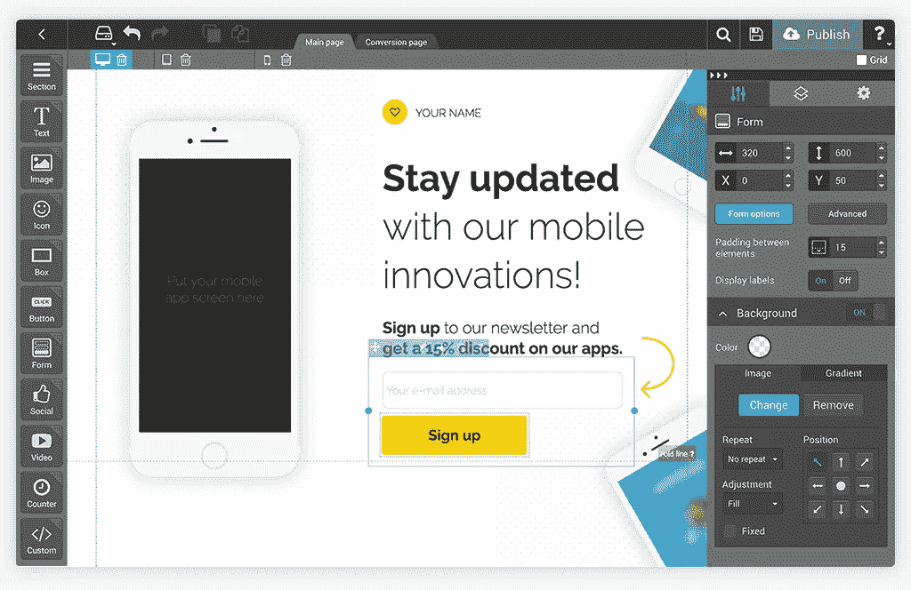
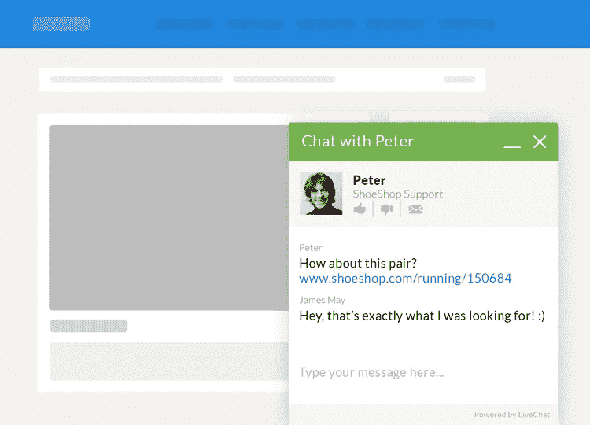
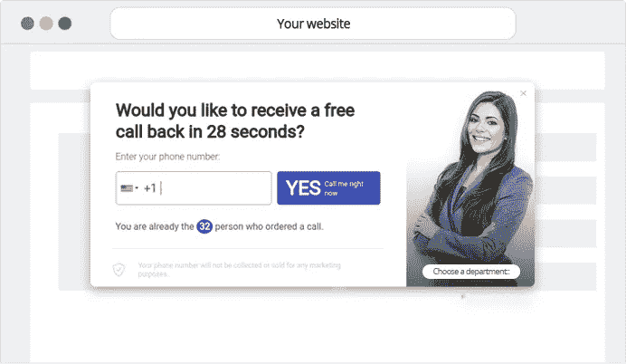
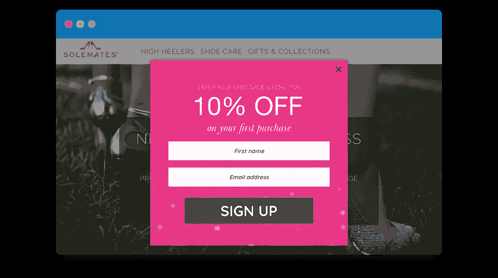
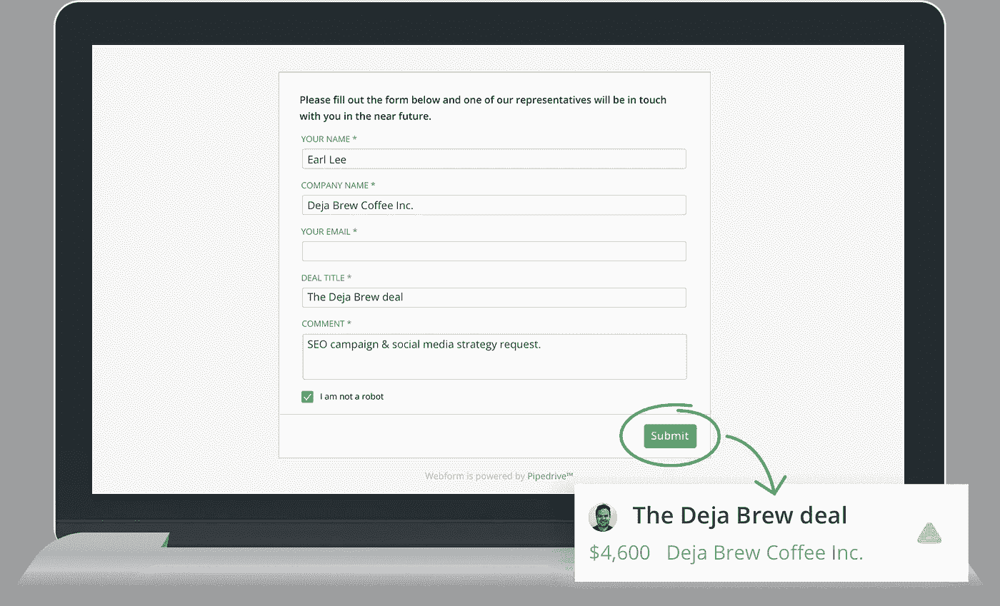
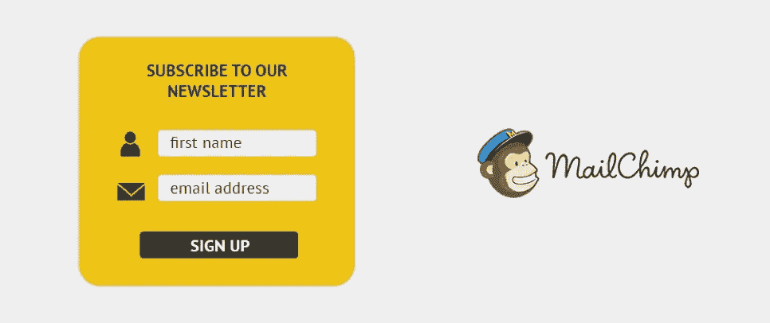
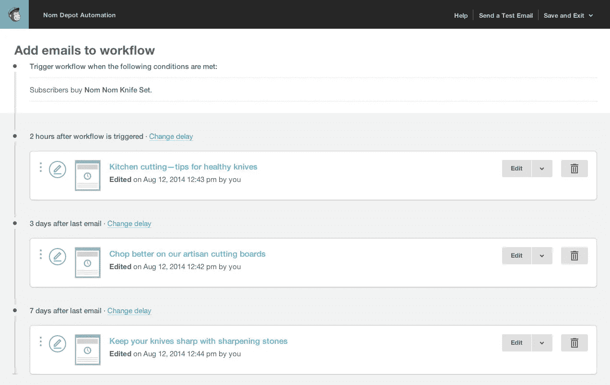
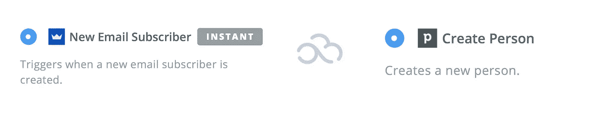

# 5 个有效的网站优化技巧，收集线索，提高转化率

> 原文：<https://medium.com/swlh/5-effective-website-optimization-tips-to-collect-leads-and-increase-conversion-6dccd5fa96be>

*本帖最初发表于* [*Landingi 博客*](https://landingi.com/blog/5-effective-website-optimization-tips-to-collect-leads) *，一款无需编码创建登陆页面的软件。*

让访问者访问你的网站似乎是一件很棒的事情。他们会浏览你的提议、资源和你传达的信息。太好了！

但现实是大多数网站和企业都失败了。这可能有多种不同的原因。

但通常情况下，这都是过程的最后一步，也就是把你的访客变成付费客户。

但是除了所有的营销技巧，我们还可以在网站上申请，比如:

*   清晰、简洁、透明的价值主张
*   用户友好的界面
*   社会证明(客户证明)

你还能做些什么来提高网站的转化率？

在当今世界，幸运的是，你有相当多的[云工具](https://picksaas.com/blog/what-is-saas-software/?utm_source=blog&utm_campaign=Landingi)来帮助你，但在我们深入探讨之前，让我们来看看一些线索收集技巧。

# 如何处理您的线索收集和处理？

一旦你开始收集线索，你需要准备好如何处理和加工它们。

你最好安排好你为顾客服务的方式，以确保你不会失去任何一个潜在的顾客或者让他们不满意。

## 将销售渠道与营销渠道分开

管理你的销售和营销渠道是两种不同类型的商业纪律。

即使你的营销团队是该领域的专家，产品也可能不会自己卖出去，除非你拥有一个高转化率的 SaaS 企业。

这就是为什么把你的营销团队和资源从销售过程中分离出来是如此重要。这是什么意思？

根据 Hubspot 创始人的[销售加速公式](https://offers.hubspot.com/sales/sales-acceleration-formula-preview)，这意味着你的销售团队应该负责联系一份已经预先确定的潜在客户名单，这些潜在客户有可能转化为付费客户。

## 确保你在正确的时间联系到潜在客户

联系潜在客户的最佳时机是什么？在开始浏览您的报价后的几秒或几分钟内。

这就是为什么建立即时沟通渠道如此重要。这可以让你向访问者传递个性化的信息，并试图将他们转化为顾客，或者至少让他们更加了解你的产品和服务。

## 关注入站渠道而非出站渠道

你可以找到许多不同的战术和战略来通过对外联系接近潜在客户。事实可能证明，冷邮件或冷电话实际上是一种发展业务的方式。

然而，随着市场认知度的提高和过度宣传，这种瞄准新线索的方式变得越来越不受欢迎和无效。

如果你真的从长远考虑你的业务，你最好专注于你的进货渠道，确保你的客户在寻找他们问题的解决方案时能够很容易地找到你。

内容策略和社交媒体活动可能需要你付出更多的努力。尽管如此，你应该更高兴看到长期的影响，看到稳定的流量导致你的业务。

现在，我们已经了解了一些关于销售线索收集流程的整体提示，让我们深入了解一些工具、提示和技巧，来帮助您在网站上获得更多的销售线索。

# 建立登录页面来收集访问者的电子邮件

使用像 [Landingi](https://picksaas.com/landing-page-builders/landingi?utm_source=blog&utm_campaign=Landingi) 这样的工具为你营销你的产品或服务提供了无限的可能性。不需要编码就可以建立新的网站，这让你可以非常方便地按照你想要的方式快速制作你的产品的推广登陆页面。

如何建立一个有效的、转化率高的[登陆页面](https://landingi.com)？以下是一些建议:

*   使用预定义的模板作为灵感，而不是作为最终设计
*   增加奖励，鼓励访问者留下他们的电子邮件地址
*   关于你的价值主张，要透明、清晰、简洁
*   添加一个可见的 CTA，如电子邮件提交表单
*   只收集需要的信息，不要阻止访问者填写长表格
*   将您的 Landingi 网站与 Pipedrive 集成，并在您的 CRM 中处理与潜在客户的联系

# 添加实时聊天或回电解决方案来提高参与度

一旦你的网站或登陆页面准备好了，你需要想出如何与访问它的人沟通。在当今世界，仅仅在你的网站上留下一些信息是不够的。

LiveChat — chat with customers visiting your website

面对如此多的网页和信息，您的客户希望在浏览您的网站时立即获得更多信息。

请记住，客户最有可能在看到你的报价时购买你的产品或服务。

CallPage — automatically connecting you and your customers

像 [LiveChat](https://picksaas.com/live-chats/livechat?utm_source=blog&utm_campaign=Landingi) 或 [CallPage](https://picksaas.com/call-back-apps/callpage?utm_source=blog&utm_campaign=Landingi) 这样的解决方案可以很容易地与任何网站集成，只需提供即时的客户服务，就可以增加销售产品的机会。

实时聊天解决方案还使您能够通过向访问者发送自动问候或设置醒目标志来确保您的聊天窗口清晰可见，从而吸引他们的注意力。你在网上卖鞋吗？设置自动化功能，自动询问顾客的鞋码，并参与对话。

您通过 LiveChat 或 CallPage 收集的任何线索都可以自动上传到您的 CRM 系统，如 Pipedrive 或 Hubspot，以确保您将所有联系人存储在一个地方。

# 在网站的关键部分使用离散的滑块或弹出窗口

让我们想象一下，你的潜在客户阅读了你网站上一篇高度相关的博客文章。很有可能，他/她会记住你的品牌，一旦他/她在寻找关于这个话题的新信息，他/她会回来找你。

Promotional pop-up in Sumo

仍然在今天这个过度促销的世界里，你不想把任何东西留给一个纯粹的运气。为什么不友好地问你的访问者他/她的电子邮件地址，以确保你能够跟进他们的进一步内容，并可能提供你的产品或服务？

使用像[相扑](https://picksaas.com/lead-capturing/sumo?utm_source=blog&utm_campaign=Landingi)或 [HelloBar](https://www.hellobar.com) 这样的工具，你可以很容易地建立一个非常离散的弹出窗口或栏来收集你的访问者的电子邮件，确保你能够联系到你的潜在客户，即使他们已经退出你的网站。

# 从您的云 CRM 应用程序嵌入联系人表单

如果您已经在使用 [Pipedrive](https://picksaas.com/crm/pipedrive?utm_source=blog&utm_campaign=Landingi) 作为管理您的联系人和销售的地方，这个 CRM 为您提供了大量的自动线索收集功能。例如，您可以从 Pipedrive 轻松嵌入联系人表单。

Contact form embeded into your website from Pipedrive

因此，留在您网站上的任何联系人都将自动上传到您的 Pipedrive CRM 中，这样您就可以:

1.  在一个位置管理所有联系人
2.  确定该销售线索是否值得在 Pipedrive 中进一步培养
3.  借助内置的邮箱集成，在 CRM 应用程序中直接联系销售线索

# 自动联系订阅你的时事通讯的访问者

在你的网站上放一个订阅表单没什么大不了的。如今，让你的访客订阅任何与你的业务或服务相关的更新已经成为一种标准。

然而，这都是关于你在客户留下电子邮件地址后提供的价值主张。不要把你的表格命名为“订阅时事通讯”。相反，告诉你的潜在客户，在他/她离开电子邮件地址后，你将提供什么价值，例如“获得每周转化优化提示”。

Sign-up form in MailChimp

不要让你的访客等待你这边的联系。他留下电子邮件地址的时候，是他对你的产品或服务最感兴趣的时候。

相反，给他发一封精心制作的欢迎信，告诉他更多关于他能在你的网站上做什么。为了节省时间，你也可以把他放在自动邮件序列中，每周发送一份时事通讯，包含你博客文章中的关键见解。

MailChimp mailing automation

要实现这一点，您可以使用 [MailChimp](https://picksaas.com/mailing-automation/mailchimp?utm_source=blog&utm_campaign=Landingi) 自动化功能。

# 使用 Zapier 或本机集成将任何应用程序连接在一起

在实现了工具并优化了工作流程之后，将它们作为完全独立的业务管理系统是没有意义的。相反，最好充分利用它们之间的数据共享，并将应用程序连接在一起。

有两种主要方法可以做到这一点:

*   使用应用程序中内置的本机集成
*   使用集成软件，如 [Zapier](https://zapier.com) 或 [Integromat](https://www.integromat.com) 将任何应用程序连接在一起

在集成软件时，本地集成往往是一种更好的方式。它们非常适合软件的功能，并提供无缝的用户体验。

另一方面，它们并不总是可用的，因为 SaaS 软件生产商通常只专注于构建最重要的集成。

Example of integration via Zapier

有了 Zapier 或 Integromat，你应该能够集成大多数可用的应用程序，通过设置特定的动作，触发特定的事件。例如，通过弹出窗口收集电子邮件->将电子邮件添加到您的 CRM 数据库中。

另一方面，Zapier 集成经常被延迟，所以在真正的集成相关操作发生之前，您可能会错过几分钟。此外，Zapier/Integromat 是一个附加软件，所以你也需要为其订阅付费。

# 确定收集销售线索的最佳渠道->投资

以上是通过你的网站收集线索的许多不同方法中的一些。虽然有很多其他的优化方法，但从简单的技术开始是值得的，以确保你能够留住在线访问你的业务的人。

下一步做什么？检查哪些渠道在性能方面是最好的，并在这些渠道上投入更多的时间和资源。

您的客户是否经常通过实时聊天提问？雇佣一个实时聊天代理来处理更多的客户问题，从而提高销售额。

你有什么登陆页面可以给你带来大量的新线索吗？关注原因，并为您的客户做更多。

通过你的网站收集线索仅仅是一个开始，看看其他关于如何将你的访客转化为快乐顾客的技巧也是值得的。

*在* [*picksaas*](https://picksaas.com/?utm_source=blog&utm_campaign=Landingi) *，我们提供在线软件咨询，我们帮助您找到 saas 软件来发展您的业务。*

*与我们聊天，关注* [*推特*](https://twitter.com/picksaas) *或* [*订阅*](https://picksaas.us16.list-manage.com/subscribe/post?u=0a811ad254e7cd14718599e3a&id=bdf0cfd955) *我们每周一次的 SaaS 软件更新。*

*本帖最初发表于*[*landing I blog*](https://landingi.com/blog/5-effective-website-optimization-tips-to-collect-leads)*，一款无需编码创建登陆页面的软件。*

## 这篇文章发表在 [The Startup](https://medium.com/swlh) 上，这是 Medium 最大的创业刊物，有 361，652+人关注。

## 在这里订阅接收[我们的头条新闻](http://growthsupply.com/the-startup-newsletter/)。

