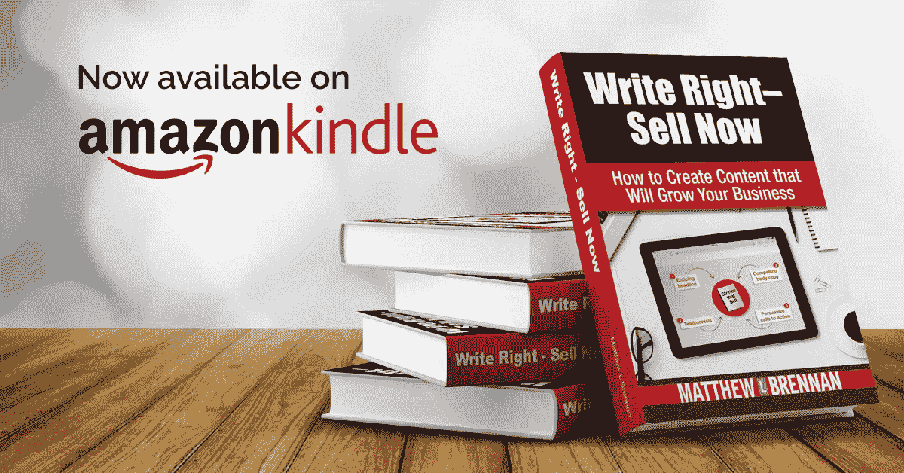

# 撰写优秀登录页面的 5 个要素

> 原文：<https://medium.com/swlh/5-essentials-for-writing-awesome-landing-pages-8b26efb1d347>

你不必是一个伟大的作家，把真棒登陆页面。事实上，很多根本不认为自己是作家的人已经这样做了。

上次我复习了[撰写高质量登陆页面文案的 15 个策略](http://matthewbrennancopywriter.com/landing-page-copy/)。awesome 登录页面包含一些关键元素。有很多[成功页面](https://instapage.com/blog/landing-page-examples)的例子，你可以从中获得灵感。[销售信函](http://matthewbrennancopywriter.com/sales-letters/)已经存在了更长时间，并且与登陆页面格式有很多共同之处。

雇佣一个[登陆页面文案](http://matthewbrennancopywriter.com/landing-pages/)也能有所帮助。以下是编写一个有效的登录页面的一些关键要素。

# 令人惊叹的登录页面的 5 个要素

**写一个杀手级标题—** 你的努力从这里开始，也在这里结束。你的[标题](http://matthewbrennancopywriter.com/5-easy-tricks-to-writing-headlines-that-sell/)需要吸引人们点击，并做出承诺。继续下去他们会学到什么？你将如何解决他们的问题？大多数人会通过搜索或社交媒体找到你的页面。如果你不给他们一个点击的理由，他们可能会继续前进。

有很多资源可以用来学习写杀手级标题的技巧。看看大卫·加芬克尔的[让你致富的广告标题](https://www.amazon.com/Advertising-Headlines-That-Make-Rich-ebook/dp/B00513MQ2G/ref=sr_1_1?ie=UTF8&qid=1517234530&sr=8-1&keywords=advertising+headlines+that+make+you+rich)，或者乔恩·莫罗的[标题技巧](https://smartblogger.com/headline-hacks/)。花点时间了解选词背后的心理。例如，研究证明，“免费”和“新”这两个词出现在标题中会产生强烈的影响。了解还有哪些[单词](http://matthewbrennancopywriter.com/impactful-words-to-help-you-sell-more/)可以帮助吸引人们点击，并学习如何有效地使用它们。

**强有力的诱饵——一旦你的标题说服了某人点击，每一句的目标就是让他们阅读下一句。你要建立信任，向他们表明你理解他们的处境。这就是钩子发挥作用的地方。**

如果你能以某种方式重述他们的问题，让他们知道你已经听进去了，并且理解了，你就会吸引读者的注意力。一旦你吸引了他们的注意力，你就可以将你的产品或服务定位为解决问题的方案。如果你的业务已经做了很长时间，使用的语言要尽可能传达:

*“我们已经帮助了成千上万像您这样的人，他们拥有 _ _ _ _ _ _ _ _ _ _ _ _ _ _ _……”*

*或*

*“我们成熟的系统正是考虑到这种情况而开发的。”*

像这样的陈述表明你已经确定了你要解决的问题，并且你有这样做的经验。

**带来价值—** 当您的客户滚动浏览您的登录页面时，他们内心会产生抵触情绪。我们内心都有一点怀疑，我们在寻找突破口。他们想知道是什么让你与众不同。他们想知道你将如何解决他们的问题。

如果你卖一种产品，他们对它是由什么制成的不感兴趣。他们对内部不感兴趣。他们对结果感兴趣。令人敬畏的登录页面使用要点传达好处。这些要点传达了对他们有什么好处。

举几个关键的例子，你的读者不会在意 V6 发动机，他会在意时速 85 英里时头发里的风。他不会关心他的电动开罐器有多少伏特，他会关心在他的晚餐制作程序中节省的时间。

登陆页面可能会很长，这取决于产品和优惠。项目符号是在扩展文本中突出这些好处的一种方式。它们让读者很容易浏览你写的东西，并迅速理解其价值。

**强大的社会证明—** 每个人都期待你成为自己最好的推销员。他们期待平稳的推介，有力的要点，以及压倒一切的价值感。当你的读者在阅读时浏览他们内心的反对意见时，他们会想到你的老客户会说些什么。他们想知道其他人是否会像你现在这样高度评价你的产品。

你可以通过在你的文案中加入一些有力的[证明](http://matthewbrennancopywriter.com/testimonials/)来轻松消除这种异议。向你的读者展示别人对你的公司、产品或服务的看法。证明越具体到你卖的东西，越好。

**集中行动号召—** 同样，大多数优秀的登录页面都有一些相当广泛的内容。简单地阅读页面是对时间的投资。你可以帮你的读者一个忙，不要跑题，让他们明白你的提议是什么。

事实证明，当你给读者选择的时候，会导致压倒性的结果。他们只是关上窗户，什么也不做。所以要弄清楚你想让他们采取的行动是什么。最常见的 CTA 是立即购买，或下载免费礼品(这是用来增加电子邮件列表)。但是不要要求他们一下子做太多，否则他们的选择就是什么都不做。

**结论**

包括这些要素可以帮助你确保你有很棒的登陆页面来帮助你发展业务。同样，你不需要成为一个伟大的作家来制作工作的登陆页面。

你也可以雇一个[的登陆页面文案](http://matthewbrennancopywriter.com/landing-pages/)来帮你找结果。

*Matt Brennan 是芝加哥地区* [*营销文案*](http://matthewbrennancopywriter.com/about/)*[*文案编辑*](http://matthewbrennancopywriter.com/copy-editing-services/) *。他也是* [*写权的作者——现在卖*](http://writerightsellnow.com/) *。**

**

## *这个故事发表在 [The Startup](https://medium.com/swlh) 上，这是 Medium 最大的创业刊物，有 300，118+人关注。*

## *在这里订阅接收[我们的头条新闻](http://growthsupply.com/the-startup-newsletter/)。*

**

*v*