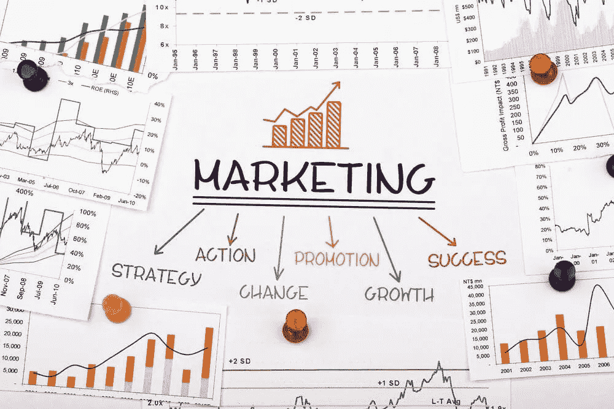

# 促成营销成功的 5 个因素

> 原文：<https://medium.com/swlh/5-factors-that-contribute-to-the-success-of-your-marketing-bffc6e48c3ef>

市场营销中有很多重要的想法和概念。内容、电子邮件和点击付费广告是成功的要素，但如果没有一些关键因素，这些都不重要。

今天，我想重点谈谈有助于营销成功的 5 个因素，并谈谈如何做一些事情来调整营销并获得更多的结果。

# #1.狭义的顾客

你必须严格定义你的顾客，而不是仅仅去追逐任何一个有名片的人。问问你自己，谁也能给你带来最大的价值。这是一个你会对其产生最大影响的群体，并且有可能会立即吸引他们。

如果你想获得他们的业务，了解你的理想客户是至关重要的。你需要了解他们的痛点、需求和需要，并能够在你的营销工作中解决这些需求。[狭义地定义你的客户](https://www.linkedin.com/pulse/first-step-small-business-growth-patrick-mcfadden/)是你发展业务时最重要的事情。

# #2.正确的区分

我可以毫不犹豫地说，**变得更好**是浪费时间，**变得不同**才是金钱和竞争优势所在。

创造更好的服务、产品或组织是艰难而短暂的。这是一个糟糕的优势，明天就可能被竞争对手以更低的价格、更便利的位置、更闪亮的奖项、更新的技术、更华丽的展示或更大的社区推翻。

你应该做的是弄清楚你如何简单地从竞争中脱颖而出。

在我看来，创造不可轻易复制的独特优势并从竞争中脱颖而出的最佳方式是:

*   采访你的理想客户以获得洞察力
*   创造你自己独特的对待顾客的方式
*   创造独特的体验
*   为人们创造一种全新而便捷的方式来获得结果

# #3.你的信息

下一个有助于你营销成功的因素是你的信息:先解决问题，再解决问题。如果你不认真对待这一点，你在市场营销方面所做的一切都将远没有那么有效。

当你在提供解决方案之前花时间**解决你的理想客户看到和感受到的问题时，**你为吸引和转化他们而实施的营销活动不太可能产生共鸣。

如果你在思考你的理想客户的问题时遇到了困难，想想你在销售会议前的谈话，你在客户访谈中提到的事情，或者希望你是一个好的笔记记录者，可以重温这些以获得一些见解。

例如，我公司的许多潜在客户可能会说这样的话——我只想让我的电话响起来，我想出现在谷歌的第一页，我想要更多的推荐，我想要更少的营销难题，我想要我的网站产生销售线索，我觉得我在无效的营销上浪费钱，等等。

所以我的公司不卖战略营销或营销计划，甚至不卖咨询——我所有的理想客户需要知道我们做的是:

*   我们让电话铃响——故事结束。
*   我们让你出现在谷歌的第一页——故事结束。
*   我们让更多的推荐发生——故事结束。
*   我们让营销难题烟消云散—故事结束。
*   我们让网站产生线索——故事结束。
*   我们让营销资金发挥作用——故事结束。

**另一个例子，按摩实践:**他们可能有最好的桌子、油和最熟练的治疗师，但他们所有的客户似乎都关心他们的疼痛和不适会消失。

因此，这就是他们需要交流、宣传和推广的承诺。剩下的只是一个期望——我的意思是不是按摩行业的每个人都有非常熟练的治疗师。

就是这样，这就是你如何重新定位你的信息，这样它就不再是关于你和你卓越的产品和服务，而是关于你卓越的客户和他们想要解决的问题。

# #4.耐心

营销的一个肮脏的小秘密是，更多伟大的营销失败的原因是营销人员缺乏耐心，而不是其他任何原因。

成功的营销需要战略耐心。 ***潜在客户需要一段时间来了解你，然后足够信任你并购买*** ，如果你改变了营销、媒体和身份，你就很难让人信任了。成功属于那些从计划开始，并有战略耐心超越即时结果需要的人。

伟大的营销之所以如此强大，首先是因为它不操纵，而是说服——这是有用的、有教育意义的信息，以一种容易理解、有趣的方式呈现。

发现这一点需要战略耐心。

你足智多谋的网站可能做不到这一点。你在 LinkedIn 上的积极参与可能不会带来同样的效果。但是你的网站和社交媒体的参与，加上你的电话跟进、电子邮件通讯、演讲、广告、宣传和耐心，可以很好地完成工作。

你的战略耐心为你的营销创造的利润赢得了奖项

# #5.语境

今天，你的潜在客户在网上对产品和服务进行某种形式的研究，这种行为转变减少了你仅仅提供信息的需要。相反，他们希望有人能够提供洞察力，阐明问题，并且通常足智多谋，能够将其他世界级的专家带到谈判桌前。

为了今天的竞争，您必须改变潜在客户对您、您的解决方案和您的组织的看法。要做到这一点，采纳下面的一个建议作为你策略的一部分。

首先，当理想客户发现你与他们相反时，你会自动改变他们对你、你的组织和你的解决方案的看法。今天，这更多的是通过教育内容被发现，而不是出去打猎。

开始发布和分享有用的内容。你必须想办法被邀请到充满潜在客户的房间里演讲，你必须想办法通过搜索引擎被找到，你必须想办法在人们寻找答案时被称为专家。

你在 Quora、LinkedIn、脸书等网站和特定行业网站上的持续参与，可以极大地帮助改变理想客户对你所做的事情或你的解决方案的看法，并在实际上使竞争变得无关紧要。

当你通过发布和分享信息而获得乐于助人、有用和相关的声誉时，你就会被邀请去有机会销售的地方。

感谢阅读！🙂如果你喜欢这篇文章，
打个招呼吧:[*insta gram*](https://www.instagram.com/pmcfadden7/)|[*Twitter*](https://twitter.com/patmmarketing)*|*[*脸书*](https://www.facebook.com/indispensablemarketing/)*|*[*LinkedIn*](https://www.linkedin.com/in/pmcfaddenmarketing)*|*[*Quora*](https://www.quora.com/profile/Patrick-McFadden-4)
在这里订阅我的简讯

**

## *这个故事发表在 [The Startup](https://medium.com/swlh) 上，这是 Medium 最大的企业家出版物，拥有 273，384+人。*

## *在这里订阅接收[我们的头条新闻](http://growthsupply.com/the-startup-newsletter/)。*

**