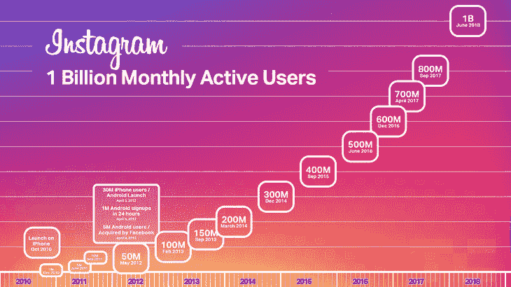

# 金融科技公司可以用 5 个公式来激活 Instagram

> 原文：<https://medium.com/swlh/5-formulas-that-fintech-firms-can-use-to-fire-up-instagram-f23115278a3b>

金融公司是 Instagram 的后来者。高盛曾在包括 Snapchat 和 Spotify 在内的大多数其他平台上[活跃，最终在 2018 年 9 月开设了一个账户。](/swlh/150-year-old-goldman-sachs-is-showing-us-the-future-of-financial-marketing-ee192b15722e)

有一种普遍的误解，认为 Instagram 不适合金融科技行业，尤其是那些在 B2B 领域运营的公司。毕竟，这是一个…