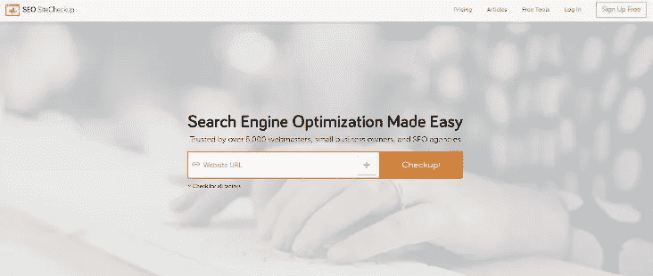
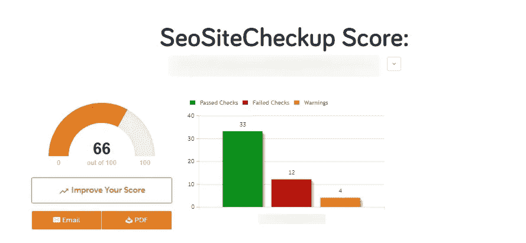
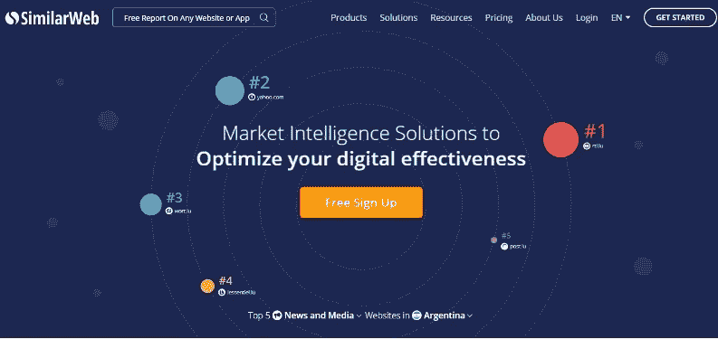

# 5 个免费有用的工具，可以帮助你进行网站和搜索引擎优化分析

> 原文：<https://medium.com/swlh/5-free-useful-tools-that-can-help-you-with-website-and-seo-analysis-5e180abb95aa>

当一个网站没有带来想要的用户数量时，首先要做的当然是寻找原因。在这篇文章中，我们整理了五个在线工具，可以帮助你快速有效地进行网站和 SEO 分析，你将了解这些工具的关键功能是如何工作的。

本文将为您提供一些工具，当您需要快速检查 SEO 指标、检查下载速度、在竞争对手中找到自己的位置、制作网站分析报告并在各种设备上显示时，您可以随时使用这些工具。

为了随时了解可能出现的问题，并及时检查错误，请使用这些工具定期检查您的数据。在短短几分钟内，你可以评估困扰你的网站的问题，即使没有任何特殊的营销知识。

# 1.通过 [GTmetrix](https://gtmetrix.com/) 分析网站速度

[根据 Think With Google](https://www.thinkwithgoogle.com/marketing-resources/data-measurement/mobile-page-speed-new-industry-benchmarks/) 的调查，53%的用户不愿意等待超过三秒钟来加载页面。如果网站在这段时间内没有加载，他们会去别的地方。

如果你的网站运行缓慢，那么其他潜在客户就会流失，因为他们必须等待你缓慢的网站加载。太可怕了！

要确定是否有任何性能问题，以及您的站点加载速度有多快，您可以使用一个名为 GTmetrix 的简单工具。

服务的基本功能是免费的。只需将您的网站地址粘贴到主字段中，然后单击“分析”按钮。

GTmetrix 可以快速分析任何站点，并显示常见的性能问题。

完整的站点分析大约需要一分钟。

在输出端，我们接收到以下数据:

–您的浏览器和位置。

–网站的绩效指标。

–页面加载速度。

–总页面重量。

扫描后，您将看到一个简短的摘要。

下面是关于如何提高网站速度性能的每个参数的建议。

所有建议都按照重要性排序。空的或红色的刻度表示这些项目是最关键的，没有观察到

每个建议都可以部署在您可以看到您的网站需要完成的具体工作类型的地方。

它不仅仅是像“优化图片”这样的建议，而是准确地指出哪些图片需要优化，以及每个图片的链接。

使用 GTmetrix，您可以随时轻松快速地检查网站速度，请记住:如果加载时间超过几秒钟，就该 ping 开发人员并优化代码和图像了。

# 2.SEO-使用 [SEO 网站检查](https://seositecheckup.com/)对网站进行分析

SEO Site Checkup 是一款免费的工具，可以在五分钟或更短的时间内检测出可能的网站 SEO 问题。

它非常容易使用，只需粘贴您的网站链接。此外，您还可以检查竞争对手进行比较。

在一分钟内，你将有一个完整的网站分析。

图表显示了错误和可能出现的问题的数量。图表下有一个建议列表。该报告可以下载成 PDF 格式或通过电子邮件发送。

## 数据汇总分为五个部分:

**SEO 的常见问题** —在重要的标记区域使用关键字、代码和文本合规性、拥有 robots.txt 文件和 XML-Sitemap、符合 HTML 标准、用于 SEO 优化的 URL，等等。

幸运的是，这项服务为您提供了如何修复所发现问题的线索。

提示很详细。您甚至可以看到在 HTML 中需要添加 alt 属性的地方。

**速度优化** —检查性能的各个方面(页面大小、压缩、缓存、最小化、服务器速度等)。).

**服务器和安全** —这一部分描述了关于主机和网站安全的几个重要特征(例如，提供不必要的访问或显示潜在的机密信息等。).

**阅读还:** [**20 种在不知道如何编码的情况下创建登陆页面的方法:一个完整的独立工具回顾**](http://blog.icondesignlab.com/en/2017/20-ways-to-create-a-landing-page-without-knowing-how-to-code-a-complete-independent-tool-review/)

**在移动设备上方便使用。这里将向你展示你的网站在智能手机屏幕上的外观。**

您可以直观地评估您的站点是否存在移动适应性问题。

高级 SEO——检查外部链接或索引重要部分的禁忌，等等。因此，搜索引擎优化网站检查会给你一个完整的图片，你的网站上的缺点和问题，干扰其搜索系统的推广。

# 3.用 [Screenfly](http://quirktools.com/screenfly/) 测试响应式网页设计

移动受众每年都在增长，根据[Statista.com](https://www.statista.com/statistics/241462/global-mobile-phone-website-traffic-share/)的数据，今年全球移动流量份额为 52.2%(2017 年为 50.3%)。

一个在手机上错误显示的网站，不仅让用户烦恼，还能彻底扼杀转化。

你的网站一切都好吗？让我们使用 Quirktools 的 Screenfly 来检查一下。

该工具有一个非常简单的界面。没有不必要的按钮和功能。

这是一个简单免费的工具，它的魅力在于你可以在不同的设备上查看站点的显示。

你可以看到你的网站在电脑上、特定的平板电脑品牌上、特定的智能手机上，甚至在电视屏幕上的外观。

标尺显示窗口的宽度和高度。

如果按钮没有放在正确的位置，内容不适合屏幕或者文本太小，你就需要提高适应性。

# 4.使用 [SerpStat](https://serpstat.com/) 服务将您的网站与竞争对手的网站进行比较

SerpStat 是一个多功能的 SEO 平台。使用免费的基本功能，你会学到很多关于你的网站和你的竞争对手的有趣的东西。

在此服务的主页上，您可以输入您的网站地址，并选择一个搜索系统进行检查。

从摘要报告中，你可以收集关于流量、关键词、反向链接，甚至你的竞争对手的信息。

该服务将免费展示:

**1)你占据最高位置的 10 个关键词。**

不仅显示位置，还显示每次点击的费用。

**2)关键词趋势**

例如，在这张图表中，您可以看到某些关键字的正增长趋势。

**3)搜索系统最可见的页面**

在免费版本中，您将看到 10 个具有最高可见性的页面。

有机搜索的竞争对手。

除了竞争对手的网站列表，这项服务还显示了他们的位置是如何变化的。

我特别欣赏这项服务，因为它让你有机会看到你在 SERP 中与谁争夺一席之地，它让你可以将你的网站与一两个竞争对手进行比较。为此，只需转到“竞争对手—比较领域”部分。

**5)报告反向链接。**

使用 SerpStat，你可以获得不同国家和不同搜索系统的关键数据。对于那些想要进入另一个国家市场的人来说，这一点尤其重要:你将看到谁在那里与你竞争，你可以去那个网站，评估他们擅长什么，你缺乏什么。

# 5.使用[相似网站](https://www.similarweb.com/)更好地了解你的听众

SimilarWeb 是另一个收集资源位置和流量摘要的网站和移动应用程序分析器。

不用注册就可以开始工作。只需在服务标志旁边的行中输入网站地址。

一个快速的网站分析会给你以下信息:

**1)站点排名。**

该服务显示全球排名、国家排名和类别排名(您的主题)。

从有机搜索和付费搜索中获得的流量数据，以及五个热门关键词。

被检查的网站只接收来自有机搜索的流量。

3)来自**社交网络**的流量分成。

很快就清楚了，你付钱给你的 SMM 经理是不是在浪费你的钱，以及你需要更多关注哪个社交网络。

你可以看到社交网络的总流量份额和每个网络的统计数据。

4)卓越的功能——你的受众的**兴趣。**

这部分显示了观众的兴趣。对那些不了解客户肖像的人很有用。

5)至于甜点——关于**你的竞争对手**的信息。

你可以把选择的域名和你的进行比较，但是说实话，SerpStat 会给你更多这方面的信息。

# 免费的在线网站和 SEO 分析工具能帮我解决转化率低背后的原因吗？

使用这五个简单的工具，你总是能够快速检查所有的主要网站指标。通过这样的分析，你可以发现下载速度和搜索引擎优化的问题，评估带来流量的渠道，了解更多关于竞争对手的信息。

但是为了理解你为什么会失去客户背后的核心问题，你的网站是否存在可用性问题或者糟糕的设计选择，你必须进行详细的市场分析。聘请一位经验丰富的营销专家是一个好主意，他将:

–深入挖掘分析

–使用数十种其他专业工具进行测试

–分析网站对用户的清晰程度

–他们留下了哪些页面，为什么

–发现设计和品牌定位问题。

因此，你手中会有一份详细的报告，报告中会列出所有会影响网站转化率的缺点，以及消除这些缺点的建议。

顺便说一下，这样的专家在我们的团队中，他们会很乐意帮助你为你的网站进行详细的市场分析。

[来源](http://www.icondesignlab.com/en/contact-us/)

## 这个故事发表在 [The Startup](https://medium.com/swlh) 上，这是 Medium 最大的创业刊物，拥有 319，583+人关注。

## 在这里订阅接收[我们的头条新闻](http://growthsupply.com/the-startup-newsletter/)。

