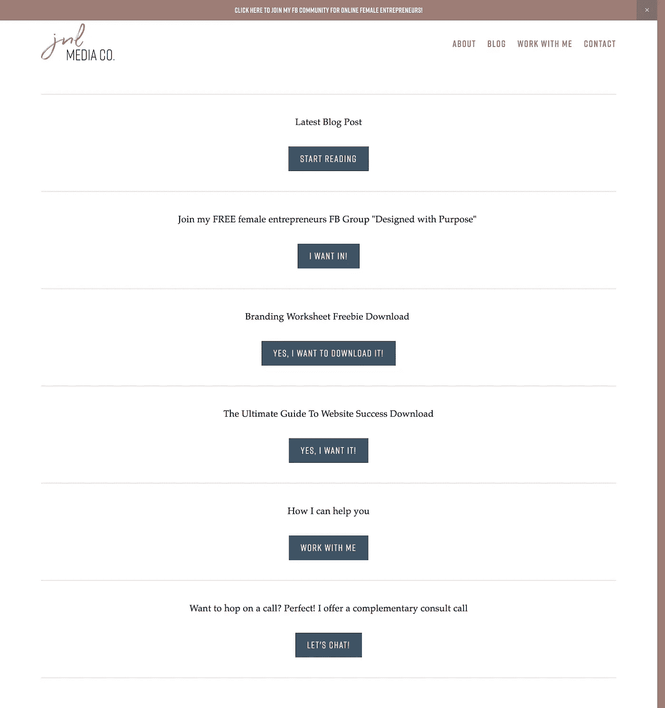

# 5 种保证提高网站流量的方法

> 原文：<https://medium.com/swlh/5-guaranteed-ways-to-drive-traffic-to-your-website-2a8e20bdd82f>

“MacBook Pro on white marble surface” by [Scott Webb](https://unsplash.com/@scottwebb?utm_source=medium&utm_medium=referral) on [Unsplash](https://unsplash.com?utm_source=medium&utm_medium=referral)

想象一下，你正在给自己举办一个迷人的生日聚会，你花了很多钱买了一件完美的衣服，做了头发，修了指甲，装饰了房子等等，但是没有人出现！结果他们根本没收到邀请！

我很高兴地说，这从来没有发生在我身上，但我敢肯定，我会超级失望！

为什么是随机故事？嗯，这就是当你投资创建一个美丽的网站和品牌，然后甚至没有人看它的时候发生的事情。

那么，你到底如何让人们出现在你的生日聚会上呢？我是说看你的网站！

# 1) Pinterest

我已经在我的博客上谈了很多关于 Pinterest 的事情，所以 Pinterest 在这个博客上排名第一是很自然的。

在我更深入地研究 Pinterest 之前，有一点非常重要，那就是你在 Pinterest 上成功的唯一途径就是为你的企业写博客。

写博客不仅能提高你的可信度和你的读者的信任度，还能改变你在谷歌搜索引擎优化中的排名。有了正确的关键词和策略，你的商业博客可以增加你的 Pinterest 流量和谷歌排名。

## 好了，现在回到 Pinterest，也就是今天的视觉谷歌…视觉什么！？是的，Pinterest 是搜索引擎，而不是社交媒体平台！

好了，现在我们弄清楚了，Pinterest 实际上是如何帮助人们浏览你的博客的？我向你保证，你的理想客户在 Pinterest 上，他们正在搜索各种各样的东西。你所要做的就是写杀手级的博客文章，研究你的理想客户已经在搜索的关键词，创建令人敬畏的图形，并开始在 Pinterest 上分享它们。

当你的理想客户看到你创建的漂亮的+引人注目的 pinnable 图形时，他们会点击它并被引导到你的网站。

这听起来很简单，实际上也很简单，但是需要:

*   每周创造有价值的博客文章
*   创建 Pinterest 图形
*   每日钉钉(排班推荐[顺风](https://www.tailwindapp.com/)
*   为 Pinterest 制定关键词策略
*   创建相关的董事会

如果你想了解更多关于 Pinterest 的信息，那就去看看 [Simple Pin Media](https://www.simplepinmedia.com/) 、 [Rachel Ngom](https://www.rachelngom.com/) 。

# 2.[中等](/)

我在 9 月份加入 Medium 是为了尝试一下博客世界，但我不知道我会对这个平台如此着迷。

事实上，我写了一整篇关于我为什么喜欢媒体作为增加你网站/博客浏览量的一种方式的文章，所以你可以在这里查看。

我一直使用媒体来 1)增加我的网站流量 2)通过以下方式获得电子邮件订户:

1.  我的个人简历上有我的网站链接
2.  如果与我所写的内容相关，我会在博客文章中包含我的网站链接
3.  Medium 允许你在博客文章的结尾呼吁行动，所以我一直在利用这一点

# 3.谷歌(搜索引擎)

大多数有创造力的企业家对这个三个字母的单词畏缩不前，但是掌握它是如此重要！SEO 是搜索引擎优化的缩写(例如:Google & Bing ),有很多东西都涉及到 SEO，但一般来说，SEO 可以被视为页面内 SEO 和页面外 SEO。

[页面搜索引擎优化](https://www.jnlmediaco.com/blog/10-things-to-know-about-squarespace-seo-site-features?rq=seo)是你最能控制的，它包括页面描述、元标签、标题、标签等..简单来说，在搜索引擎上排名靠前与否的区别在于你的网站有多优化+你在一致的基础上产生了多少有价值的正确关键词的内容。

总的来说，要想让谷歌的有机流量流向你的网站，你必须:

*   有一个搜索引擎优化优化的网站
*   写关键词丰富优质内容

SEO 是其中一个有很多活动部分的主题，所以如果你对它完全陌生，那么我真的推荐你看一下这篇文章: [SEO 变得简单:一步一步的指南。](https://neilpatel.com/what-is-seo/)

# 4.照片墙

阿克玛！Instagram 不仅仅是一个你花费大量时间使用的应用程序，而是一个强大的商业工具！这是一个你可以用来与你的理想客户建立联系并与他们建立关系的地方。

**老实说，我更喜欢 Instagram 而不是 FB，因为它让我可以真正地寻找我的理想客户(通过标签)并直接与他们接触。**

像所有事情一样，这是一个长期战略**只有当你坚持发布并与你的目标受众互动(喜欢、评论、关注)时才会奏效。**

Insta 只允许你在你的简历中包含一个链接，所以确保你充分利用这个空间，包含一个到你的网站的直接链接或者一个“链接树”,也就是一个有很多到你网站不同部分的链接的页面，就像我使用的这个:

# 5.脸谱网

最后同样重要的是 FB！如果你还没有一个 [FB 商业页面](https://blog.hootsuite.com/steps-to-create-a-facebook-business-page/)，那么你一定要先创建它。

诚然，有机食品和饮料业务页面覆盖范围不如从前，但创建一个仍然很重要，因为:

*   你可以邀请朋友和家人喜欢这个页面，这样他们就会知道你开创了一个了不起的事业
*   你可以在你的个人资料页面的职业下链接到你的商业页面
*   当你在餐饮集团上与你的理想客户接触时，他们可以很快看到你在哪里工作，并点击你的业务页面来了解你的一切
*   如果你有 [FB 群组](https://www.facebook.com/groups/DesignedwithPurpose/)，你可以将它链接到你的 FB 页面，你的群组成员可以看到它连接到你的业务，甚至在那里给你发消息

我希望这篇文章能在你的脑海中激发出一些新的想法，告诉你如何为你的网站带来流量。让我知道，如果你有任何其他方式，你一直在推动交通到您的网站，或者如果你有任何问题。

还有，别忘了加入我的[女性创业者 FB 群](https://www.facebook.com/groups/DesignedwithPurpose/)！

# 行动呼吁

你是企业家还是有抱负的企业家？那么我相信你知道拥有一个漂亮的网站和一个能吸引你理想客户的品牌的重要性。我整理了一份 12 页的清单，可以帮助你理解创建一个符合其目的的网站的过程。下载吧 [***这里***](https://www.jnlmediaco.com/checklistdownload)

*原载于*[*www.jnlmediaco.com*](https://www.jnlmediaco.com/blog/guaranteed-ways-to-drive-traffic-to-your-website)*。*

## 这篇文章发表在 [The Startup](https://medium.com/swlh) 上，这是 Medium 最大的创业刊物，拥有+368，052 名读者。

## 在这里订阅接收[我们的头条新闻](http://growthsupply.com/the-startup-newsletter/)。

