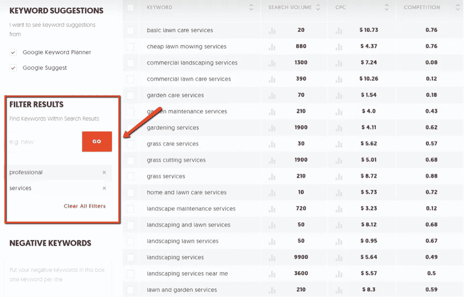

# 5 种游击营销策略适用于创业企业

> 原文：<https://medium.com/swlh/5-guerrilla-marketing-tactics-that-work-for-bootstrapped-businesses-74a9ad3a4265>

[http://www.cainco.org.bo](http://www.cainco.org.bo)

## 简明扼要的游击营销运作计划

如果你在经营一家自举企业，首先，你需要制定一个游击营销策略计划，你还需要拥有*游击队*的激情、韧性和足智多谋。

这些是战士，他们面对巨大的逆境，依靠他们的狡猾和非常规的战术，以最少的资源产生最大的结果。

# 游击营销策略计划

让我们面对它；如果你打算按照知名品牌的规则行事，那么你几乎没有机会对抗那些资金雄厚的知名品牌。虽然在传统营销策略方面，你无法超越或胜过他们，但你可以用实用、低成本的策略*智胜*他们，让你在自己的领域产生足够大的影响。

如果你对目前读到的内容感到满意，那么请允许我与你分享 5 个有效的*游击营销策略*——即使你预算有限。

# 1.挑选容易得手的关键词

在线营销策略的生死取决于它们被优化的关键词。

不管你是计划建立链接，点击付费，还是全力以赴的内容营销活动，瞄准正确的关键词可以确保你的信息到达正确的受众。

他们还决定你将与谁竞争，无论是广告位置还是搜索引擎排名。

这就是为什么你在做*关键词研究时需要格外小心。*使用类似 [**Ubersuggest**](https://neilpatel.com/ubersuggest/) 的工具来衡量你的目标的需求和竞争力。

要使用 Ubersuggest，请输入“种子关键字”，调整您的研究的本地化，然后单击“查找”这将立即产生数百个对你更可行的长尾关键词建议:

根据经验，在使用 Ubersuggest 进行研究时，选择竞争力评分大约为 **0.4** 或更低的关键词。这些都是适合资金不雄厚的品牌的中低竞争关键词。

当然，*搜索量*指标是不言自明的。它衡量一个关键词每月的平均搜索量，直接转化为它的受欢迎程度。

请务必使用左侧的“过滤结果”功能，通过添加“服务”、“雇佣”、“专业”和其他商业术语来细化您的搜索。

# 2.提供您的内容作为解决方案

有很多方法可以利用长尾关键词的新阵容。其中之一就是把它们作为你下一个内容的想法。

你知道该怎么做:提供可操作的见解，保持简单， [**用不同的媒体格式增加趣味**](https://isragarcia.com/content-is-your-best-product-definitely) ，等等。

然而，你还没有尝试的是在像 [**Quora**](https://www.quora.com/) 这样的问答网站上提供你的内容作为解决方案。

很直白。进入网站后，在主搜索栏中键入种子关键词，然后点击您看到的第一个选项:

这将弹出一个 Quora 用户在特定时期发表的帖子列表。现在，使用左边的过滤器，确保选择“按类型”部分下的“问题”,并梳理过去的小时、天、周和月，以找到最新的帖子。

这样做，你可以找到尚未回答的问题——让你的品牌有机会成为焦点。一个标准的方法是将整篇文章复制并粘贴到你的答案中，同时包含一个链接到你的页面 URL。

如果你碰巧发现一个你还没有内容的有趣问题，考虑采取游击方式，今天就创建一个*。只要你对自己的领域有所了解，并且在 Quora 上使用了正确的种子关键词，这是可行的。*

# 3.将统计数据整合到信息图表中

在网络世界中，一些最容易链接的资产是内容营销者用来证明他们观点的统计数据。

作为一个自创品牌，你可能没有足够的资源来有效地开展你的研究。但是，您可以将现有的统计数据合并成可读性更强、视觉效果更好的信息图。

不要担心——你不必为这项任务雇佣专业的平面设计师。你可以在一个免费工具的帮助下自己完成，这个工具提供了模板和拖放界面。

要使用 [**Canva**](https://www.canva.com/) ，请创建一个免费帐户，并从“创建设计”页面选择一个“信息图”模板:

然后，您将能够通过添加图标、文本、形状和其他可视元素来自定义您的信息图。您还可以通过选择与您想要涵盖的主题相匹配的预制布局来节省时间:

一旦你的信息图完成，抓住每一个机会在网上传播。你可以在 Quora 回答问题时附上它，在社交媒体上分享它，在撰写客座博文时链接到它，等等。

无论你做什么，只是不要忘记用精心编写的文本内容包围它，并在底部提供原始数据源的链接。

# 4.加入社交媒体群组

另一种快速吸引目标受众注意力的方法是加入他们的社交媒体团体。

随着**社交媒体网站(作为一个整体)显示出看涨的上升趋势，你不利用社交媒体营销空间的力量是不明智的。**

**你不需要一个专门的工具或一个奇特的技术来做到这一点。大多数社交媒体网站，如脸书，通过内部搜索引擎尽可能容易地找到这些群体:**

****

**可以利用社交媒体群作为免费渠道，让你的内容曝光。对于这种策略，您只需要记住几件事情:**

*   ****成为积极的参与者。**
    群组非常适合成员之间的深度互动。试着通过回复评论、分享和回复其他帖子来尽自己的一份力量。**
*   ****分享您的内容。就像 Quora 这样的 Q
    A 网站一样，只要你的内容有意义，你就可以随时提供答案。****
*   ****与其他成员联系。**
    为了扩大你的社交媒体影响力，关注或添加其他用户，鼓励他们再次添加你。不要犹豫，首先通过回复他们的帖子或直接与他们交流来“热身”。**

# **5.回应品牌提及**

**如果你的品牌已经活跃了一段时间，有可能人们已经在谈论你的品牌了。**

**其中大部分可能是关于您品牌可信度的问题，例如:**

*   ***这些产品安全吗？***
*   ***我为什么要选择这个品牌？***
*   **有人购买过该品牌的产品吗？**

**如果您有正确的答案，这些疑虑可以转化为销售线索挖掘机会。你现在需要的是一个工具，它将帮助你发现这些品牌提及，这样你就可以做出相应的反应。**

**排名不分先后，以下是你在游击营销策略中应该考虑的五大社交媒体倾听工具:**

1.  **[**BuzzSumo**](http://buzzsumo.com/)**
2.  **[**谷歌快讯**](https://www.google.com/alerts)**
3.  **[**胡特**](https://hootsuite.com/)**
4.  **[TweetDeck](https://tweetdeck.twitter.com/)**
5.  **[**纸板阅读器**](http://boardreader.com/)**

# **舞台是你的**

**这就是自举企业的一些最佳游击营销策略。**

**当使用这些营销策略时，你得到的结果与你付出的努力成正比。耐心点，记住这些策略都不是一夜之间就能奏效的！**

**在上面的列表中没有看到你最喜欢的游击营销策略之一吗？欢迎通过下面的评论来分享它！**

**【*本文首发于***

# ****只有当你觉得值得的时候，才让这个故事震撼吧！如果你发现任何有价值的东西，请鼓掌。****

> ****Isra Garcia = 53 个客户，48 家企业，398 次演讲，3.454 篇帖子，24 个项目，6 本书，380 场讲座，6 家公司，16 次冒险，25 次实验，∞失败。到目前为止…****
> 
> ****[营销人员](https://isragarcia.com/wp/marketer)。顾问。扬声器。作家。教育家。经理。在 [IG](http://thisisig.com) 的负责人。博主。企业家。颠覆性创新。数字化转型。高绩效者和生活方式实验者。****

# ****行动号召>>点击[此处](http://feeds.feedburner.com/isragarcia)订阅更多类似的文章！****

********

## ****这个故事发表在 [The Startup](https://medium.com/swlh) 上，这是 Medium 最大的创业刊物，拥有 316，638+人关注。****

## ****在这里订阅接收[我们的头条新闻](http://growthsupply.com/the-startup-newsletter/)。****

********