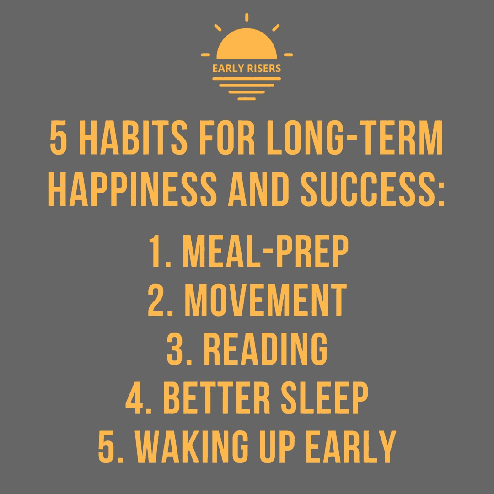
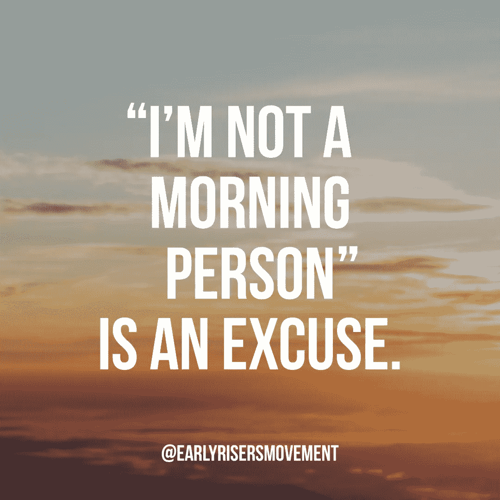

# 获得长期幸福和成功的 5 个习惯

> 原文：<https://medium.com/swlh/5-habits-for-long-term-happiness-and-success-d0cd5dd2114f>

我们是习惯的动物。从早上醒来到晚上睡觉，我们一整天都在做许多小习惯。从我们每天早上的例行公事，到我们进行日常卫生活动的方式，到我们与人交谈的方式，甚至到我们的想法，我们的习惯既可以推动我们成为更好的人，也可以让我们变得更坏。这就是为什么明智地选择我们的习惯如此重要。在本周的“周四思考”中，我列出了 5 个习惯，我认为它们对长期过上更快乐、更成功的生活至关重要。我还讲述了我听到的最普遍的借口，关于为什么人们不能做每一件事，以及为什么那些事情是借口而不是真正的原因。我希望你喜欢。

**1。用餐准备—** 用餐准备的目的是为了更好地了解一周内你要吃什么。这将减少你因为时间限制而改变饮食习惯去吃快餐汉堡的机会。当我谈到做饭时，我听到的最常用的借口是做饭很无聊。人们可能想象的是一个健美运动员，他每餐都用普通的糙米和无聊的西兰花烹饪干鸡肉，储存在塑料容器中等待微波加热。事实上，做饭是尝试新食谱和更有创意的东西的时候。这是尝试新的美味的机会，而不是做一个密集的食谱，只做一顿饭。但是做饭甚至不需要一次做好一周的每一顿饭。用餐准备可以简单到计划好一周内每一餐你要做什么和吃什么，这样你就知道会有什么了。

**2。运动—** 运动的诸多好处之一是它有益于你的身心健康、长寿和注意力集中(以及其他许多事情)。当人们想到运动和锻炼时，最大的借口就是没有足够的时间。我想他们会想象花 10 分钟换衣服，20 分钟开车去健身房，10 分钟热身，一小时锻炼，10 分钟放松，在桑拿房或蒸汽房呆一会儿，洗个澡，20 分钟开车回家。幸运的是，你可以在自己家里或附近舒适地进行一次高强度的 HIIT 锻炼，只需五分钟。

**3。阅读—** 正如营养和锻炼对身体有益一样，阅读也是锻炼大脑的时候。读书是保持现状、学习新信息或者只是欣赏一个很酷的故事的好方法。阅读可以提高创造力和智力，甚至可以减轻压力和炎症。谈到人们不读书，我听到的最大借口是“他们不喜欢读书”。我的猜测是，如果你不喜欢阅读，你只读过高中时他们强迫你读的书。外面有那么多令人惊奇的书，即使你每天只阅读 10 分钟或 10 页，你也一定会在生活中看到一些好处。

**4。睡眠——睡眠通常被认为不重要，而事实上，它是我们生活中最重要的部分之一。睡眠质量差或睡眠时间长会导致许多健康问题，包括我们的身体和大脑。获得适当的睡眠对长期的健康和幸福非常重要，用“我没有时间”这个借口是无关紧要的。无论你的生活中发生了什么，睡眠都应该是最重要的。即使因为某些原因你不能腾出更多的时间睡觉，至少努力提高你的睡眠质量。你可以在这里抓取我们的*更好睡眠蓝图* [。](https://earlyrisers.activehosted.com/f/1)**

**5。早起—** 个人觉得这是我的最爱。早起并创造一个专注于你的日常生活是让你度过压力更小、更成功的一天的最好方式。普通人每天早上都会打好几次盹，然后在开始新的一天时，马上查看手机或去为别人做些事情。这会导致不必要的压力，如果你在早上花 5 分钟放松一下，关注一下自己，你的日子会好上十倍。我听到的最常见的借口是“我不是一个早起的人”，这也是我过去经常使用的借口。但是，如果你专注于获得更好的睡眠，专注于在早上建立一个一致的作息规律，事情会变得容易得多。试试看。如果你正在寻找一个开始的地方，一定要去看看[早起者课程。](https://early-risers-movement.com/transition-video-info)

# 要分享的报价:

## 这个故事发表在 [The Startup](https://medium.com/swlh) 上，这是 Medium 最大的创业刊物，拥有 321，672+人关注。

## 在这里订阅接收[我们的头条新闻](http://growthsupply.com/the-startup-newsletter/)。

