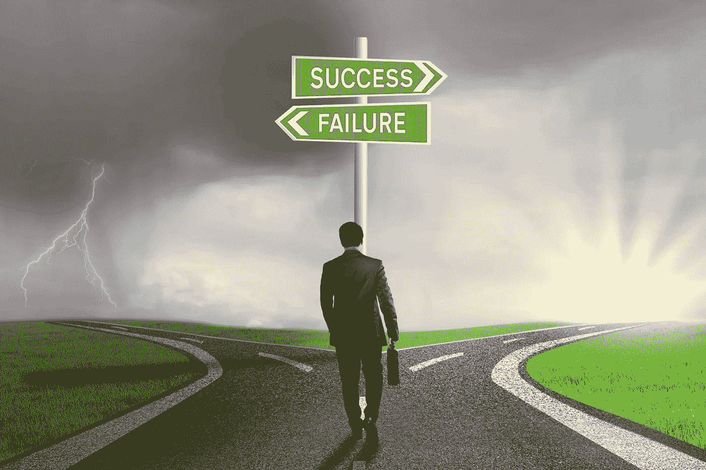

# 成功需要放弃的 5 个习惯

> 原文：<https://medium.com/swlh/5-habits-to-give-up-to-be-successful-a5a34f4aed33>

成功的定义是完成一个目标或目的。

我们如何定义这个目标或目的，就是为什么成功对每个人有不同的意义。最终的目的地是不同的，特别是在定义什么是*成就*方面。

然而，为了最终取得成功，一些生活方式的改变必须到位。