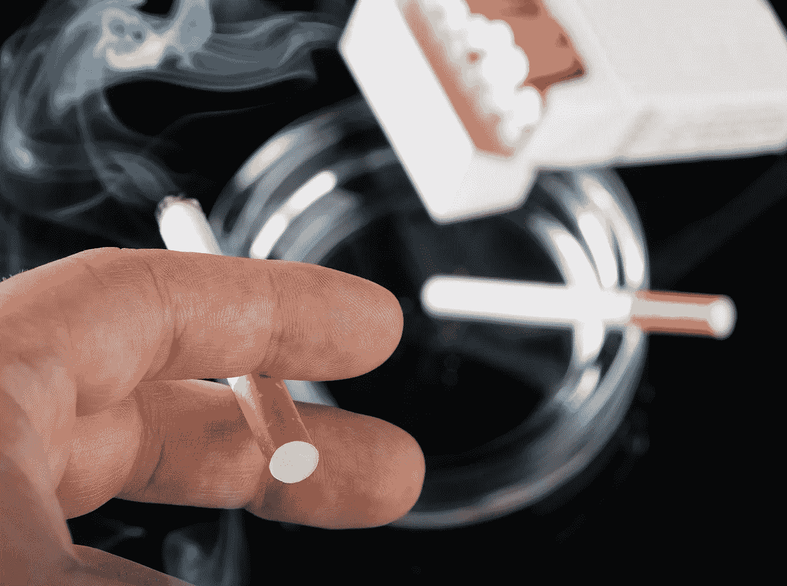

# 你需要立即抛弃的 5 个习惯

> 原文：<https://medium.com/swlh/5-habits-you-need-to-ditch-immediately-20e11005d213>

我们是习惯的动物。从早上醒来到晚上睡觉，我们一整天都在做许多小习惯。从我们每天早上的例行公事，到我们进行日常卫生活动的方式，到我们与人交谈的方式，甚至到我们的想法，我们的习惯既可以推动我们成为更好的人，也可以让我们变得更坏。这就是为什么明智地选择我们的习惯如此重要。在本周的《周四思考》中，我列出了 5 个你需要立即停止的习惯，以及为什么它们如此有害。我希望你喜欢。

**1。停止将自己与他人比较——将自己与他人比较是一件非常棘手的事情。一方面，它可以用来激励你更加努力地去实现你设定的目标。不幸的是，另一方面，它会让你觉得自己不熟练或无足轻重。当你将自己与他人比较时，无论你认为自己比他们好还是比他们差，你都是在为不健康的情绪打开大门，比如骄傲或不安全感。我们都是独一无二的人，当我们将自己的技能、智力或情感与其他人比较时，这是一个灾难的处方。**

**2。不要在反对者身上浪费时间——你周围的人是如此重要。他们是决定你成为什么样的人的人，不管你喜不喜欢。如果你周围的人总是贬低或侮辱你或你的目标，你将更有可能停滞不前，抗拒成长。如果有人不相信你，并不断让你知道，这是一个暗示，从你的生活中移除那个人。阿尔伯特·爱因斯坦曾经说过，“每个人都是天才。但如果你根据一条鱼爬树的能力来判断它，它会一辈子都认为自己很蠢。”其他人可能看不到你的愿景，可能从*他们*的角度认为你是一个低等人类，但这在现实中毫无意义。**

**3。停止抱怨—** 当你抱怨时，你在关注生活中不好的事情。这导致皮质醇激增，你的身体和精神健康随之受损。学会停止抱怨是一件非常重要的事情，因为我们的抱怨塑造了我们的现实。不停地抱怨和关注不好的事情会把你的注意力从生活中所有好的、积极的事情上移开，这些事情会推动你变得更好。

**4。一醒来就停止使用手机——从你醒来的那一刻起，一直到你上床睡觉的那一刻，让别人全神贯注，对你的心理健康极其不利。当你醒来第一件事就是查看手机时，你是在把别人放在第一位。这让你无法专注于自己，并可能导致广泛的心理健康问题。早上和晚上花十分钟到一两个小时不打电话，这对健康和幸福非常重要。**

**5。停止贪睡—** 贪睡键是平均值的定义。当你打盹时，你是在告诉自己推迟你的义务没关系，你对你的一天不感到兴奋。不仅如此，它还会让你处于睡眠惰性状态，在起床后的额外三个小时里，你会更加疲劳。学会避开贪睡按钮是在当今社会取得成功的一个至关重要的习惯，如果你正在寻找从哪里开始的指导(因为这非常难学)，看看我们的*[*无贪睡设置*](https://earlyrisersmovement.com/store/nosnoozesetup) 的框架，我曾经每天早上打 5-6 次瞌睡，然后完全从我的日常工作中去除它。*

*如果你喜欢这篇文章，请随时与我联系！*

*[脸书](http://facebook.com/groups/earlyrisersmovement) | [Instagram](http://instagram.com/earlyrisersmovement) | [领英](https://www.linkedin.com/in/ssdiehm/) | [网站](http://earlyrisersmovement.com)*

# *录像*

# *值得思考和分享的名言:*

********

## *这个故事发表在 [The Startup](https://medium.com/swlh) 上，这是 Medium 最大的创业刊物，拥有 325，962+人关注。*

## *在这里订阅接收[我们的头条新闻](http://growthsupply.com/the-startup-newsletter/)。*

**