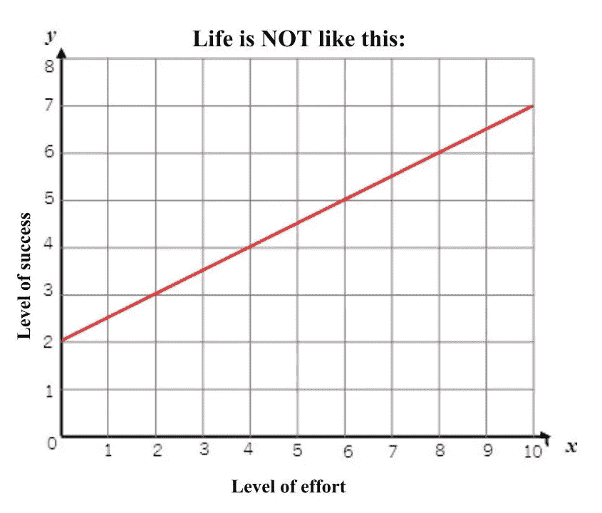

# 如何做到“优秀到让他们无法忽视你”的 5 个隐藏真相

> 原文：<https://medium.com/swlh/5-hidden-truths-on-how-to-be-so-good-they-cant-ignore-you-15e81a955628>

## 在创业世界和更远的地方。

[Photo: Unsplash](https://unsplash.com?utm_source=medium&utm_medium=referral)

演员史蒂夫·马丁经常因为这句实事求是的话而受到称赞:

> "好好表现，让他们无法忽视你。"

但这并不像看起来那么容易。毕竟，你不能只是“做好人”。你不能神奇地迫使人们不再忽视你。

但是我有好消息告诉你。

尽管这不像打个响指那么容易，但也绝对不是**不可能。**如果心态正确，事情也会变得非常简单。

## 隐藏的真相#1:天赋不存在。

记住这个。在这个**星球**上，没有人天生就有你没有的某种技能。你可以学习任何你想学的技能。

如果你记住了这一点，你就再也不会气馁、害怕或犹豫了。你会有狮子般的自信。因为你知道没有全能的超人想把你踢倒。

> 唯一能打倒你的是你自己。

你担心:**“如果【在此插入梦想】已经是最好的，我就不可能成为伟大的【在此插入梦想】！”**

比方说，你想成为一名伟大的音乐家，但艾德·希兰已经成为众人瞩目的焦点。尽管艾德·希兰与你的生活毫无关系，但你还是制造了这个虚假的障碍，因为你缺乏自信。

但是想一想。你认为当阿姆在 2000 年位居排行榜首位时，艾德·希兰就决定退出了吗？

更好的是，你认为谷歌的联合创始人只是因为雅虎而决定关门大吉吗？抢在他们之前上市？当然不是。你也不应该，因为没有人生来就有天赋。只有梦想和实现梦想的决心。

> 如果你的梦想足够强大，你就不应该在乎别人在做什么。这是你的生活和梦想。

## 隐藏的真相#2:成功与努力不成正比。

正如没有完美的人和你作对一样，也没有每周工作 300 小时的半神工作狂。我们都有 24 小时工作日和 168 小时工作周。

大多数人都有这样的问题。他们认为如果他们比其他任何人都努力，他们将会是最成功的。但是生活并不是这样。

当然，最成功的人努力工作，但这不是他们所做的全部。他们聪明地工作。没有天赋这种东西，努力也不是关键，但有一样东西能让这 1%的人与众不同:

**一致性。**

## 隐藏的真相#3: **这都归结于一致性。**

好了，现在是我说漏嘴的时候了。这是我写这篇文章的真正原因。

我一直在做一些关于如何成为一个伟大的媒体作家的研究。事实证明，这就像每天点击一次“提交”一样简单。看看这些:

*   [让我给你讲个小故事。就在世纪之交，高科技在硅谷蓬勃发展——但它也即将破产。

    两家支付技术初创公司 X.com 和 Cofinity 一直在不停地竞争。但是他们的创始人很聪明。毕竟，他们后来会继续创建像 Palantir、SpaceX 和 Tesla 这样的公司。是的，这是贝宝的故事。

    但是如果这两家初创公司在 2010 年的时候互相争斗，就不会有贝宝的故事了。网络泡沫即将破裂。相反，他们冷静的头脑和双赢的态度让他们在危机中坚持下来。

    尝试采用双赢的态度。如果你这样做了，你甚至可能和你以前的竞争对手一起成为下一个“PayPal 黑手党”的一员。

    ## 隐藏的真相#5:每一次成功都是独一无二的。每次失败都一样。

    这里有两点:

    **不抄袭。**你可以尽你所能改善你自己和你的事业，但不要试图成为你不是的人。

    > “下一个比尔·盖茨不会启动操作系统。下一个拉里·佩奇不会启动搜索引擎。下一个马克·扎克伯格不会创办社交网络公司。如果你是在抄袭这些人，你就不是在向他们学习。”
    > ~彼得·泰尔

    **原创。最有意义的问题是那些没有人谈论的问题。**发现那些问题。常见的东西不仅陈腐，而且已经有很多人在解决热门问题:癌症研究、虚拟现实等。****

    > “所有快乐的公司都是不同的:每一家都通过解决一个独特的问题而获得垄断地位。所有失败的公司都是一样的:他们没能逃脱竞争。”
    > 
    > ~彼得·泰尔，又来了

    毕竟，我们告诉我们的孩子，在受欢迎的人群中是没有意义的。

    那么，为什么我们的创业公司不应该也是这样呢？](https://medium.com/u/d0feb9cb177b#4:这个世界不一定要有输赢。</h2>
<p id=)[媒体](/@slu.true)和[推特](https://twitter.com/TheTrueSlu)上给我一个关注！这真的会促使我写更多的东西！:)

## 这个故事发表在 [The Startup](https://medium.com/swlh) 上，这是 Medium 最大的创业刊物，拥有 343，876+人关注。

## 订阅接收[我们的头条新闻在这里](http://growthsupply.com/the-startup-newsletter/)。

