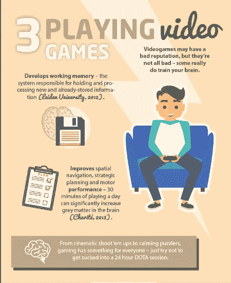
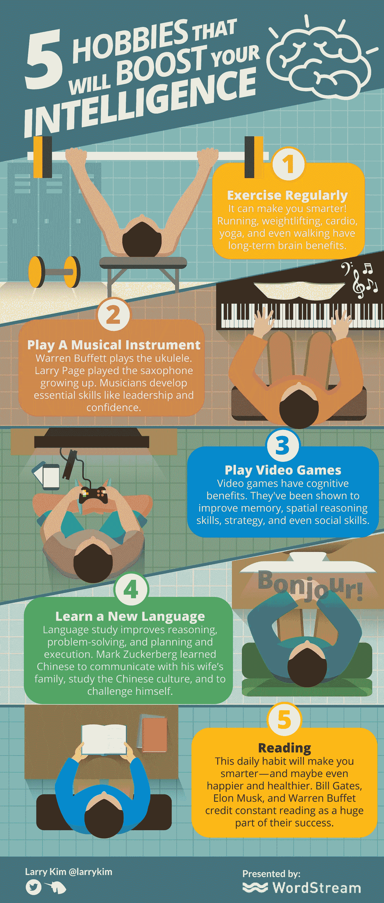

# 5 个能提升你智力的爱好

> 原文：<https://medium.com/swlh/5-hobbies-that-will-boost-your-intelligence-e8d56b437c98>

一些富有和著名的企业家有一些非常奇怪的爱好。

> 爱好对缓解压力很有帮助。但是你知道爱好也能提高你的智力吗？

如果即使是最忙碌的企业家和亿万富翁也能为业余爱好腾出时间，那么你也可以。这里有五个爱好可以考虑。

## 1.定期锻炼

[定期锻炼](http://%3Ca%20href%3D%22http//www.inc.com/larry-kim/12-mindfulness-hacks-you-can-use-in-24-hours.html%22%3Efocus%3C/a%3E,%20be%20%3Ca%20href=%22http://www.inc.com/larry-kim/23-best-productivity-hacks-of-the-year.html%22%3Eproductive%3C/a%3E,%20and%20be%20%3Ca%20href=%22http://www.inc.com/larry-kim/27-quotes-about-happiness-from-entrepreneurial-superstars.html%22%3Ehappy%3C/a%3E)有助于你保持健康——但也能让你变得更聪明。

史蒂夫·沃兹尼亚克打赛格威马球。马克·贝尼奥夫做瑜伽。谢尔盖·布林表演空中飞人。

跑步、举重、有氧运动、瑜伽，甚至只是散步，都会对大脑产生长期的好处，帮助你成为更好的企业家。

甚至[仅仅走路就能提高创造力](http://%3Ca%20href%3D%22http//www.inc.com/larry-kim/9-ways-to-dramatically-improve-your-creativity.html%22%3Ecreative%20thinking%3C/a%3E,%20and%20some%20of%20the%20smartest%20business%20leaders%20regularly%20have%20%3Ca%20href=%22http://www.inc.com/peter-economy/7-powerful-reasons-to-take-your-next-meeting-for-a-walk.html%22%3Ewalking%20meetings%3C/a%3E)。

## 2.演奏乐器

沃伦·巴菲特演奏尤克里里。拉里·佩奇从小就吹萨克斯。许多其他企业家和商业领袖在成长过程中学会了一种乐器，或者一直演奏到今天。

不可否认演奏音乐和成就之间的联系。

音乐人和企业家分享[几项必备技能](http://%3Ca%20href%3D%22http//www.inc.com/larry-kim/5-tips-for-getting-coworkers-on-board-with-your-crazy-ideas.html%22%3Eteamwork%3C/a%3E)，比如[领导力](http://%3Ca%20href%3D%22http//www.inc.com/larry-kim/9-places-to-learn-leadership-skills-for-free.html%22%3Eleadership%3C/a%3E)、[创新](http://%3Ca%20href%3D%22http//www.inc.com/larry-kim/4-must-watch-inspirational-ted-talks-on-creativity-in-business.html%22%3Einnovation%3C/a%3E)，以及[自信](http://%3Ca%20href%3D%22http//www.inc.com/larry-kim/12-tips-for-silencing-the-bad-self-esteem-demon-on-your-shoulder.html%22%3Econfidence%3C/a%3E)。

## 3.玩电子游戏

尽管电子游戏名声不好，但科学已经进入，而且游戏确实对认知有益。

见鬼，很多富人平均每周玩 5 个小时的游戏。像爸爸妈妈告诉你的那样，成为一名游戏玩家不仅仅是浪费时间。

视频游戏已经被证明可以提高记忆力，空间推理能力，策略，甚至社交能力。

因此，无论你是解决复杂的谜题，在后启示录地狱场景中杀死一波又一波的僵尸，还是在圣安地列斯成为一名富有的犯罪策划者，只要适度地玩就行了！

## 4.学习一门新语言

相当令人印象深刻！脸书首席执行官马克·扎克伯格表示，他学习中文有三个原因:与妻子的家人交流，学习中国文化，挑战自我。

所有伟大的理由。还有一个:说多种语言可以提高大脑的执行功能，包括从记忆、推理、解决问题到计划和执行的所有功能。

在当今的全球商业世界中，掌握西班牙语、德语、阿拉伯语、俄语和葡萄牙语等其他语言对企业家极为有益。

## 5.阅读

最伟大的企业家[阅读](http://%3Ca%20href%3D%22http//www.inc.com/larry-kim/you-did-this-as-a-kid-but-the-greatest-entrepreneurs-never-stopped.html%22%3Egreatest%20entrepreneurs%20read%3C/a%3E)。

阅读是一种日常习惯，会让你变得更聪明，甚至更快乐、更健康。

需要一些读什么的想法吗？看看沃伦·巴菲特告诉百万富翁们要读的八本书。另见[乔布斯、](http://%3Ca%20href%3D%22http//www.inc.com/geoffrey-james/12-books-steve-jobs-wanted-you-to-read.html%22%3E)T4、比尔盖茨、[埃隆马斯克](http://%3Ca%20href%3D%22http//www.inc.com/geoffrey-james/9-powerful-books-elon-musk-recommends.html%22%3E)的阅读推荐。

尽管培养这些爱好中的任何一个或全部都不会让你的智商提高到天才的水平，但它们会帮助你保持敏锐的记忆力，增强你的认知能力，并让你的大脑在未来几年保持活力。

# 做驴海里的独角兽

获取我的最佳独角兽营销和创业成长秘诀:

1.  [**报名直接发到你邮箱**](https://mobilemonkey.com/blog-subscription)

**2。** [**通过 Facebook Messenger 注册偶尔的 Facebook Messenger 营销新闻&提示。**](http://m.me/447438332063924?ref=e58448cdd16367419b279793544e132f5388067506f92c92e6)

# 关于作者

拉里·金是全球最好的 Facebook Messenger 营销平台提供商 MobileMonkey 的首席执行官。他也是 T21 的创始人。

你可以在 [Facebook Messenger](http://m.me/447438332063924?ref=e58448cdd16367419b279793544e132f5388067506f92c92e6) 、 [Twitter](https://twitter.com/larrykim) 、 [LinkedIn](https://www.linkedin.com/in/larrykim) 、 [Instagram](https://www.instagram.com/kim_larry/) 上和他联系。

原载于[Inc.com](http://www.inc.com/larry-kim/5-hobbies-that-will-boost-your-intelligence.html)