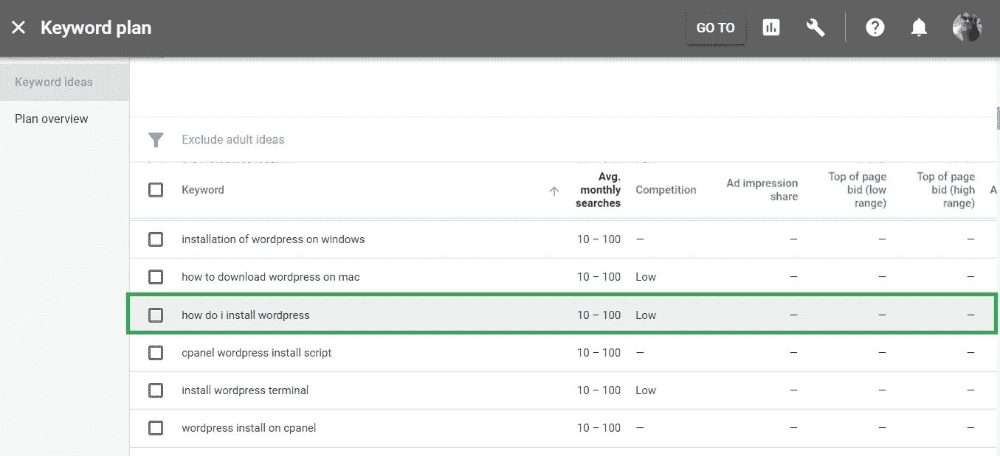

# 5.如何通过回答他们的问题获得更多的客户— 30 天的媒介

> 原文：<https://medium.com/swlh/5-how-to-get-more-customers-by-answering-their-questions-30-days-of-medium-b462d237533e>

欢迎回到 30 天中等。

今天我将向你展示一个在网上发展业务的技巧。

如果你错过了，你可以在这里赶上 Medium 的前 4 个**日:**

## [0。30 天的介质](/swlh/30-days-of-medium-c7ab34953c6c)

## [1。建立自己的网站需要什么？— 30 天的培养基](/swlh/1-what-do-you-need-to-build-your-own-website-30-days-of-medium-1ed1ad4e505c)

## [2。如何找到自己热爱的事业— 30 天的媒介](/swlh/2-how-to-find-a-business-you-love-30-days-of-medium-cb7a4a702d1b)

## [3。如何建立自己的网站—媒体 30 天](/swlh/3-how-to-build-your-own-website-30-days-of-medium-587f994672ec)

## [4。如何衡量你网站的表现——30 天媒体](/swlh/4-how-to-measure-your-websites-performance-30-days-of-medium-75e650969695)

## [5。如何通过回答他们的问题获得更多的客户——30 天介质](/swlh/5-how-to-get-more-customers-by-answering-their-questions-30-days-of-medium-b462d237533e)

## [6。成功的商业网站备忘单——媒体 30 天](/swlh/6-the-successful-business-website-cheat-sheet-30-days-of-medium-42f89eb43e67)

## [7。如何衡量成功——30 天中期](/swlh/7-how-to-measure-success-30-days-of-medium-3da43f4b4a44)

## 8。了解在线销售漏斗——30 天媒介

## 9。什么是流量，为什么流量很重要？— 30 天的培养基

## 10。什么是 Google URL Builder，为什么要使用它？— 30 天的培养基

## 11。通过自动化你的社交媒体日程，让你的流量翻倍——30 天的媒体

## 12。如何辨别什么好卖——30 天介质

## [13。我如何在 6，500% — 30 天的培养基中培养我的培养基](/swlh/13-how-i-grew-my-medium-following-6500-30-days-of-medium-c9d2d6f80b51)

## [14。你如何看待事情很重要——30 天中等](/swlh/14-how-you-look-at-things-matters-30-days-of-medium-f641b9733b90)

## 15。如何向小型企业销售服务— 30 天介质

## [16。如何通过有效的提案赢得更多交易— 30 天的媒介](/swlh/16-how-to-win-more-deals-with-effective-proposals-30-days-of-medium-481f16bbc86f)

## [17。如何在 10 分钟内建立一个网上商店——30 天的媒介](/swlh/17-how-to-setup-an-online-store-in-10-minutes-30-days-of-medium-a4f955e9b493)

## 18。如何在任何地方工作— 30 天的媒介

## [19。为什么你的网站会破坏你的销售——30 天媒体](/swlh/19-is-your-website-sabotaging-your-sales-30-days-of-medium-f63bdbdb350)

## [20。你的流量从哪里来？— 30 天中值](/swlh/20-where-does-your-traffic-come-from-30-days-of-medium-a9b2d2c088bb)

## [21。如何真正识别倦怠——30 天中等强度](/swlh/21-how-to-actually-recognise-burnout-30-days-of-medium-7972a7a7a89e)

## [22。如何修改你的时间表并完成两倍的工作——30 天中等时间](/swlh/how-to-hack-your-schedule-and-get-twice-as-much-done-30-days-of-medium-441a509dc9be)

## [23。不要模仿你的竞争对手——30 天的媒介](/swlh/23-dont-copy-your-competitors-30-days-of-medium-56382b7ba8ed)

## [24。如何 SEO 优化一篇博文——30 天的媒介](/swlh/24-how-to-seo-optimise-a-blog-post-30-days-of-medium-80180eba4e8b)

## 25。独一无二或者被遗忘——30 天灵媒

## 26。跟着感觉走——30 天中等水平

## 27。人们不支付平均 30 天的中等费用

## 28。如何做关键词研究— 30 天介质

## 29。为什么帕累托原则是世界上最大的诀窍——30 天中期

## 三十。你的内容比你的电话更有利可图——30 天的媒介

# 通过成为你所在领域的权威来赢得客户

最近，我一直在试图与一张看起来很可怕的税单搏斗，这张税单涉及从一家美国公司向一家英国公司支付代销商佣金。

这个过程一直是一个**非常令人沮丧。**

在任何地方都没有简单的答案，这对我来说似乎很荒谬，因为这可能是很多人都在处理的事情。

# 如果有疑问，就用谷歌搜索一下

为了找出答案，我在谷歌上搜索了一下。我惊讶地发现，在我正在处理的这个**问题**上，有几条内容非常具体。

我更惊讶的是，他们中没有一个人**真的有帮助**。

他们都谈到了不同类型的税务表格，并对它们进行了概述。

虽然我知道公司**不能**或**不想**给出任何**税务建议**，但如果他们提供了足够的价值并给了我以下内容，这绝对是把我变成未来客户的绝好机会:

“虽然我们不能提供税务建议，但假设一家总部位于英国的公司从一家美国公司获得关联收入，将需要此表格，并需要用‘X’回答第 2 部分(没有意义的部分)。如果您不确定，我们建议您联系您的会计师。”

# 将这些问题转化为客户

听说过 [**谷歌关键词规划器**](https://adwords.google.com/aw/keywordplanner/) 吗？

这是一个免费的工具，用于检查关键字在谷歌中的搜索量和竞争力。

你可以使用这个工具来查看人们在搜索什么东西，并获得一大堆查询数据。

使用 Google Keyword Planner，你可以搜索所谓的**长尾搜索词**，它们通常有 3-4 个词或更长，搜索量**比宽泛的短词**低，竞争**也低。**

这些术语非常具体，通常背后都有商业意图。

因为他们有一个**较低的竞争水平**，他们很容易在谷歌排名。

Long tail keywords

看看**超限定**这个关键词是怎样的。

这个人需要**帮助安装 WordPress。**

我经营一家 WordPress & Woocommerce 公司。

即使他们不需要有人为他们建立一个网站，他们可能需要帮助安装 WordPress 或设置他们的主题。

如果我的网站上有关于这个关键词的很棒的内容，他们很可能会决定给我发电子邮件，或者在未来使用我，因为我通过给他们**免费价值**在他们那里建立了权威**。**

# 要找什么

在你的领域寻找**低竞争低销量关键词**和**商业意图**。

**How to** “搜索查询”通常是客户寻求帮助，是进入销售流程的好地方，可以引导客户并为他们建议正确的行动方案。

开始撰写经过充分研究的内容，提供这些问题的答案，并确保它们是正确的 **SEO 优化的**。

不要期望一夜之间就有结果，做好努力工作的准备，这样你就可以开始收获建立威信的回报。

## 关于这个话题有什么问题吗？请在评论中告诉我。

## 你可能也喜欢这个:

## [为什么 WordPress 是在](/swlh/why-wordpress-is-the-best-platform-to-build-your-business-or-startup-website-on-df3fe932fad7)上建立业务或创业网站的最佳平台

## 如果你喜欢这个故事，请点击👏按钮并分享，帮助其他人找到它！欢迎在下方留言评论。

## 这个故事发表在 [The Startup](https://medium.com/swlh) 上，这是 Medium 最大的创业刊物，拥有 317，629+人关注。

## 在这里订阅接收[我们的头条新闻](http://growthsupply.com/the-startup-newsletter/)。

