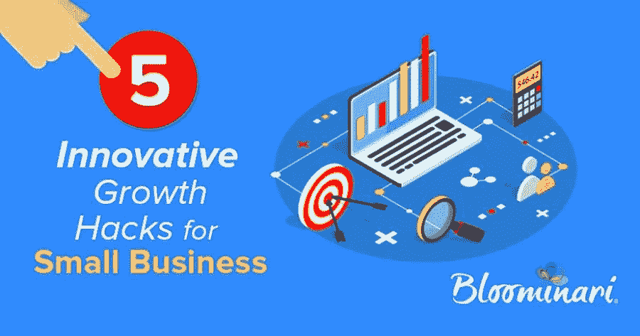

# 小企业的 5 个创新增长秘诀

> 原文：<https://medium.com/swlh/5-innovative-growth-hacks-for-small-business-d67af70ea2af>

# 不费吹灰之力拓展业务

小企业主变得如此全神贯注于管理他们企业的日常任务，以至于没有时间去发展它们。然而，增长对于在竞争中领先一步至关重要。你如何用相对较少的努力来发展你的业务？从这些"[成长秘诀](https://www.bloominari.com/blog/take-load-off-your-small-business)"中的一个开始

# 1.尝试基于员工的推荐计划。

最近的研究表明，你的员工和你自己的社交媒体网络有高达 8%的重叠。这是一个很好的促销机会。IBM 启动了一项员工推荐计划，发现来自社交媒体的线索转化频率是来自其他来源的线索的七倍。通过创建一个[以员工为中心的推荐项目](https://www.bloominari.com/services/marketing-strategy-consulting)，你可以在提高员工满意度的同时增加利润——这是一个双赢的局面。它还节省了昂贵的营销活动费用。

# 2.尽可能自动化

自动化重复性任务可以[帮助你的企业更快发展](https://www.bloominari.com/blog/reasons-use-marketing-automation-software-small-business)。两种最有效的业务自动化是在你的市场营销和销售部门。例如，自动化您的电子邮件营销活动可以让您的营销部门腾出时间来创建精彩的内容和开发新的营销活动，而自动化您的销售部门耗时的任务可以让您的团队积极地寻求更多的线索。

# 3.明智地使用社交媒体

一些小企业陷入了试图通过所有可能的社交媒体网络寻求参与的陷阱。不幸的是，这只会让你把自己铺得太薄。做一些市场调查，了解你的目标受众。这将有助于你做出选择某些社交媒体途径的决定。例如，当你的大多数目标受众都超过 40 岁时，拥有一个 Snapchat 账户并没有多大好处。

# 4.使用有机销售策略

在网络空间中，广告无处不在——但是人们仍然不喜欢被推销的感觉。当其他人都在利用付费或赞助内容时，很容易忘记有机 SEO 策略。人们喜欢感觉好像他们在做自己的研究，而不是被引诱到一个网站。事实上，用户搜索是网站流量的第一要素，所以不要忽视你的有机 SEO 努力。

# 5.完全拥抱移动

到目前为止，许多企业已经针对手机优化了他们的网站。如果没有，你可能会落后于形势。确保您的网站易于导航，无论人们使用什么设备访问它。但这还不止于此:考虑进入移动广告的世界，特别是因为人们在移动设备上花费的时间比台式机或笔记本电脑更多。最后，考虑一个移动应用程序来鼓励易用性和转换。与浏览移动网络相比，电子商务商店在应用程序上的添加到购物车选项增加了 90%。

发展你的业务不一定是一件苦差事。通过观察一些简单的技巧——比如明智地使用你的时间，为你的移动受众投入足够的时间和精力——你可以增加你的转化率并最终推动销售。这将允许你用相对较少的时间和金钱投资[发展你的业务](https://www.bloominari.com/services/technology-solutions-automation)。

*原载*[*www.bloominari.com*](http://www.bloominari.com)

## 这篇文章发表在 [The Startup](https://medium.com/swlh) 上，这是 Medium 最大的创业刊物，拥有 275，554+人关注。

## 在此订阅接收[我们的头条新闻](http://growthsupply.com/the-startup-newsletter/)。

