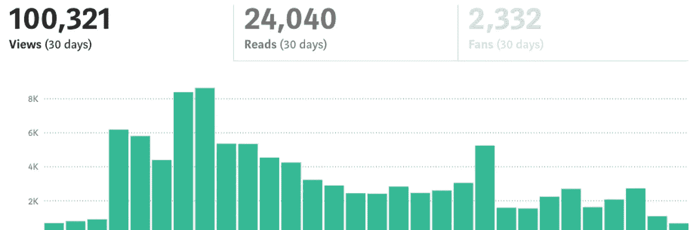
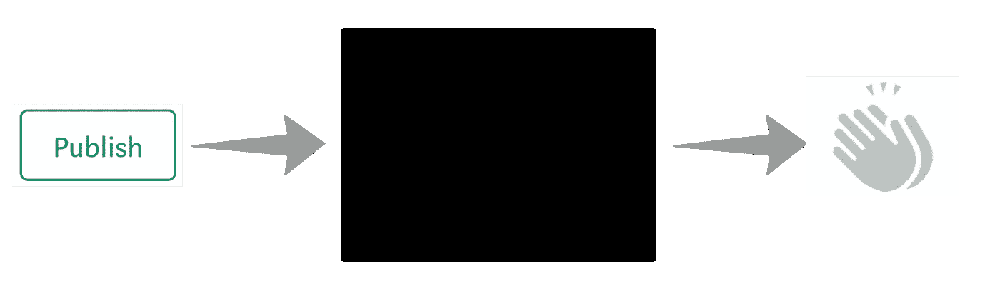
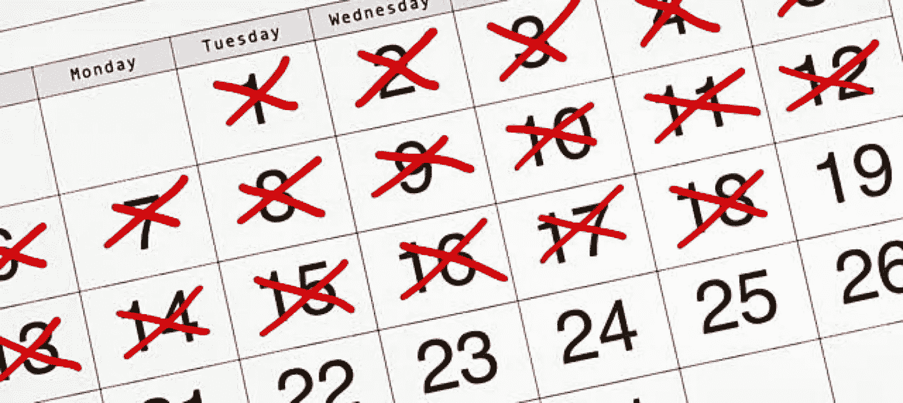
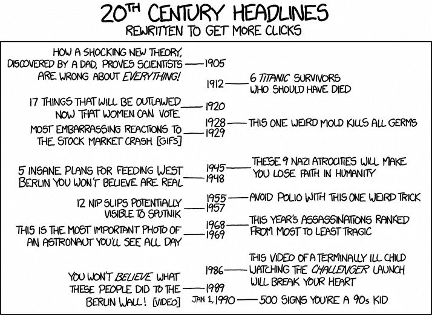

# 每天写作的 5 个感悟

> 原文：<https://medium.com/swlh/5-insights-from-writing-every-single-day-1f2640b14621>

## 辛苦 30 天，100，000 次浏览后…

# 介绍

这篇文章不是原创的。这肯定不是第一次。我需要一个科学计算器来计算出我在 Medium 上写帖子所学到的*的实际数量。*

不管怎样，我还是要发表这篇文章。为什么？因为最近 30 天每天早上都写完了。对于许多知名作家来说，这是一件轻而易举的事情。许多人谈到了 T2 每天写作和挤出时间来发挥创造力的重要性。

*但那不是我。*

在此之前，我从未连续五天写作。更别说整整一个月了。我会经历一段时间，在这段时间里，我发表了很多文章，然后是几周甚至几个月的电台沉默。我是那种当灵感来临时或者当一个项目有了成果时就写作的人。不多不少。

我想改变这一切。我知道写作的好处，但是我没有给自己一个机会去体验它们。

> “不管你是写日记还是把写作当作冥想，都是一回事。重要的是，你在和自己的思想建立关系。”—娜塔莉·戈德堡

我知道我想去哪里。我也知道，就像大多数有价值的事情一样，达到目的的唯一方法是每天都靠在身体上练习。

带着这个想法，我开始了。

Source: [Unsplash](https://unsplash.com/search/photos/writing?utm_source=unsplash&utm_medium=referral&utm_content=creditCopyText)

# 该过程

我知道如果我要每天写作，它必须是早晨的第一件事。我非常相信立刻做最重要的事情。对我来说，这包括在每个工作日早上 7 点上班前划出一个小时。到了周末，有时会有一场混战，但我确保它发生了。我不能让自己打破这个记录。

> 经过足够的刻意练习，你会变得更好。就这么简单。

随着时间的推移，我开始形成一种节奏。我看到一些变化开始发生。我的写作提高了。我变得更善于与我的听众交流，分享想法，用简单的语言交流复杂的想法。

反过来，我的作品开始接触到更多的人。我看到我的追随者增加了 1000 多名用户，我的每周简讯订阅量增加了一倍多。在这个月的最后一天，我达到了前 30 天 100，000 次浏览的里程碑。

随着这次经历接近尾声，我决定坐下来反思一些事情。我抓起记事本和笔，写下我在整个过程中学到的一切。以下是我带走的 5 个最有影响力的见解和观察。

# 写作是一个黑盒子

当设备、过程或系统具有已知的输入和输出，但内部工作方式未知时，某些东西被称为 [*黑盒*](http://www.businessdictionary.com/definition/black-box.html) 。我写的越多，发表的越多，我就越觉得写作是一个黑箱。我来详细说明一下。

你有一个想法，你想发展或分享，所以你坐下来，启动媒体或你选择的文本编辑器。一旦你最终完成并修改了你的作品，是时候出货了。

你把你的思想和想法带到这个世界上，却不知道它们会被如何看待。即使过了一段时间，反馈也会以超高水平的指标形式给出，比如浏览量、掌声或粉丝数。

在发布按钮和那些反馈统计数据之间发生了什么？

事实是我们不知道。我们得到的最接近真实反馈的信息来自于那些少之又少的反馈。目前读者和作者之间的反馈回路远非完美。

我们被迫依靠虚荣心来解释我们工作的接受程度。我不相信纯粹的掌声数量是一个故事及其影响力的最强有力的指标。虽然现在，这是我们最好的。

# 克服犹豫

航运并不总是像其他一些文章和报价看起来那么迷人。有时很难点击发布。在我写作生涯的早期，这一点对我来说尤其如此，直到今天它仍然影响着我。

这就是出版你的作品的严酷现实。我们害怕它不会引起共鸣或者别人会通过联想来评判作品和作者，所以我们犹豫不决。不管这种犹豫是持续一秒钟还是一个月，我们都因为恐惧和不安全感而推迟了发货。

> “在没人听的时候发表需要勇气，但你必须”

前面提到的流程的黑箱性质进一步加剧了这种情况。如果你的驱动力是浏览量和其他虚荣心指标，当他们让你失望时，你会筋疲力尽——他们会的。

相反，把注意力放在如何与他人分享你的想法和观点能够积极地影响你的成长。这种思维方式的简单转变可以让运输变得更加容易，尤其是每天练习的时候。

随着时间的推移，你会越来越习惯点击 P*publish*。这并不总是容易的，有时仍然会很困难。但是我们必须。

# 积聚动力

我注意到，最困难的部分出现在我前一天努力完成日常工作之后。然而，最容易的训练通常是在连续第四天或第五天的比赛中进行。

这绝不是巧合。动量是一个强有力的工具。在一个大日历上标记一个 *'* X '来写下那一天，这个简单的动作对我非常有帮助。这种黑客行为通常被认为是喜剧演员[杰瑞·宋飞](https://lifehacker.com/281626/jerry-seinfelds-productivity-secret)所为。

> “几天后你就会有一条链子。只要坚持下去，这个链条就会一天比一天长。你会喜欢看到那条链子，特别是当你有几周时间的时候。你接下来唯一的工作就是不要打破链条。”—杰瑞·宋飞

不要弄断链条。就这么简单。要想在某方面出类拔萃，你必须每天朝着最终目标不断前进。

Source: [Pittand](http://pittand.com/2018/01/11/dont-break-chain/)

赢得你的“X ”,继续前进。第二天早上，当你坐下来，看一眼那张空白的纸，看着那些纯粹出于习惯的想法流到画布上，你会感谢你自己。

# 更多的投入=更多的产出

这看起来很直观，但却经常被忽视。在我的经历中，我注意到一个有趣的模式。我消费的高质量内容的数量和产生想法的容易程度之间有明显的相关性。

> “我没有什么是原创的。我是我认识的所有人的共同努力。”—恰克·帕拉尼克

这种心态令人难以置信地自由。让你感到安慰的是，你不必从头开始创造。你可以混合一些你喜欢的东西，用那种方式创造一些新的令人兴奋的东西。这本受欢迎的书由奥斯丁·克莱恩所著， [*【偷像艺术家】*](https://www.amazon.com/dp/B0074QGGK6/ref=dp-kindle-redirect?_encoding=UTF8&btkr=1)*进一步探讨了这一主题。*

*对我来说，这体现在播客、文章和书籍中。通过积极地阅读或倾听并做笔记，我收集了不同的片段和发展的想法。这些作品给了我灵感，并最终被塑造成我自己独特的想法，成为后来文章的基础。*

# *做能引起共鸣的事*

*即使从别人那里获得灵感，也不总是容易想到要写的想法。我知道当我连续一个月每天都试图出货时，我一直在为此挣扎，我只成功了 20 次。我发现特别有帮助的一件事是重置我的思维，专注于与我有共鸣的东西。*

*每隔一段时间，我发现自己开始根据我认为别人会如何理解来评估帖子的想法；而不是我的感受。*

> *试图为你的观众创造并不一定是一件坏事，但如果不加以控制，这可能会很危险。*

*当你写一些让你兴奋的东西时，你的最佳作品就会出现。这是无法避免的。如果你对 X 或 *10* *阅读会改变你的理由*的*区块链不感兴趣，那就不要写那些帖子。从观点的角度来看，它们可能做得更好，但除非你对主题感兴趣，否则它们不会是你最好的作品。**

**

*Source: [xkcd](https://xkcd.com/1283/)*

*通过将你的注意力转移到与你有共鸣的事情上，你保证你会更喜欢写这篇文章，反过来，它会写得更好。*

*此外，Medium 每月有超过 3000 万用户。相信有人会对你感兴趣的东西感兴趣。不要迎合大众，迎合你的兴趣和想法。人群会来的。*

# *让我们回顾一下*

*这一经历始于一个简单的 [30 天挑战](https://www.ted.com/talks/matt_cutts_try_something_new_for_30_days)。最初，我想成为一名更好的作家，并获得一些被其他人广泛报道的好处。这个实验绝对没有失败。让我们回顾一下我们已经提到的关键见解和要点:*

*   ***写作是一个黑盒***
*   ***克服犹豫***
*   ***造势***
*   ***更多的输入=更多的输出***
*   ***做能引起共鸣的事***

*所有这些认识都极大地影响了我。然而，重要的是要注意到好处不止于此。我得到的回应和反馈也是无价的。*

*它们意味着我过去一个月的时间不仅仅是为了我个人的成长。它不仅帮助我提高了作为一个作家和思想家的能力，而且对其他人也产生了积极的影响，不管这种影响有多小。*

> *出版是将你的思想和想法传递给世界的行为。很高兴知道有人在接收端。*

*虽然这个挑战[不一定适合每个人](https://writingcooperative.com/4-reasons-why-you-should-and-should-not-write-a-story-everyday-b7fef4be7ff0)，但我怎么推荐都不为过。我已经做了很多不同的实验，但是每天积极地写作和发布是最有益的。*

*我的下一步是什么？我计划继续每天写作，并坚持不懈地运送我的作品。通过这次经历，我明白了，我不想再回去了。我只能希望你也一样。*

*感谢阅读！请随意查看下面我的一些类似文章，并订阅我的时事通讯中有趣的链接和新内容。*

*   *我独自一人徒步穿越欧洲 3 个月——以下是我学到的东西*
*   *[我最近在读的东西](https://www.conordewey.com/blog/what-ive-been-reading-lately/)*
*   *[每一章的思考速度快，慢在 7 分钟](https://www.conordewey.com/blog/every-chapter-of-thinking-fast-and-slow-in-7-minutes/)*

*你可以在 [Medium](/@conordewey3) 上关注我更多类似的帖子，也可以在 [Twitter](https://twitter.com/conordewey3) 上找到我。想了解更多关于我和我在做什么，请查看我的网站。*

**

## *这个故事发表在 [The Startup](https://medium.com/swlh) 上，这是 Medium 最大的企业家出版物，拥有 343，876+人。*

## *在此订阅接收[我们的头条新闻](http://growthsupply.com/the-startup-newsletter/)。*

**