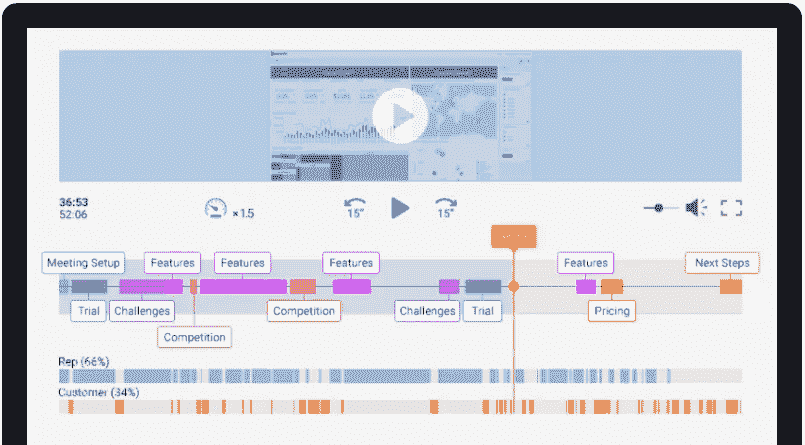
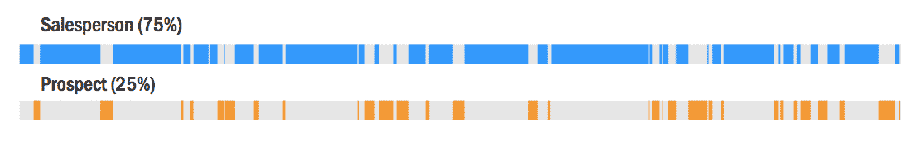
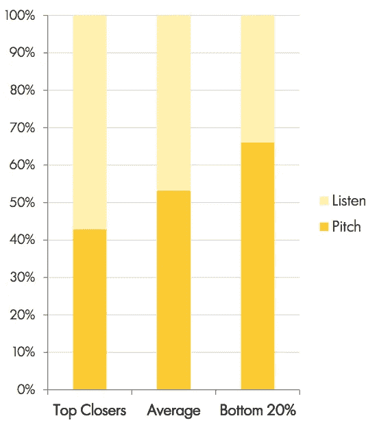
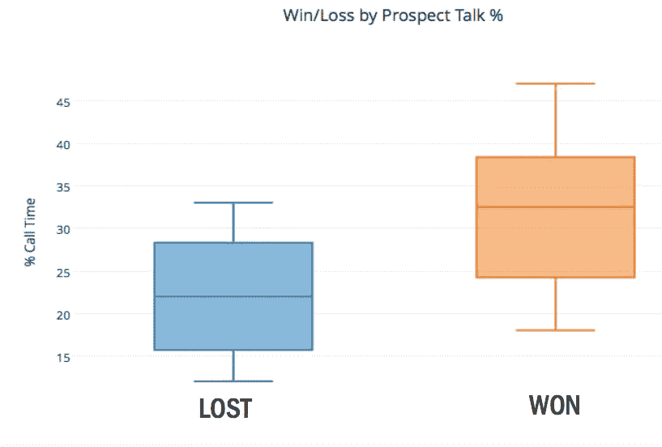
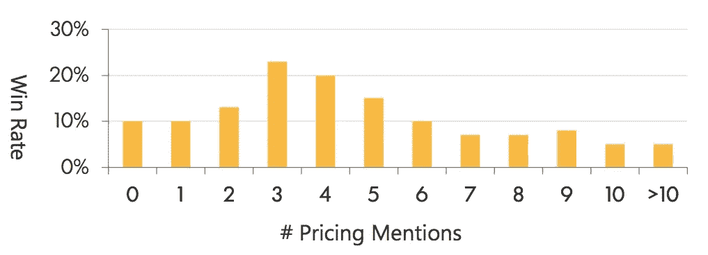
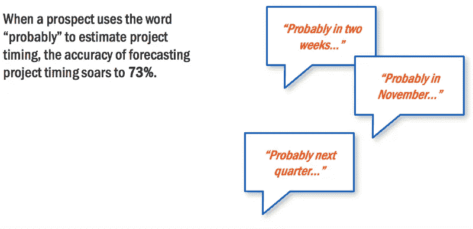
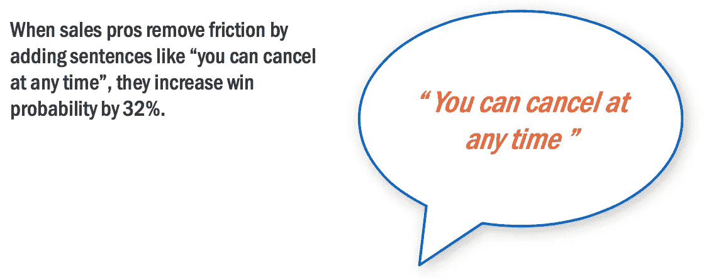
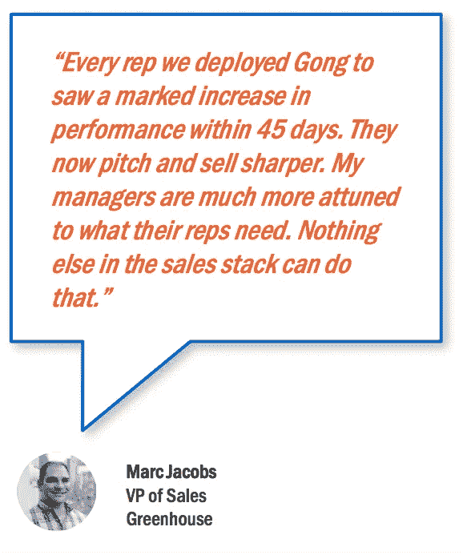

# 通过分析 25，537 次与人工智能的 B2B 销售对话，揭示了 5 点见解

> 原文：<https://medium.com/swlh/5-insights-revealed-from-analyzing-25-537-b2b-sales-conversations-with-ai-920e7c3f8c77>

## 所有这些都是为了找出销售电话中真正有效的方法

我的心沉了下去。

我刚刚开始在 [Gong.io](http://gong.io) 的新工作，我就被*立即*派去与一位*的大*潜在客户现场会面，试图敲定这笔交易(或者至少让它进入下一个合乎逻辑的步骤)。

我的新团队指望我来完成这个项目。这对我们来说意义重大。

在整个会议中，我的信心水平上下波动，因为购买小组似乎对我感兴趣。

这些家伙很难读懂。

然后他们说了一句可怕的话…

我问他们购买的时间表，他们回答说:

> 好问题。这项技术看起来非常有趣和有用。我们仍然需要弄清楚谁能最终决定这件事。下周我们会回来陪你。

我知道你在想什么…这难道不是一个好的迹象吗？

难道他们看起来不是朝着正确的方向前进吗？

那不是“买入信号”吗？

# 违反直觉的销售呼吁洞察力

到这篇文章结束时，你会明白为什么那个粗体字让我感到恐惧。

但我要分享的不仅仅是这些。

我的意思是…

为了让你理解下面的研究和数据，你必须了解一些关于[龚](http://gong.io/)的事情，以及我们所从事的行业。

那就是 [B2B 销售对话智能。](http://www.forbes.com/sites/gilpress/2016/06/21/artificial-intelligence-discovers-how-to-improve-sales-performance/#570d7ccd418f)

从广义上讲，我们提供了记录和转录销售电话的平台，将它们映射到 CRM 结果，并使用人工智能来分析哪些销售行为导致了最高的胜率。

*这就是为什么这篇文章的其余部分与这个背景相关……*

# 数据驱动的销售对话？

在我们的 17 位客户中，我们分析了匿名化的销售对话数据，试图回答这个问题:*哪些对销售拜访有效(哪些无效)？*

这些数据来自一些知名的 B2B 技术公司，通常规模在中端市场。

我们的目标是找出导致最佳销售结果的对话模式和趋势:更高的胜率、更多的收入和更短的销售周期。

# 我们是如何做到的

## **首先，这里是我们用来揭示这些趋势的分析方法的概要:**

*   分析了在 GoToMeeting、join.me 和 Webex 等平台上进行的 25，537 次 B2B 销售电话的通话记录——平均通话时长为 43 分钟。
*   首先，我们将 CRM 机会结果与每个相应的电话联系起来
*   然后，录音与说话者分离，并清晰地从语音转换为文本
*   最后，我们用龚的人工智能引擎对电话和记录进行了分类

*这是我们目前所学的…*

# **一:黄金“听说比”**

大多数销售代表说话的方式比他们认为的要多。销售代表平均花费 65–75%的通话时间来说，而不是听。

The typical dialogue between sales rep, and prospect

最高收益的销售对话大约占通话总时间的 43%。

43/57 seems to be the golden ratio

事实证明，将*客户的*谈话时间从 22%增加到 33% *会从根本上*提高销售业绩。

There is a direct correlation between listening time, and win-rates

# 第二:让我们谈谈价格

理想的销售对话遵循一种可预测的模式，即*何时*以及*多久*讨论一次定价。

Pricing comes up 3–4x in the ideal sales conversation

如果在价值确定之前讨论定价(太早)，少于 3 倍(不够)，或多于 5 倍(太多)，达成交易的机会就会减少。

在一次通话中，价格出现的黄金次数似乎是 3-4 次。

这并不是说你的销售代表应该*努力*确保价格出现那么多次。

这与其说是一种销售技巧，不如说是一种购买信号。

如果你想从这一见解中获得一个销售技巧，那就是:**在谈价格之前先确立价值。**

# 第三:潜在客户时间表的信号与噪音

回想一下我开头的故事。

当潜在客户*在回答我的时间表问题时回答“我们仍然需要弄清楚 _ _ _ _ _ _ _ _ _ _ _ _ _ _ _ _ _ _ _ _”时，我提到我“感到恐惧”。*

*事实证明，当潜在客户用以下短语回答您的时间表问题时，在您的预期预测范围内达成交易与*负相关*:*

> *“我们仍然需要弄清楚还有谁需要参与进来。”*
> 
> *“我们需要弄清楚预算从何而来。”*
> 
> *“在继续前进之前，我们仍然需要找出你的产品的最佳内部用例。”*

*“我们需要弄清楚 ______________”是死亡之吻(好吧，这有点夸张)。*

*当然，我们要记住相关性和因果性不一样(我们知道区别，对吧？).*

*在这枚硬币的另一面，我们还发现了一个**正**时序关联。*

*当潜在客户用**“可能”**这个词来回答你的时间表问题时，这与在你的预期内达成交易有正相关关系。*

**

*违反直觉，但却是事实。*

*毕竟，“可能”并不是决定性的语言。*

*事后看来，你可以说潜在客户给出了更谨慎的答案，因为他们考虑购买的认真程度。*

# *第四:用规避风险的语言安抚他们的恐惧*

*当销售代表谈论(并积极兜售)扭转风险的交易政策时，胜率往往会飙升。*

*这些是交易条款，如…*

*   *选择退出条款*
*   *退款保证*
*   *轻松取消*
*   *等等。*

**

*不要隐瞒这样一个事实，如果客户不喜欢你的产品，他们可以很容易地“退出”。*

*让他们一清二楚。*

# *第五:蔻驰销售人员的对话水平*

*销售领导能够参与的最有影响力的活动莫过于指导他们的销售代表改善他们的销售对话。*

*这就是像龚这样的对话智能技术的用武之地。*

*当使用这种类型的技术来执行电话记录审查和指导时，销售组织发现其销售团队达成交易的能力大幅提升。*

**

# *最后*

*我们已经正式进入了一个新时代:在这个时代，销售职业可以像市场营销职业一样拥有很多分析学科。*

*现在我们已经公布了第一波数据，你有什么想法？*

*这篇文章的哪些方面让你感到惊讶？*

*或者你的直觉仅仅是用硬数据验证的？*

****附言*** *如果您喜欢刚刚阅读的内容，请按下面的* ❤-shaped 按钮“推荐”这篇文章好吗？*