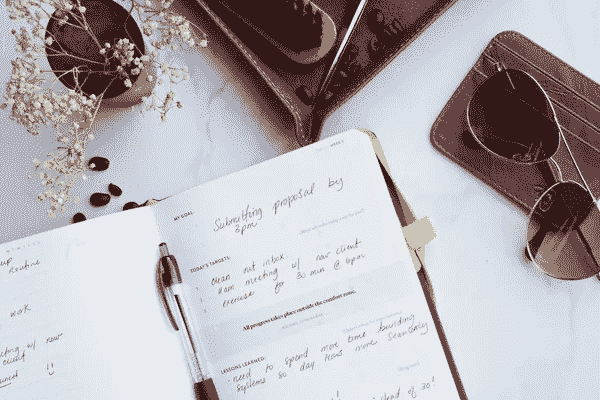

# 每个企业家必须拥有的 20 美元/€20 以下的 5 件物品

> 原文：<https://medium.com/swlh/5-items-under-20-20-every-entrepreneur-must-own-10ef5a403134>

# 1.笔记本/鼹鼠皮笔记本

定期写日记和做笔记是实现你想法的最快和最有效的方法。现在格式并不重要，关键是要养成一个有规律的写作习惯。记录你的进步，计划你的目标，监控你的进步。这一单采购将会使你的生产率提高 100%。