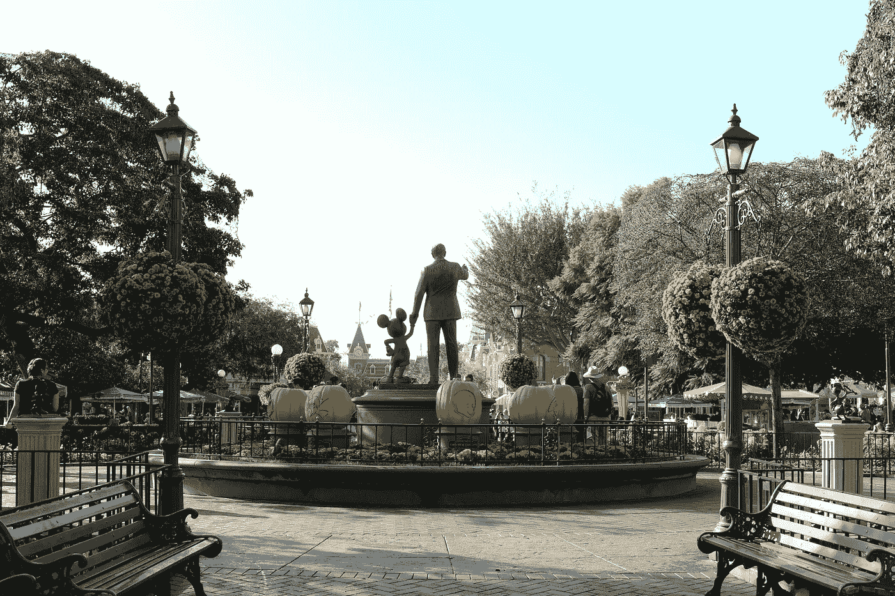

# 来自迪士尼乐园的 5 个关于保持活力和保持梦想的教训

> 原文：<https://medium.com/swlh/5-lessons-from-disneyland-on-staying-animated-and-keeping-your-dreams-big-77feabb75e79>

> *“太多人长大了。这才是这个世界真正的麻烦，太多人长大了。”—华特·迪士尼*

我从上周的迪斯尼乐园之旅中学到的第一件事是:**在*马特宏峰*T5【不可能不微笑。**