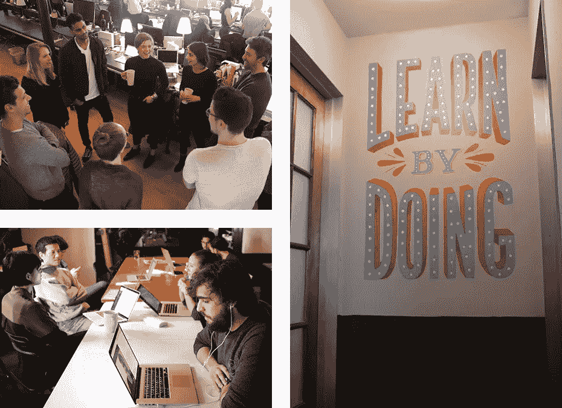
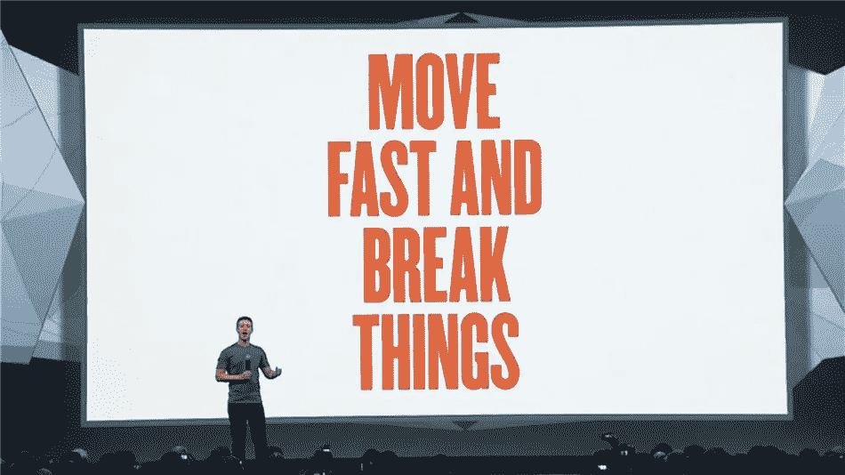

# 建设公司文化的 5 条经验

> 原文：<https://medium.com/swlh/5-lessons-from-growing-the-skillshare-team-to-50-8488adad9903>

## 像设计产品一样设计你的文化。

文化是扩展和建立一个成功的公司的最重要的基础。这对于 Skillshare 从一个小型初创公司成长为一个有凝聚力的 50 多人的团队至关重要，也是我们为数百万会员构建的[平台的核心。](http://skillshare.com/)

如果你建立了正确的文化，它将决定谁会被雇佣，人们的行为和决策。文化是公司的暗流。创造伟大的文化是每个人的工作和责任，但引导它是领导者的工作。

在引导文化和让它有机发展之间有一个微妙的平衡。以下是我从建立和发展公司文化中学到的五条可行的经验。

# 1.定义你雇佣的人以及他们如何一起工作

我们在 Skillshare 做的第一件事就是创建我们的价值体系。这个价值体系决定了谁被雇佣以及他们如何一起工作。

在早期，文化契合围绕着啤酒测试——你能和这个人喝杯啤酒吗？这不起作用，所以我们把它改成了飞机测试——在从纽约到旧金山的飞机上，你能拿瓶啤酒坐在这个人旁边吗？

这种测试的问题在于，你下意识地根据你是否想和一个人成为朋友来做决定。这不会创造出对伟大作品至关重要的多样化观点，而且会导致千篇一律。我们从未定义我们的价值体系，所以我们没有比较的基础。

因为最好的文化来源于人们采取的行动，所以必须围绕最佳行为定义期望，这为价值体系奠定了基础。在 Skillshare，我们的价值体系分为两部分:

*   ***核心价值观****——决定谁被雇佣、提升或解雇。这些是我们重视的个人行为和特质。*
*   ***原则*** *—我们渴望作为一个集体团队一起工作。把这些想象成我们可以在会议中用到的短语。*

我们的核心价值观是:

*   自我激励者
*   健康
*   适应性
*   T21 资源
*   追求卓越

我们有一个专门针对这些核心价值观的面试流程，我们因为这些人而与他们分道扬镳，并根据我们的核心价值观和原则提拔他们。这让我们能够建立并保持一个多元化的团队。

比如我们有面试问题，对每个核心价值观都有明确的预期。缺乏谦逊是候选人无法通过整个面试过程的首要原因。谦逊程度高的候选人在任何情况下都首先对自己负责，而不是责备他人。

我们已经放弃了那些过于消极或急于指责他人的候选人——即使他们是超级明星。不值得它日积月累的文化债务。

如果核心价值观意味着在个人层面上定义行为，那么原则就是以团队为中心。这些是我们在会议上说的话。

脸书有一个著名的原则，叫做“快速移动，打破常规”。这让脸书的每个人都知道，做决定、把产品运出去、承担风险是可以的。

我们的一个原则是围绕“学得快”来设定的。我最近参加了一个会议，会上一个团队成员用它来优化我的学习，而不是考虑决定。这很好地提醒了我们，这个决定是可逆的。学得越快越好。

在 Skillshare，我们发现最好的合作方式就是运用这些原则。它们在关键、艰难的时刻提醒我们重要的真理——在我们最需要它们的时候，也是最容易忘记它们的时候。

# 2.给信任电池充电

如果说文化是任何伟大公司的基础，那么信任则是建立伟大团队的基础。

不久前，我读到了 Shopify 的鸢·吕特克的一篇文章，讲述了他如何用[信任电池](https://www.nytimes.com/2016/04/24/business/tobi-lutke-of-shopify-powering-a-team-with-a-trust-battery.html?_r=0)为他的团队提供动力:

> *“当人们第一次被雇佣时，它被收取 50%的费用。然后，每次你和公司里的某个人一起工作时，你们之间的信任电池要么被充电，要么被放电，这取决于你是否兑现了你的承诺。”*

信任电池监控人和团队之间当前的信任水平。如果信任电池充满电，它允许快速做出决定。它促进了激烈的辩论，也是推动承诺、责任和结果的因素。

当信任电池电量低时，一切都变得更加困难。信任不是一种固定的状态。它在不断发展。它可以被侵蚀，也可以被重建。

例如，我看到新员工“摇摆不定”，希望在前面赢得信任。他们从一开始就做出重大决定。在做出关键决定之前，很少花时间去倾听。

为此，我在每个新员工入职的第一周就设定了明确的期望。我试图反复强调的一点是建立信任。做到这一点的最好方法是集中精力积累大量的小胜利，以增强势头。这会建立信任，并给信任电池充满电。

先听，再决定，再沟通。这里的顺序是关键。

根据吕特克的说法，只有两种日子——“一种是你的团队变得更好的时候，另一种是你的团队变得更差的时候。”你的团队变得更好的那一天，就是信任电池充满电的那一天。

# 3.鼓励激烈的辩论

决策过程中的分歧是好的。它允许团队探索所有可能的解决方案和不同的观点。它还使我们能够将第一性原理思维应用到我们的挑战中。分歧有助于澄清问题，并产生更有力的解决方案。

在 Skillshare 的早期，我们正处于一个重大决定的十字路口。我们应该让业务保持离线还是应该将业务转移到线上？我们有一个完整的场外专用于这一决定，并不奇怪，该团队被分为两半。

我们鼓励每个人表达自己的观点，挑战我们所有的假设。在整个过程中有很多紧张，但这种紧张的最终结果创造了一个开放、透明和信任的团队。

如果没有经过激烈的辩论，我们可能不会故意做出上网的决定。这种深层次的辩论只有在每个人都把自我放在房间外面的时候才有效。这就是为什么谦逊对我们的文化如此重要。

决策不是从每个人那里获得反馈以达成 100%的一致。而是给每个人一个参与的机会。我们可能不会都同意最终的决定，但我们应该觉得我们的观点得到了考虑。

对于重大的决定，我们会放慢速度，然后再加快速度。做出决定通常需要更长的时间。这个过程可能是缓慢而痛苦的，因为会有很多阻力。但最终的结果是我们做出更好的决策，并快速高效地执行。

# 4.分配任务，而不是任务

为了分散决策权，我们分配任务给团队成员。这创造了更多的杠杆作用，让我们能够派遣非常有能力的人去完成由结果决定的任务，而不是命令战术。

聪明的人会被开放性所激励。我们只雇佣那些我们可以信任其判断的人，这样我们就可以让他们在一个项目上自由行动，并且知道他们会执行。

这里有一个例子:我没有告诉营销经理把 10K 花在重新定位上，而是告诉她我们需要加快获取客户，但我不知道如何做。并且相信她会用预算找到最有效的路线。

这也导致了所有权。如果你告诉她重新定位，但没有用，他们可以说“你告诉我这么做的。”如果你定义一个目标，他们决定战略和战术，他们将拥有他们决定的一切，并有权承担风险。

# 5.雇佣文化乘数

虽然大多数公司招聘员工是为了文化契合度，但我们更看重那些文化倍增器——能让每个人发挥最大潜能的团队成员。我们雇佣他们，提拔他们，给他们更多的自由和责任。

倍增者有一种成长的心态——他们把每一个挑战都视为机遇和学习经历。他们不仅推动对公司的影响，他们每天都践行核心价值观，并让周围的人变得更好。

如果你雇佣文化倍增器——这将为整个公司的每个人定下基调。我的建议是尽一切努力雇佣和培养乘数，因为这是建立一家伟大公司的最强大的因素。

文化听起来像是大量的前期工作。的确如此。但这对贵公司的长期价值和成功绝对至关重要。作为一名创始人，你在建立和引导你的文化方面做得越多，你就越能更好地扩展你的团队和你自己。(后一个话题改天再说。)

*→以后想收到我的消息，订阅我的* [*每月简讯。*](http://newsletter.mikekarnj.com/)