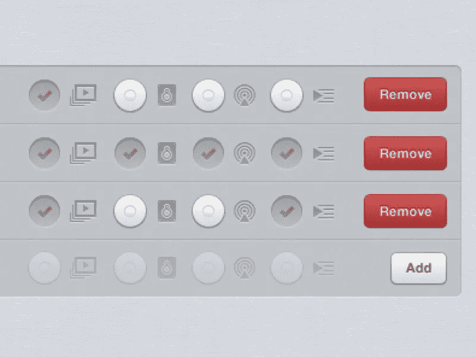

# 设计导航栏时要避免的 5 个错误

> 原文：<https://medium.com/swlh/5-mistakes-to-avoid-while-designing-a-navigation-bar-8bceef627348>

Assembly — Navigation bar states by [Jesse Dodds](https://dribbble.com/jessedodds)

设计导航栏？这里有一些要避免的错误！

不考虑导航栏这个非常重要的功能是愚蠢的。用户依靠它来找到他们需要的信息。

导航条设计中的一个小错误会给用户带来更多的负担。我们知道当用户不得不过度使用时会发生什么，他们会离开网站。

我们列举了设计导航栏时的 5 个常见错误。如果你犯了这些错误中的任何一个，是时候改正它们了，伙计！

# 1.不突出显示

iPad App by [Mads Egmose](https://dribbble.com/madsegmose)

相当多的设计者错过了在他们的导航栏上突出选中的按钮。这是一个新手的错误，因为高亮显示是必不可少的，因为当用户点击任何给定的按钮时，他们需要一个关于他们是否选择了什么的视觉反馈。

除此之外，他们对自己在任务流程中的位置没有多少线索。

例如，他们很容易将当前所在的页面误认为是任何其他相似的页面。请记住使用颜色对比和形状来突出按钮，因为只使用颜色会使色盲的人最难接触到按钮，使用形状将有助于这一点。

突出显示的标准经验法则是在标签下加一条粗体下划线。你也可以做更多的实验，比如在它周围放置一个轮廓。但是要确保它与其他任何行动号召按钮区别开来，以避免混淆。

# 2.选定按钮上的低对比度

Higher Contrast Buttons by [Artur Pokusin](https://dribbble.com/apokusin)

为了有所变化，一些网站使用低颜色对比来突出选中的按钮。为什么这是一个错误？仅仅是因为它降低了用户在站点层次结构中的速度。

低色彩对比度按钮变得难以阅读。这迫使用户不得不收回并思考他们点击了什么。这可能会导致迟滞，从而导致烦躁。如果用户可以通过一个视觉符号来识别所选的按钮，那会更快更容易。

您可以利用对比度检查软件来获得按钮标签和背景之间的正确对比度。

# 3.非活动按钮上的低对比度

Sources in portrait by [Morgan Allan Knutson](https://dribbble.com/morgan)

是的，现在认为非活动按钮应该具有较低的对比度是完全正确的。这是事实，但是，它不应该太低，以至于标签难以阅读。对比度太低会让用户错过按钮，因为他们可能会认为它被禁用了。

# 4.标签周围的区域

Tran*** Dashboard by [Marine Legrand](https://dribbble.com/marine_legrand)

众所周知，我们在工具栏按钮周围提供了一个空白区域，将它与其他按钮分隔开来。设计师经常犯的一个错误是，他们错过了让空白区域可点击的机会。这样可以给用户一个更大的点击目标区域，从而使导航更加容易和快速。

# 5.按钮上没有悬停和聚焦效果

Right column by [Oykun Yilmaz](https://dribbble.com/oykun)

另一个技巧是在你的导航按钮上设计一个悬停效果，这样更容易点击。这允许用户知道他们的鼠标何时在可点击区域。减去悬停按钮，用户可能倾向于认为他们的光标总是需要点击实际的标签来激活按钮，从而使点击目标变得更小，正如你可以想象的那样，并要求用户更加精确。

# 最后

导航条通常是用户用来导航的第一件东西，通过克服这些常见的错误使你的按钮更直观。

*您可以关注我们的* [*脸书*](https://www.facebook.com/monsoonfish)*/*[*LinkedIn*](https://www.linkedin.com/company/13404751/)*/*[*Twitter*](https://twitter.com/monsoonfishy)*/*[*Dribbble*](https://dribbble.com/monsoonfish)

*原载于 2018 年 1 月 16 日*[*monsoonfish.com*](http://monsoonfish.com/blog/5-mistakes-navigation-bar/)*。*

## 这篇文章发表在 [The Startup](https://medium.com/swlh) 上，这是 Medium 最大的创业刊物，拥有 285，454+人关注。

## 在这里订阅接收[我们的头条新闻](http://growthsupply.com/the-startup-newsletter/)。

