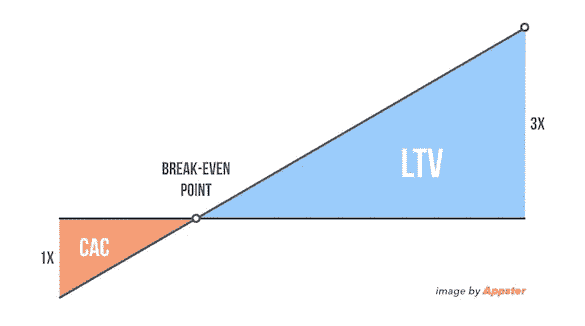
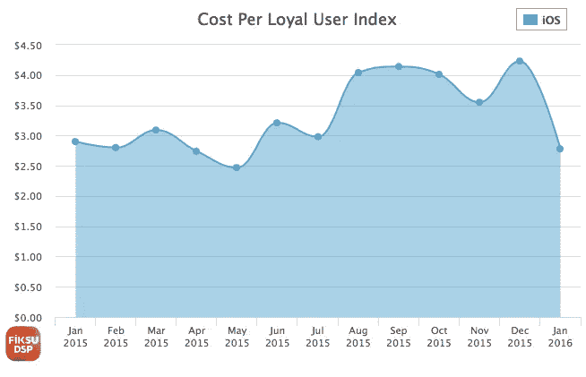
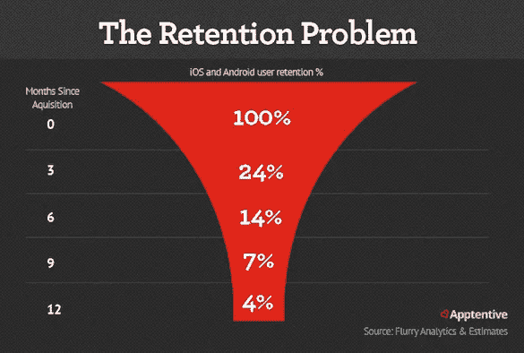
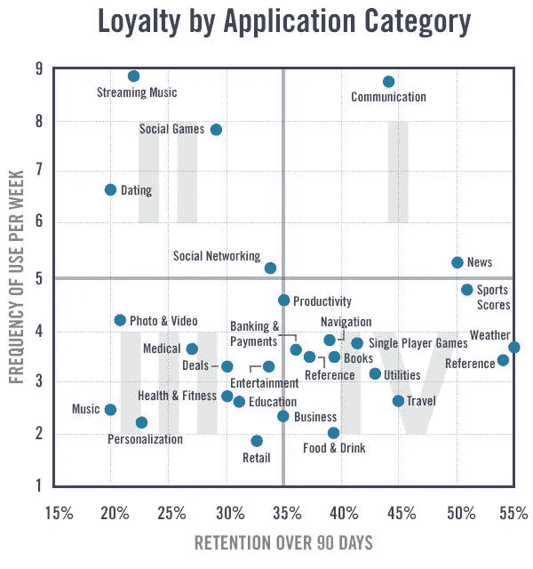
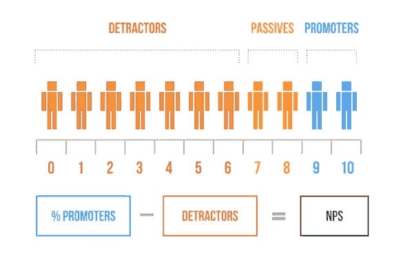

# 初创公司应该跟踪的 5 个移动营销指标

> 原文：<https://medium.com/swlh/5-mobile-marketing-metrics-startups-should-track-3b912fe95f32>

Originally published on [http://www.appsterhq.com](http://www.appsterhq.com/?utm_source=CP&utm_medium=Medium)

正如彼得·德鲁克[【现代管理的创始人】](https://www.forbes.com/sites/stevedenning/2014/07/29/the-best-of-peter-drucker/#3a53c48a5a96)曾经说过的一句名言:

> 被测量的东西会得到改进。

科技创业公司很容易将**的基本指标**——即那些可操作的和基于事实的指标——与**的错误统计数据**——即除了提升自我之外没什么作用的“虚荣指标”——混淆。

衡量正确的指标不仅对了解你的公司做得好的方面至关重要，而且对了解你需要改进的方面也至关重要。收集错误的数据可能意味着创业公司的死亡。

我最近发表了一篇文章，解释了[所有*初创公司都应该衡量*](http://www.appsterhq.com/blog/4-financial-metrics-startups-measure)的财务指标，无论它们是否创建应用。

在本文中，我将讨论在移动领域运营的初创公司应该跟踪的 5 个营销指标:

# 1.ARPU 和 LTV

基于史蒂夫·布兰克对创业公司的定义，当组织实施“可重复和可扩展的商业模式”时，他们就获得了高效营销和销售的能力，从而促进了增长。

客户 (LTV)的**终身价值是衡量效率的关键指标之一。**

从广义上讲，LTV 代表了你的应用程序的财务价值，因为它表明了每个应用程序用户在其一生中对你公司的价值。

我最近对 LTV 做了更具体的描述:

> *“LTV 是客户一生中预期产生的收入。*
> 
> 在最简单的情况下，它的计算方法是将你每年的服务成本乘以一个人成为你公司顾客的预期年数。
> 
> 例如:如果你的服务成本是每年 100 美元，而你的普通客户会停留 5 年，那么你的 LTV 就是 500 美元。”

早期创业公司可能很难估计他们的 ltv，因为他们通常缺乏具体的数据。

在这种情况下，粗略评估 LTV 的一个方法是在你的行业中找到类似的公司，以了解一个可比的 LTV 会是什么样子。

许多风险投资家和企业家的[普遍共识](https://www.klipfolio.com/resources/kpi-examples/saas-metrics/customer-lifetime-value-to-customer-acquisition-ratio)是，盈利企业的 ltv 至少比它们的[客户获取成本](http://www.appsterhq.com/blog/3-crucial-features-high-growth-startups) (CACs)高 3 倍:

**每用户平均收入** (ARPU)是一个略有不同的指标，它与你的客户的购买和整体消费习惯相关。

Investopedia 将 ARPU 定义为…

> *“…衡量每个用户或单位产生的收入。*
> 
> *单位平均收入允许分析公司单位水平的收入产生和增长，这可以帮助投资者识别哪些产品是高收入或低收入产生者。*
> 
> *公司也可以利用这些信息来确定哪些产品线落后了。”*

总的来说，你希望在扩大用户群的同时，尽可能提高 LTV 和 ARPU 的市场占有率。

# 2.消费物价指数和 CPLU

**每次安装成本** (CPI)，是衡量你的公司为了获得一个安装你的应用的用户而花费的金额。

[Tubemogul.com](https://www.tubemogul.com/glossary/cost-per-install/)从数字广告的角度描述 CPI:

> *“CPI(每次安装的成本)活动专门针对移动应用。*
> 
> *在按安装付费的活动中，发行商在一系列媒体上投放数字广告，努力推动广告应用的安装。只有在安装了应用程序的情况下，才会向品牌收取固定费用或竞价费用。”*

因此，CPI 跟踪付费安装，而不是“有机”安装([来源](https://www.apptentive.com/blog/2015/04/07/the-five-mobile-marketing-metrics-that-matter-most/))。

正如阿尔贝托·弗尔兰指出的，CPI 是根据以下公式计算的:

**广告支出÷总安装成本=每次安装成本**

例如:5000 美元(广告)÷ 1500 美元(安装)= 3 美元 CPI

**每位忠实用户的成本** (CPLU)是获得一个“忠实”或“活跃”用户的成本衡量指标，通常定义为在指定时间内打开一个应用程序至少 3 次的人( [1](https://www.apptentive.com/blog/2015/04/07/the-five-mobile-marketing-metrics-that-matter-most/) 、 [2](https://support.appsflyer.com/hc/en-us/articles/211719806-App-Settings) )。

答显然，CPLU 是这两个指标中更有意义的一个，因为它反映了你的初创公司为了获得一个真正*使用*你的应用的客户，而不是一个仅仅*安装*你的应用的客户，必须花费多少钱。

结合 ARPU 进行分析时，CPLU 可以帮助您计算:

1.  您营销努力的[投资回报(ROI)](http://www.investopedia.com/terms/r/returnoninvestment.asp)；和
2.  你的[盈亏平衡点](https://www.business.qld.gov.au/running-business/finances-cash-flow/managing-money/break-even-point)，也就是你的收入与支出完全匹配的点。这很重要，因为超过盈亏平衡点的点就是你开始积累利润的点(见[这里](http://www.appsterhq.com/blog/4-financial-metrics-startups-measure))。

移动营销技术公司 Fiksu DSP 的最新数据显示:

*   移动领域的全球 CPLU 平均水平为[【2.51 美元】](http://www.marketwired.com/press-release/cost-per-loyal-user-drops-as-spring-lull-lands-in-april-find-fiksu-indexes-2128727.htm)(2016 年 4 月)；
*   iOS 的全球平均 CPI 为[【1.88】美元](https://fiksu.com/fiksu-indexes/fiksu-indexes-for-january-2016/)(2016 年 1 月)
*   安卓系统的全球平均消费物价指数为[【2.42】美元](https://fiksu.com/fiksu-indexes/fiksu-indexes-for-january-2016/)(2016 年 1 月)

(image [source](https://fiksu.com/fiksu-indexes/fiksu-indexes-for-january-2016/))

# 3.用户保持率

今天，[500 万个应用](https://www.statista.com/statistics/276623/number-of-apps-available-in-leading-app-stores/)可以在谷歌的 Play Store 和苹果的 App Store 下载。

然而，将近 85%的智能手机使用量用于 5 个或更少的应用程序；几乎五分之四的用户[在第一次安装应用程序 72 小时后再也不会使用它。](http://www.androidauthority.com/77-percent-users-dont-use-an-app-after-three-days-678107/)

换句话说，大多数人只持续使用少数几个应用程序，并永久放弃所有其他应用程序。

[因此，用户留存](http://www.appsterhq.com/blog/how-to-boost-app-user-retention-rates)显然是所有以应用为中心的创业公司必须解决的一个重大问题。

一些估计，比如那些由 [Apptentive](https://info.apptentive.com/customer-retention-for-mobile-apps) 讨论的估计，表明只有 4%的 iOS 和 Android 用户在首次下载应用程序 12 个月后继续使用它:

正如我最近提到的那样，“当你成功获得一个新客户的时候，你必须开始尽一切努力尽可能长久地留住这个客户。”

[Inc.com](https://www.inc.com/encyclopedia/customer-retention.html)和[莫莉·加莱托](https://www.ngdata.com/what-is-customer-retention/)都提供了关于客户维系的有用定义:

> “客户保持率指的是一旦建立，企业能够长期维持的客户关系的百分比。”
> 
> “客户保持计划的目标是帮助公司从客户与公司的第一次接触开始，并在这种关系的整个生命周期中持续保持尽可能多的客户。”

为什么测量保持力很重要？

因为，正如亚历克斯·瓦尔兹指出的:

> “与其他指标相比，了解你的留存率可以更好地表明你的应用程序的成功和当前的客户群。你的应用程序可能有 100，000 次下载，但这些人中有多少是真正活跃的？保留数据使得回答这个重要问题成为可能。”

因此，保留使你能够提炼和更有针对性的营销努力，因为它有能力揭示你最好的客户。

提高你的用户保留率是有效提高你的 LTV 数和增加你的总收入的最有效的方法之一。

# 4.约会

敬业度本身并不是一个单一的具体指标。相反，它可以通过跟踪和汇编来自各种其他指标的数据来衡量，包括:

*   会话长度和时间间隔，
*   app 交互，
*   用户选择加入，
*   以及每个会话的应用屏幕([来源](https://www.apptentive.com/blog/2015/04/07/the-five-mobile-marketing-metrics-that-matter-most/))。

参与度很重要，因为除了纯粹的量化评估之外，它还能让你感受到应用使用的***质量*** 。

不出所料，最大的移动应用产生了最令人印象深刻的参与度数据。

下图比较了各种应用类别的 90 天保留率和每周使用频率，让我们深入了解了像脸书这样的大规模高增长初创公司获得 2000 亿美元估值的可能性。

高度参与的客户群不仅推动了留存率和 LTV 数，还促进了基于[病毒式传播](http://www.appsterhq.com/blog/startup-growth-viral-loops)和社交分享的积极网络效应。

因此，敬业度对于创业公司的评估至关重要。

# 5.国家公园管理处(National Park Service)

客户满意度和应用病毒率的顶级指标之一被称为**净推广者得分** (NPS)。

它是通过向您的用户询问以下关键问题来衡量的:*“从零到十，您向朋友、家人或同事推荐我们的应用的可能性有多大？”*

[Netpromoter.com](https://www.netpromoter.com/know/)概述了各种受访者之间的差异:

*   "**促销员**(9-10 分)是忠诚的热心人，他们会不断购买和推荐他人，促进增长。
*   **被动型**(得分 7-8)是满意但缺乏热情的客户，容易受到竞争产品的影响。
*   **诋毁者**(0-6 分)是不高兴的顾客，他们会损害你的品牌，并通过负面口碑阻碍增长。

总 NPS 的计算方法是从发起人总数中减去反对者总数。

用“为什么？”来跟进主要的 NPS 问题很重要问题，以找出你的用户的答案背后的原因。

不管你的 NPS 是非常高，非常低，还是介于两者之间，你仍然需要确定用户的感受。

这一指标非常有用，因为:

*   这有助于表明你的公司是否在寻找适合的产品/市场。
*   它衡量你的应用的价值和[病毒潜力](http://lp.appsterhq.com/appster-whitepaper-viral-growth-of-fastest-growing-startups)；和
*   它标志着你的用户可能与他人分享你的应用程序并无意中为你创造新客户的程度(即，高分表明你的用户可能会积极评价和传播关于你的产品的信息)。

//

## 感谢阅读！

# 如果你喜欢这篇文章，请随意点击下面的按钮👏去帮助别人找到它！

> 最初发表于 http://www.appsterhq.com[的](http://www.appsterhq.com/?utm_source=CP&utm_medium=Medium)

