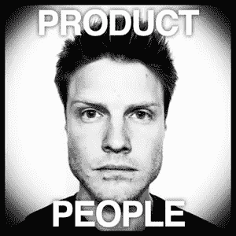

# 打造在线产品的 5 个必听播客

> 原文：<https://medium.com/swlh/5-must-listen-to-podcasts-for-building-online-products-c2fa562cbf87>

如果你正在建立，或考虑建立一个在线产品，这里有五个播客来查看伟大的建议，提示，见解和采访。

# 1)产品人员

Justin Jackson

[产品人](http://productpeople.tv)是一个“关注伟大产品和制造这些产品的人的播客”。每一集，贾斯廷·杰克逊都会采访一些真正有趣的角色，并深入挖掘产品制造过程中的特定主题。

**查看:** [EP69 带 Nir Eyal](http://productpeople.tv/2014/10/30/ep69-nir-eyal/) 如何打造习惯养成产品。

# 2)启动聊天

Steli & Hiten.

创业聊天播客提供“直接来自创业和商业生活的未经过滤的见解和可行的建议”。crazy egg[的 Hiten Shah 和 close . io](http://www.crazyegg.com)的 Steli Efti 每周两次播出一集 20 分钟的小节目，通过公开坦率的讨论解决具体问题。Hiten 的市场营销背景和 Steli 的销售背景构成了一个很好的对比。在每个节目的最后，他们会给出两个可行的建议，你可以在你的产品或业务中实施。

**查看:** [第 30 集:如何获得你的前 10 个客户](http://thestartupchat.com/030/)

# 3)内部对讲机

Intercom

[内线通话](https://www.intercom.io/podcast)提供“与产品管理、设计、创业和营销领域从业者的对话”。这个相对较新的播客来自 Intercom 团队，他们已经是围绕产品管理创建内容营销的专家。

**查看:** [第二集](https://blog.intercom.io/podcast-braden-kowitz-talks-design-and-startups/)——德斯·特雷纳与布雷登·科维茨谈论谷歌风投*设计冲刺*流程。

# 4)宿舍大亨

Dorm Room Tycoon

宿舍大亨播客提供“对设计师、黑客和初创公司创始人的采访”。在每一集里，威廉·钱纳都与一位顶尖的思想家谈论关于创业的各种话题。之前的受访者包括一些知名人士，如雅各布·尼尔森、约书亚·托波尔斯基和 MG·西格勒。每一次对话都揭示了有价值的见解，您可以将其应用到自己的产品中。

**看看:** [实现你的愿景](http://drt.fm/scott-heiferman/)—Meetup 的联合创始人 Scott Heiferman 向我们揭示了产品愿景的重要性。

# 5)指数

Exponent

[指数](http://exponent.fm)是一个“由本·汤普森和詹姆斯·奥尔沃斯主持的关于科技和社会”的播客。本和詹姆斯每周鸟瞰科技行业，探索当前科技运动背后的商业策略和理论。这是一个很好的播客，可以展望未来，发现可能对你自己的产品有影响的见解。

查看: [第 48 集](http://exponent.fm/episode-048-an-exhausting-week/) —本和詹姆斯讨论了 Twitter 的未来，苹果对谷歌的貌似战争，以及苹果音乐。

*发表于* **创业、旅游癖和生活黑客**

-