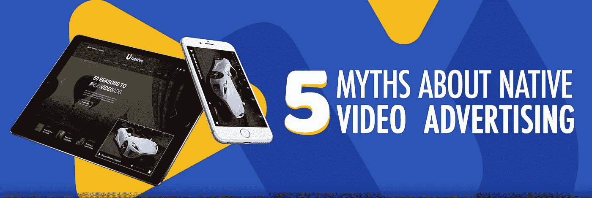
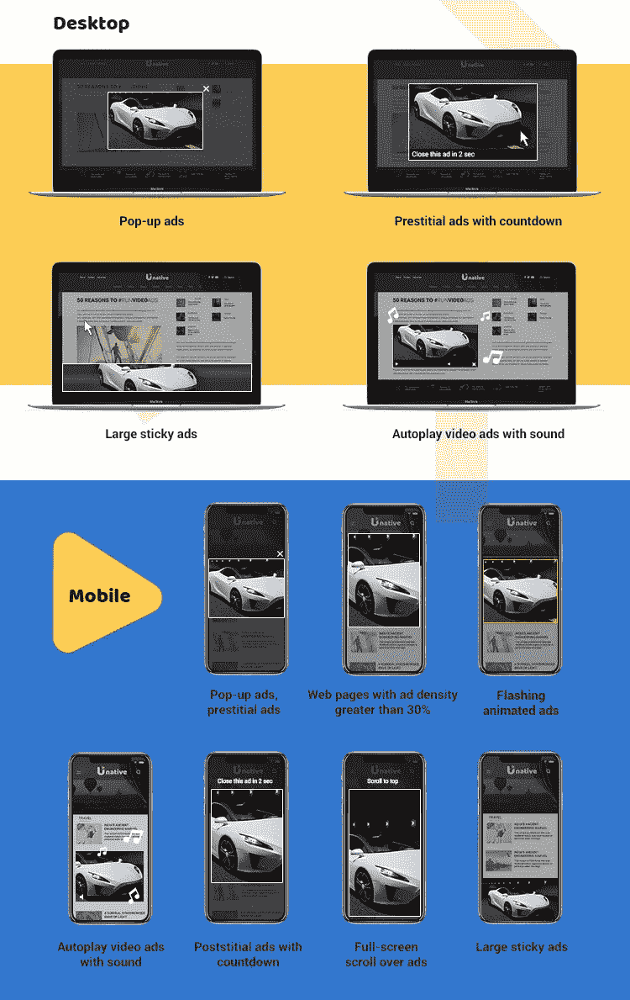

# 5 个本土视频广告神话被揭穿

> 原文：<https://medium.com/swlh/5-native-video-advertising-myths-debunked-edbbb301d45>

> 新的广告现实留给劣质广告的空间越来越少。随着广告标准的提高，业内人士感到事情开始变得棘手。尽管如此，大多数出版商并没有重新考虑使用过时的广告形式。关于原生视频广告，出版商需要了解什么？我们试图理清围绕原生广告的讨论，并用最近的数据打破一些神话。

**神话#1 更好的广告将结束我的生意**

正如 [VentureBeat](https://venturebeat.com/2017/12/19/chrome-will-start-blocking-ads-on-february-15/) 最先报道的，谷歌在一篇面向开发者的[博客文章中透露](https://developers.google.com/web/updates/2017/12/better-ads)原生广告拦截将于 2 月 15 日在 Chrome 上上线
新的现实意味着没有弹出窗口，没有阻止网页内容显示的广告，直到计时器倒计时，没有覆盖网站大部分区域的广告，也没有自动播放音频的视频广告。
更好的广告标准将以下广告类型视为对网络用户体验的干扰和负面影响:

简而言之，如果你不是一个广告网络，停留在 2000 年代初，你一定不能把所有的鸡蛋放在一个篮子里。使用原生广告格式。对它们的需求只会更高。

神话 2:在线视频广告非常可靠和安全。我应该投资视频技术来赚取更多的收入。

直到最近，没有视频内容的出版商还不能出售视频广告空间。
有了 outstream videos，他们可以发布各种内容的视频广告，比如不需要视频播放器的社论。

插入式视频是一种格式化的视频框，夹在文本或照片的段落之间，当它们可见时会自动启动。

你可能在你的脸书订阅中见过它们:你滚动，视频就会出现，当你走过时就会暂停。

虽然有出版商声称销售视频广告，但只是在标准横幅库存中投放广告，我们相信这不是你的故事。使用一个[本地广告网络](https://unative.com/)来正确实施插入式广告。像 Buzzfeed 这样的大出版商已经从在线视频中获得了超过 50%的广告收入，两年后，这一数字有望达到 75%。

**神话#3 外流产生的收入较少**

该行业面临着消费者可获得的广告印象数量急剧减少的局面。尽管避免广告的情况有所增加，但许多用户意识到，广告让他们不必为每天免费访问的内容付费。[page fair](https://pagefair.com/blog/2017/adblockreport/)最近的报告显示，77%的美国广告拦截用户表示，他们并不反对所有的广告——只是讨厌的广告。

> 所以，问题不在于[人屏蔽广告。](http://www.thedrum.com/topics/adblocking)问题在于广告本身。通过迫使该行业清理自己的行为，谷歌也可以很好地帮助拯救它。

恼人的广告形式是增加收入的最快方式，但具有短期效应。广告业正试图清理这个大市场，在这个市场上，不同的卖家大声叫卖以吸引用户的注意力。

近年来，出版商已经认识到，追求点击量和快速收入是不可持续的。努力重新定位自己，专注于创造高质量的内容，以吸引更多的观众。
在[辅助](https://unative.com/)的帮助下，集成将变得简单而流畅。

成为将从谷歌新举措中获益的出版商之一，因为低质量和侵入性的库存已经成为过去。

神话# 4 社交媒体巨头正在主宰这个行业。移动里没有适合我的东西。

尽管脸书将继续统治移动世界，但你仍然可以分享你的收入。

据预测，到 2020 年，大部分移动广告收入将来自原生广告。注重以用户为中心，鼓励用户在你的网站上创建自己的内容，并让他们分享。
在很短的时间内，以原生广告形式分享的客户评论和意见将比量身定制和精心制作的广告更加有益。从长远来看，一家拥有相关忠实读者的小出版商将击败“小淘气”。

**误区 5 原生视频广告是一个优质细分市场。我不能把它卖给更小的广告商**

原生视频广告被证明不仅仅是另一种趋势，而是即将成为视频广告的标准。

有多个广告网络可以确保对用户友好的广告形式的持续需求，如视频滑块和读入。查看[unattive](https://unative.com/)了解如何利用原生视频广告将你的库存货币化。

*分享一些关于本地视频广告的“事实”,这些事实应该持保留态度！*

## 这篇文章发表在《T4》杂志《创业》(The Startup)上，这是 Medium 最大的创业刊物，有 316，638 人关注。

## 在这里订阅接收[我们的头条新闻](http://growthsupply.com/the-startup-newsletter/)。

