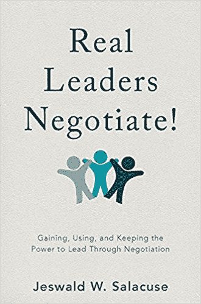
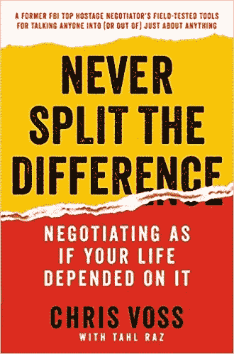
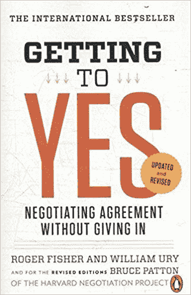
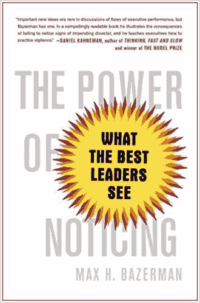
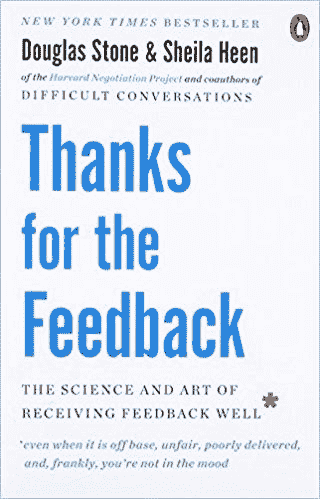

# 每一个创业公司的创始人要想取得成功，都必须阅读的 5 本谈判书籍

> 原文：<https://medium.com/swlh/5-negotiation-books-every-startup-founder-must-read-to-get-ahead-ba3110e2e17b>

不要被落下。阅读这些来完善你的谈判游戏！

Source: [Pexels](https://www.pexels.com/photo/two-person-shaking-each-others-hands-872957/)

我们每天都在谈判。

对于创业公司的创始人来说，你的谈判能力将决定你的成功。

无论是与投资者、联合创始人、员工、其他企业还是客户，学习如何掌握谈判工具可以带来更好的交易、更强的基于合作的双赢结果和更多的美元。

阅读以下五本书，让你的谈判技巧更上一层楼:

# **1。真正的领导谈判！**

**字幕** *:获得、使用和保持谈判的主导权*

**作者:** 杰斯瓦尔德·萨拉库斯

**为什么值得一读:**谈判中“让我成为一条鲨鱼，得到我所能得到的一切”的心态可能在短期内是成功的，但从长远来看，它可能会带来灾难性的后果。

尤其是当你需要这种关系来完成事情的时候。与你的员工、客户、投资者和合伙人谈判需要魅力、远见和合作精神。

这本书帮助你理解如何有意识地运用你的权力和影响力，无论是在你的创业公司内部还是外部，这样就能达成有效的对话和交易。

 [## 真正的领导谈判！:通过谈判获得、使用和保持领导能力

### 这本书探讨了谈判在获得、行使和保持领导力方面的核心作用…

www.amazon.com](https://www.amazon.com/Real-Leaders-Negotiate-Gaining-Negotiation/dp/1137591145) 

# **2。** **从不分割差额**

**副标题:** *谈判就像你的生命取决于此一样*

**作者** *:* 克里斯·沃斯

为什么值得一读:这本书教你情绪的逻辑基础，以及如何在谈判中利用它们。

初创公司创始人对快速增长的关注可能会让没有逻辑或明确答案的情况陷入情感困境，疏远或挫伤人们的积极性。克里斯沃斯讲故事的诀窍让你完全知道如何使用某些工具来缓和局势，影响对手，并产生令人满意的结果。

扳动开关，以理性的方式驾驭情绪，以便有效地推进艰难的谈判或对话。

# **3。得到肯定**

**副标题:** *谈判协议不让步*

作者:罗杰·费舍尔和威廉·尤里

为什么值得一读:经典的谈判 101 书是任何谈判者的标准读物。

《回答是》以一种简单易懂的方式分解了谈判的基本部分，揭示了构建双赢结果的谈判需要一些任何人都可以使用的基本工具和策略。

这本书将帮助你了解如何将人们从问题中分离出来(即，许多人都有的个性化问题)，如何发明导致合作结果的选项，如果出现僵局该怎么办，以及如何以良好的方式结束谈判。

# **4。注意的力量**

**字幕** *:最佳领导看什么*

**作者** *:* 马克斯·h·巴泽曼

**值得一读的原因:**谈判破裂是因为初创公司的创始人没有读懂言外之意，从而错过了关键信息。这本书帮助你实现这一点。

通过做出更好的决定，注意重要的信息，并学习如何利用这些来发展领导力，这本书包含了一些重要的智慧炸弹。

通过发现使成功谈判成为可能的隐藏细节来掌握困难的对话。

# **5。感谢您的反馈**

**副标题:** *接受反馈的科学与艺术*

作者:道格拉斯·斯通和希拉·希恩

为什么值得一读:反馈是谈判的一种形式。你必须与另一方协商他们是否真的会接受它，并且，考虑到大多数人的身份都包含在其中，这本书展示了来自组织层面(即，如何在公司内创建结构和流程以利用反馈)和个人的反馈的讨厌之处。

本书中使用的框架对于任何想要提升反馈游戏的创始人来说都是一个很好的起点。

**最后一句话:**初创公司是一个高压环境，在这里，模棱两可、快节奏的决策和混乱可能是常态。创始人需要学会如何主动管理这些情况。出色的人际交往技巧、耐力和超越现状的能力都是谈判训练教授的技能。这些书帮助创始人磨练这些技能，同时提供可操作和相关的经验，以扩大快速增长的创业。

## 这个故事发表在 [The Startup](https://medium.com/swlh) 上，这是 Medium 最大的创业刊物，拥有 333，853+人关注。

## 在这里订阅接收[我们的头条新闻](http://growthsupply.com/the-startup-newsletter/)。

