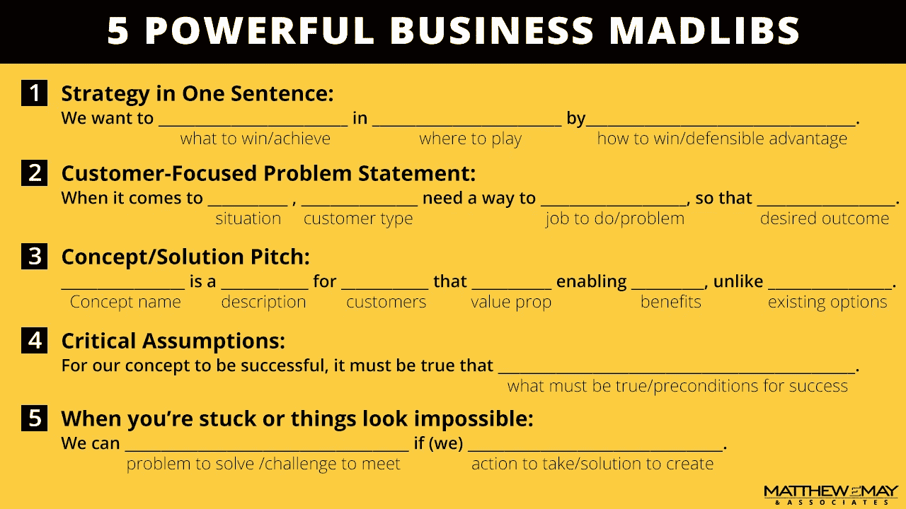

# 5 个强大的商业狂人

> 原文：<https://medium.com/swlh/5-powerful-business-madlibs-16f7699c65f7>

## 创造性的即插即用让你摆脱困境

当你的创造性努力似乎绕来绕去却毫无进展时，试试下面五个强有力的“疯狂”让你摆脱困境:

## 1.一句话的策略:

我们希望通过[如何赢得/可防御的优势]在[在哪里玩]中[赢得/实现什么]。

## 2.以客户为中心的问题陈述:

当谈到[情况]时，[客户类型]需要一种[要做的工作/问题]的方式，以便[期望的结果]。

## 3.概念/解决方案推介:

[概念名称]是针对[目标客户/用户]的[解决方案描述]，与[现有选项/备选方案]不同，[关键价值主张]，实现[主要优势]。

## 4.关键假设:

为了使我们的方法/策略/解决方案取得成功，必须做到[必须做到的事情/成功的先决条件]。

## 5.当你陷入困境，事情看起来不可能时:

如果我们[采取行动，创造解决方案]，我们就能[解决问题/迎接挑战]。

## 这篇文章发表在《创业公司》杂志上，这是 Medium 最大的创业刊物，有 306，372 人关注。

## 订阅接收[我们的头条](http://growthsupply.com/the-startup-newsletter/)。

