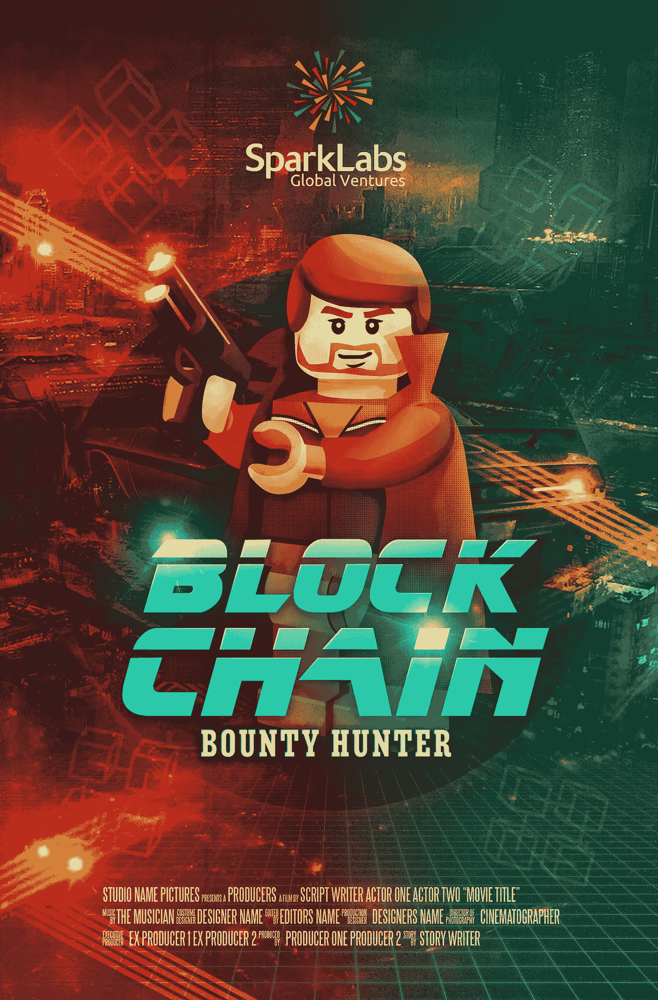

# 2018 年的 5 个预测:区块链赏金猎人等等

> 原文：<https://medium.com/swlh/5-predictions-for-2018-blockchain-bounty-hunters-and-more-1fb4abc68232>

Image Credit: SparkLabs Global Ventures

*(我的第 11 篇年度科技预测原本是* [*发表在 VentureBeat*](https://venturebeat.com/2018/01/07/5-predictions-for-2018-blockchain-bounty-hunters-and-more/) *。为我去年的预测插入的原始“等级”插入在下面)*

在过去的 10 年里，我每年都在 VentureBeat 上发布年度预测，我很不好意思地说，我对去年的几个预测都严重失误。随着物联网的升温和自动驾驶汽车的出现，我认为我们将在 2017 年看到智能高速公路。错误*(等级:F)* 。随着金融科技领域的如此大的变化，我确信我们会在去年看到一家全球纯在线银行的推出。又错了*(:D 级——)*。虽然这一预测没有达到 2017 年，但像 [Beam](https://meetbeam.com/) 这样的初创公司可能会在今年推出。

我还预计网络安全会成为去年科技领域的头号话题。虽然这肯定是科技媒体的五大话题之一，但它被比特币狂热和 2017 年的加密疯狂严重掩盖了。

我的另外两个预测——中国将入侵美国的科技领域*(等级:A+)* ，以及我们将看到人工智能继续领先*(等级:A)*——都是对的。中国对美国科技领域的投资快速增长，各种中国实体仍然希望在美国获得更多投资机会。而艾的热度延续到了 2017 年，也将延续到 2018 年。对机器世界和终结者的恐惧也将继续。

不过，关于去年的预测已经说得够多了。让我们来看看今年的。

以下是我对 2018 年的预测:

# 1.区块链赏金猎人将成为一份工作

到 2018 年底，“区块链赏金猎人”将成为一个新的工作类别。随着区块链技术在企业和政府中变得越来越普遍，我们将会看到一波新的工作岗位的产生。想象一下，联邦机构将他们的信息放在拥有数百万或数十亿条记录的公共分布式分类账上。人手不足的政府官僚机构将需要几十甚至几百人，他们是今天的 bug 赏金猎人和未来的银翼杀手的结合体，以找到公共记录(账簿)中的差异。这些区块链赏金猎人可能是法医金融欺诈专家，也可能是使用人工智能引擎的数据科学家，他们在公共区块链的 SEC 记录中寻找下一个伯尼·麦道夫，或者违反 YouTube 内容政策的人。

# 2.量子计算将成为新的比特币

我们将开始看到量子计算的一些现实应用，到今年年底，它将成为新的潮流。粒子传送或镜像相隔数英里？放在你手中的量子芯片比一群超级计算机的计算能力更强？谷歌预计将在 2018 年推出其 50 量子位量子计算机，所以难怪它会出售波士顿动力公司，以降低天网和终结者成为现实的可能性。凭借领先的人工智能技术和量子技术，谷歌可能会成为未来 100 年的主导公司。

“Quantum computer with grid computer generated abstract background” (image Credit: BigStock)

# 3.中国和其他 5 个经合组织国家将推出自己的加密货币

随着监管机构决定如何推进加密货币和 ico，[几个月来，我一直表示，整个市场](https://www.forbes.com/sites/sparklabs/2017/12/05/dont-be-dumb-money-how-to-invest-in-icos-and-blockchain-startups/#3ad1c63b7c74)将变得更加规范、更加理智。我还认为，主要经合组织国家今年将开始推出自己的加密货币，从中国开始。我敢打赌至少有 5 个人会效仿。较小的国家，如爱沙尼亚和委内瑞拉，已经开始了他们的计划，但市场不会改变，直到全球主要经济体在这一领域变得活跃。我认为，随着各国在未来几年创造自己的加密货币，许多较小的加密货币将会整合或崩溃。

# 4.无人驾驶出租车将在五个城市运行

随着亚利桑那州钱德勒市的更多试验开始进行，自动驾驶汽车仍将是 2018 年的热门话题。到今年年底，我们应该会在美国五个城市看到全面运行的自动出租车服务。随着这些服务的开展，当长途乘车变得可行时，不要惊讶地看到全新的创业公司提供补充服务，如食品、按摩和辅导。

Image Credit: Waymo

# 5.大脑控制的机器将会在市场上爆发

各种各样的[设备一直在用精神控制界面做着可爱的把戏](http://neurowear.com/projects_detail/necomimi.html)，但是今年我们将会看到几十个行业采用这项技术。[日产刚刚宣布将脑波技术整合到其汽车中。我们已经看到了精神控制的计算机界面和机器人，但随着这项技术变得更加成熟，我们将看到它在家用电器、建筑行业和数十个其他垂直行业中进行测试，在这些行业中，时间或多任务处理是重要因素。](https://www.theverge.com/2018/1/3/16844648/nissan-brain-to-vechicle-self-driving-car-technology-eeg)

你对 2018 年有什么预测？让我知道你对我的反馈或反应。祝 2018 年愉快！

伯纳德·穆恩是一家由加速器和风险投资基金组成的网络公司 SparkLabs Group 的联合创始人和合伙人。

## 这个故事发表在 [The Startup](https://medium.com/swlh) 上，这是 Medium 最大的企业家出版物，拥有 283，454+人。

## 在这里订阅接收[我们的头条新闻](http://growthsupply.com/the-startup-newsletter/)。

