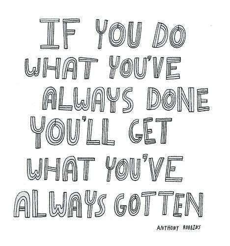
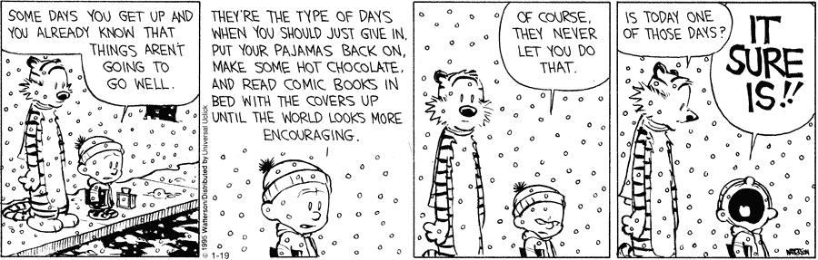

# 5 个行之有效的步骤将帮助你做你喜欢的事情

> 原文：<https://medium.com/swlh/5-proven-steps-that-will-help-you-do-what-you-love-a33168b0c4cd>

## 成功人士如何找到激情并长期坚持的秘密。

[Pexels](https://www.pexels.com/photo/man-person-wooden-table-work-374049/)

“成功”对不同的人有不同的含义。

名声，财富，爱情，金钱，自由等等。定义可能不同，但目标是一样的——幸福。我们相信成功会给我们带来幸福。我们想象，这种成功会在我们找到激情后到来。

大多数人都知道什么可以帮助他们找到激情并获得成功。他们遵循一个屡试不爽的公式去追求它。事情是这样的:

1.  专注于一个目标。
2.  阅读专家是如何实现的。
3.  尝试一切，直到有所收获。

只有一个问题。这个公式不管用。

看啊。

偶尔，你可能会走运，找到一个值得追求的长期目标。但是这种情况比社交媒体上的[无愤怒日](http://aryatra.com/why-we-outrage/)还要罕见。

很长一段时间，上面的公式就是我的圣经。但是每次我跟着它，我的故事就会这样展开。

我选择了一个目标。我尝试了很多事情来实现它。当我没有看到立竿见影的效果时，我心灰意冷，退出了。然后我发现了一个闪亮的新目标，历史重演了。

但我知道一件事是肯定的。我不是唯一一个受苦的人(受苦？)从这种困境中。

许多人亲身经历了上述公式的无效性。然而，他们坚持这样做。在工作中，在约会中，为了个人目标，比如减肥或者[创业](/@thestartup_)，等等。

> 疯狂是一遍又一遍地做同样的事情，却期待不同的结果。—阿尔伯特·爱因斯坦。

如果上面的公式如此流行，为什么它不起作用？

因为我们看到的只是结果。

这位曾经超重现在健康的朋友已经瘦了。我们看的[畅销书](http://aryatra.com/read-more-often/)都已经写好了。我们参加的[单口喜剧活动](https://www.eventshigh.com/mumbai/frontline+comedy)涉及的艺术家已经足够优秀，可以登上舞台。我们在电视上看到的投资专家已经赚了数百万(和数十亿)。

丹尼尔·科伊尔在他的书《天才密码》中写道，我们认为这样的人是“杰出的——神秘的天才局外人，不知从哪里来的被命运亲吻的孩子。”

但是我们看不到的是这些“例外”的人是如何做到的。他们的努力、牺牲、痛苦、失败和微小的胜利——所有的一切都被“天赋”这一神话般的外衣所掩盖

以文艺复兴时期著名的雕刻家米开朗基罗为例。直到他 24 岁，人们都知道他有希望。但是当他雕刻出圣像时，人们突然开始称他为天才。

但是米开朗基罗不同意这种说法。“如果人们知道我有多努力才能获得成功，这看起来一点也不美妙，”他说。

以下是米开朗基罗在《圣母怜子图》之前的生活。

从六岁到十岁，他和一个石匠生活在一起，学习如何使用锤子和凿子。然后，他师从伟大的吉兰戴欧，在佛罗伦萨最大的教堂之一绘制、临摹和准备壁画。接下来，他得到了雕刻大师贝托多和其他名人的指导，直到他 17 岁。24 岁时，他创作了《圣母怜子图》。

他现在听起来不像个“天才”了，是吗？或者像某人有一个“尤里卡！”寻找激情的时刻。

那么，米开朗基罗和所有“天才”是如何获得非凡的专业知识和成功的呢？

通过*关注重要的事情*。他们狭隘的眼光和对这方面的不懈关注使他们取得了非凡的成就。

当你在生活中吸收了这些特质，没有什么能阻止你[实现你的长期目标](http://aryatra.com/to-do-list-templates/)。

> *无论何时你想取得成就，睁大你的眼睛，集中精力，确保你确切知道你想要什么。没有人能闭着眼睛击中目标。—保罗·柯艾略*

你是否感到有点焦虑，因为你不知道哪些任务对你实现目标很重要？

别担心。这篇文章的其余部分将告诉你如何识别并长期坚持它们。

# 如何识别什么是重要的

在他们的书[执行的 4 个原则](https://www.amazon.in/4-Disciplines-Execution-Chris-Mcchesney/dp/1471142086/)中，作者详细阐述了两种衡量成功的标准——*滞后措施*和*领先措施*。

滞后措施*“记录发生了什么，描述你正在努力改进什么。”*它们是你行动的结果，突显了你与目标之间的距离。

对于试图减肥的人来说，一个滞后指标是他们在一个月末减掉了多少体重。对于自由职业者来说，滞后指标包括她创造的收入。对于作者来说，可能是她完成了多少本书的手稿。对于一家初创公司来说，这是新用户的数量。

大多数人在追求目标时只关注滞后措施。这是自然的。但这也是一个巨大的错误。原因如下。

滞后措施不会改变我们的行为太多。他们只是记录我们是如何做的。这就是为什么人们一遍又一遍地做着同样的事情，或者做了太多，却没有真正理解他们在做什么。

结果呢？他们进展缓慢。他们会失去注意力，将注意力转向生活中其他“紧急”的事情。然后他们找到了另一个目标，嗯……似曾相识。

然后是铅的措施。根据 4DX 的作者的说法，这些度量标准*“影响变化并测量行为，从而在滞后测量上取得成功。”*

对于试图减肥的人来说，主要措施包括他们每天的卡路里摄入量和锻炼持续时间。对于自由职业者来说，潜在客户数量包括潜在客户数量和发送的建议数量。对于一个作者来说，它们是每天写的“可用”字数。对于一家初创公司来说，他们是每天注册试用的客户数量等等。

领先措施是**重要的**任务，是你必须每天(或每周)坚持的任务。

滞后指标描述了结果。领先指标描述了你必须关注的目标。

滞后措施是目的。引导措施是为实现目标扫清道路的工具。

> *“任何值得做的事都值得每天去做。”—格兰特·卡尔多内*

# 确定并坚持领先措施的 5 个步骤

没错。

既然你已经确信了引导措施的重要性，那么让我们来讨论一下你可以采取哪些步骤来识别和处理它们。

准备好投入工作了吗？很好。我们开始吧。

## a.设定微小的目标

> *“光荣的失败导致一无所有；微小的成功可能会导致不微小的成功。”——阿诺德·贝内特*

设定目标这一步是大多数人犹豫的地方。

根据调查，92%的人无法实现他们的新年愿望。如果其他目标的统计数据相似，我不会感到惊讶。

为什么？因为大多数人还没站起来就想跑。

人们为自己设定了离谱的目标。他们想要移动山脉，改变河流的流向，或者殖民木星(因为埃隆·马斯克已经选择了火星)。

但不到一周，庞大的工程就将他们压垮，推下悬崖。结果呢？他们放弃了。

不要试图在六个月内减掉 50 磅。专注于每月只减掉五磅。不要试图一年写一篇 10 万字的稿子。专注于每天只写 500 个单词。作为自由职业者，不要设定一年挣 3 万美元的目标。专注于赚取你的第一个 1000 美元。

从小规模开始，然后逐步扩大。

## b.确定您的主要衡量标准

一旦你为自己设定了一个小目标，是时候弄清楚哪些行动会让你实现它，然后[为它们设定每日目标](http://aryatra.com/to-do-list-templates/)。

例如，我想增加我的[电子邮件订户](http://aryatra.com/subscribe/)的数量。这是我的滞后测量。为了实现它，我的主要措施是:

阅读一本书——每天 30 页，写作——每天 500 字

出版——每周两次

设定目标不仅仅让我专注于重要的事情。它也迫使我减少无用的活动，比如看电视和浏览网页。

但是等等。在你为你的领导措施设定目标之前，这里有一个警告。

就像你的目标一样，你可能会尝试设定一些离谱的目标(还记得殖民木星吗？).小心点。如果你屈服于这种诱惑，你甚至会在开始之前就让自己失败。

相反，设定“可控制的”目标——将你推向能力边缘的目标。

> *“你不想 40%的时候都成功。那是鞭打。你不想 95%的时间都成功。那太容易了。你需要不断地切换、调整环境，这样你就有 60%到 80%的成功率。”—丹尼尔·科伊尔*

## c.追踪你的进度

设定目标后不要掸手。那只是工作的百分之十。跟踪和坚持这些目标是剩下的 90%。

原因如下。

尽管设定了正确的目标并有正确的意图，你还是有可能会忘记自己在做什么。因为，嗯…生活。每次你迷失方向，重新开始需要两倍的努力。

当你追踪你的目标时，从长远来看你会赢，因为有两个原因。

第一，你继续朝着你的目标前进。

第二，你取得小胜利。

每次你达到你的每日(和每周)目标，你都会经历一次小小的胜利。这些胜利的影响力几乎与取得胜利本身不相称。

一位[康奈尔大学的教授写道](http://www.cfar.com/sites/default/files/resources/BN_Small_Wins.pdf)“小胜是小优势的稳定应用。一旦取得了一个小胜利，就会产生有利于另一个小胜利的力量。”

小胜使牛顿第一定律生效。当你坚持做重要的事情时，你就让自己动起来了。结果是动力，这比天赋或努力实现你的目标更重要。

> “无论你是以一英寸还是一英里的优势获胜都不重要。赢了就是赢了。”—多米尼克·托雷托

## d.接受糟糕的日子

> “在特别艰难的日子里，当我确信自己无法忍受的时候，我会提醒自己，到目前为止，我度过糟糕日子的记录是 100%，这已经很不错了。”—未知

你希望事情按计划进行。你希望负面情绪不存在。

但是有一些消息要告诉你。无论你做什么，它们都会存在。总有一天，一切都会失控。

就像一年有多少个夜晚就有多少个白天一样，生活也有足够多的悲伤和快乐的时刻。如果你的生活没有悲伤、焦虑或愤怒的时刻，*快乐就会失去意义。*

*你会感受到负面情绪。但是你让这些感觉影响你到什么程度…嗯，这取决于你。*

*你可以让这些经历侵蚀你的自尊。你可以相信宇宙与你作对。沉浸在自怜中。*

*或者，你可以从这几天开始学习。你可以检查哪里出了问题，哪些地方可以做得更好，以及如何在未来应用这些经验教训。*

*你接受逆境越多，你就变得越强大。你训练你的大脑选择积极的想法而不是消极的想法。这是人类对抗压力的最大武器。*

**

## *e.请自便*

> **“把工作变成一种游戏，在游戏中，你密切关注每一个方面，并试图找出如何让它变得更好。”—米哈里·齐克森特米利**

*即使是最有效率的人也会失去注意力。*

*无脑运动能坚持多久？或者在不被竞争对手添加的功能分散注意力的情况下处理客户反馈？或者写在你的手稿上，却不想做一些“更有趣”的事情？*

*“有趣”是这里的关键。*

*人类的大脑喜欢玩耍。根据研究，玩耍有助于提高认知能力，如增强记忆力、学习技能和创造性解决问题。它还提供了社会效益，如合作、团队建设和控制冲动。*

*把你生活中的“游戏”带回来。不要再严肃了，开始玩吧。*

**

*这里有两种方法。*

*第一，考虑如何将每一项领先指标游戏化。尝试不同的食物类型，找出有助于你更快减肥的食物。尝试在一天的不同时间写作。[进行小实验](/@suprada/2-week-experiments-and-6-week-projects-8c29a5fbb310)优化你的产出，更快地达到你的每日目标。*

*第二，每次达到目标时给自己一些小奖励。例如，在达到卡路里和锻炼目标后，你可以奖励自己一集《权力的游戏》。在你写完一天的目标字数后，你可以浏览 Instagram 三十分钟。*

*小小的奖励会激发我们大脑中的多巴胺——寻求快乐的化学物质。当大脑再次渴望这种感觉时，我们会推动自己回到重要的任务上。我们可以享受“浪费时间”的奖励，而不会感到内疚。*

# *带回家*

*你可能在寻找你的激情。但是激情一直在变。你真正寻找的是意义。*

*意义不会在你到达目的地后到来。当你踏上改善之旅时，它就来了。当你专注于重要的事情时，它就来了。*

*这需要大量的时间和精力。很多人也放不进去。所以他们中途或者一开始就放弃了。*

*放弃很容易。但是轻松从来不会让你变得更好。它从未让你自我感觉良好。挑战自己，让自己比昨天更好一点——那会让你变得更好，更快乐。它让你成为你想成为的人。当事情变得艰难时，它会让你成为关键人物。*

*用正确的工具武装自己，成为那个人。每天都用。*

*你值得过你想过的生活。但是你必须走出去，为你自己去创造。*

**最初出现在***上。***

****

## **这篇文章发表在 [The Startup](https://medium.com/swlh) 上，这是 Medium 最大的创业刊物，有 339，876 人关注。**

## **在这里订阅接收[我们的头条新闻](http://growthsupply.com/the-startup-newsletter/)。**

****