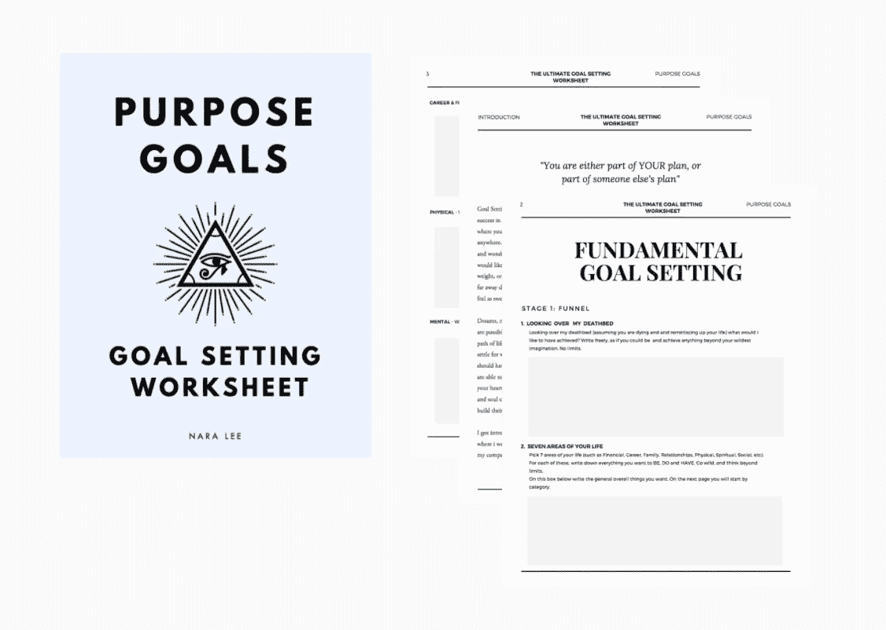

# 设定目标并实现目标的 5 种行之有效的方法

> 原文：<https://medium.com/swlh/5-proven-ways-to-set-goals-and-achieve-them-cf19016b3af1>

在这篇实现你的目标的文章中，你将学习如何设定和实现你的目标。目标不是你某天能实现的，而是你应该实现的。

> *“当我们第一次允许自己疯狂地、无限制地做梦时，我们的梦想就会变成现实。然后我们把那些梦想变成目标，这是我们为自己创造的世界想象和现实之间的桥梁。”*

设定目标是迄今为止任何人想要在生活中有所成就都必须做的最重要的事情之一*。*

为什么目标设定如此重要？在生活中，你要么是别人计划的一部分，要么是你自己计划的一部分。不设定目标的人，往往“随波逐流”，相信生活会发生*到*他们身上，或者他们拥有或没有的一切都是因为“运气”的问题。想象一下，海洋上的两艘帆船。一个说“我想去巴哈马群岛”，它扬帆驶向巴哈马群岛，并到达那里。另一个人，从来没有想过方向的重要性，他去了海边，享受每一天，只是“随波逐流”。几周后，它降落在阿富汗。

这就是设定目标和不设定目标的区别。这是掌控你的生活和拥有生活、掌控你之间的区别。

掌握主动权，并不意味着不享受这个过程，或者不随波逐流。它简单地意味着，你享受旅程，但你知道你要去哪里，你每天都朝着它努力，直到你到达你想要的目的地。

## 没有写下你的目标吗？从今天开始，使用这个[自由目标设定工作表](https://purposegoals.teachable.com/p/goal-setting-planner-worksheet)

哈佛大学做了一项研究，调查了两组不同的人。当低成就组被要求设定目标并完成同样的任务时，他们取得了显著更高的表现和成功率，以及更高的动机、动力和幸福感。

已经进行了数百项实验研究，它们都证明了同一个结论:在生活的任何领域——这意味着——商业、家庭、精神、身体、财务、精神、社会等，设定目标能显著提高成功率。你会想要为你生活的所有领域设定目标，否则，你可能会在其中一个领域取得成功，而所有其他领域就会失去平衡。

话虽如此，“尽管在各种环境下，目标设定能显著提高绩效，但它仍然是一种技能。一个人必须学会如何有效地设定目标

在我的一生中，我一直是一个目标设定者，测试了许多不同的系统和技术，并实现了许多最贴近我内心的目标。我还学到了一件别的地方没有教过的事情，那就是，你的目标必须与你的目的相一致。当你的目标与你的目的脱节时，你可以踏上一段人生旅程，去实现许多事情，向公众证明你的外在价值，但不是真正从内到外实现。你会达到这些目标，但仍然会觉得缺少了什么——这是因为你为自己设定的目标与你的人生目标不一致。

在这篇文章中，我将与你分享 5 种行之有效的方法来设定和实现你的目标。

# 1.让你的目标与你的目的一致

你是否发现自己设定了美好而惊人的目标，但不知何故却失去了实现这些目标的动力？你强迫自己去完成，从外部来看这是要实现的“正确的事情”，但是在你的内心深处却不喜欢这样做。你没有内在的动力，所以你寻找外在的动力让你继续前进。

如果这听起来像你，很有可能，问题是*不是*的动机，而是*缺乏一致性。*

设定目标有两种方式。

肤浅而传统的方法是根据你认为你应该做什么或完成什么来设定目标。这些目标是可行的，也是可以实现的，但是，这些也是你在前进的道路上可能会放弃的目标，因为它们与你的目标或/和更高的自我不一致。你可能不会把它们扔掉，但你可能会想“哦，是这个吗？”。你所追求的*感觉*和*体验*并不是这个目标带来的——因为，这个目标从一开始就不一致。

所以，当你设定目标时，去追求你最深处的梦想、渴望、激情和召唤。不要让你头脑中的声音告诉你“这是不可能的”、“这太复杂了”等等——因为如果你不设定那个目标，你将永远不会做你在地球上要做的事情。

因此，我的第一条建议是——设定目标，与你的灵魂和目标保持一致。

# 2.让你的目标随时可见

你可能知道你想要什么，你要去哪里。但是非常重要的是要有一个书面的计划，告诉你自己要达到什么目标，以及你打算如何达到目标。更重要的是，要经常查看这个计划，因为我向你保证，在你的旅程中，你会有很多让你分心的事情和很多让你眼前一亮的机会，这些会让你偏离轨道——如果你不记得你的目的地的话。

设定好的目标放在抽屉里积灰，然后被遗忘，通常永远不会实现。你需要与你的目标保持联系，并经常回顾它们，所以把它们放在你能看到的地方，而不是把目标写在一本书上并储存起来。

每周回顾你的目标并跟踪你的进展。看看你在哪里落后了，为什么。根据你的表现，调整你的目标达成策略。

每天看看你的目标，如果不是每周。保持专注。

# 3.获得一个负责任的伙伴或系统

当你设定目标时，你要确保你实现了目标。目标不是梦想。做梦之后，你坐下来，写下你的目标。目标是要实现的。尤其是当它们与你的生活目标联系在一起时，它们会以一种新的形式出现，成为你必须达到的目标，而不是你 T2 能达到的目标，T4 有朝一日能达到的目标。

确保你实现目标的有效方法是什么？

有问责制度或合作伙伴。

如果你设定了目标，并且不与任何人分享，如果你没有实现它们也没什么大不了的，因为你将是唯一知道你秘密目标的人，如果你可以让自己失望，那么没有实现那个目标是没有责任的。

问责制度将你的目标与让你承担责任的个人、社区或公众联系在一起。例如，当我第一次决定有一个博客时，在我的想象中，这是一个与更大的长期目标相关的想法。然后我把它连接到我现有的目标设定系统。然后，我让公众，我的责任伙伴。所以我会坚持写作和出版，即使我没有足够的读者。事实上，我的博客是公开的，这促使我继续写作和发表我的作品。

如果你想减掉 10 公斤，你可以制定一个每周和每天的营养计划，根据你的结果来贯彻和衡量你的计划。你可以在每一天或每一周结束时与你的责任伙伴分享这个计划，仅此一点就下意识地迫使你想要坚持到底。或者你可以每周和朋友一起训练 3 次，或者和私人教练一起训练。只要知道你的朋友早上 7 点在你家门外等你，就会让你准时醒来，穿上跑鞋，开始工作。这就是责任的力量。

# 4.找到一个值得你生活的目标

当我们开始任何新的旅程，我们想象一帆风顺。我们相信一切都会很容易，很顺利，并按计划进行。我天生是个乐观主义者，所以我承认，我经常落入这个陷阱。这就是为什么我最终接受了这样一个事实:旅程可能不是一帆风顺的，没有香槟和鱼子酱。

你的目标必须*足以配得上你的人生*(而不是你配得上你的目标)，因为当你在你的道路上面临障碍和挑战时，你必须找到坚持下去的力量、动力和动力。任何值得实现的目标都需要时间、承诺、坚持和努力。

如果一个目标“对你来说没那么重要”，你就不会去实现它。这并不意味着你是一个失败者，它仅仅意味着，你必须找到一个值得你生活的目标

****

# *5.预见障碍*

*现在你知道你的旅程可能不是一条直线，这意味着你在通往目标的路上会遇到反对、挑战和障碍。如果你没有心理准备，这些就足够了*

*1.带你离开航线*

*2.阻止你，让你退出*

*所以，在你开始之前，做好心理准备迎接障碍，并找到克服障碍的方法和资源。*

*提前列出所有你认为你将会或可能遇到的潜在障碍。然后制定一个应急计划来克服这些困难。*

*当然，有些打击是你从未计划甚至预料到的，当它们出现时，你将不得不去应对。*

*总的来说，最重要的是做好心理准备，面对任何可能出现的反对或挑战，并致力于找到解决方案并坚持到底——无论需要多长时间，或有多艰难，无论发生什么，你都要坚持下去。*

## *[点击这里](https://purposegoals.teachable.com/p/goal-setting-planner-worksheet)开始设定你的目标，使用这个[免费模板](https://purposegoals.teachable.com/p/goal-setting-planner-worksheet):*

**

*CLICK TO [GET ACCESS TO THIS FREE GOAL SETTING WORKSHEET DOWNLOAD](https://purposegoals.teachable.com/p/goal-setting-planner-worksheet)*

**

## *这个故事发表在 [The Startup](https://medium.com/swlh) 上，这是 Medium 最大的企业家出版物，拥有 295，232+人。*

## *在这里订阅接收[我们的头条新闻](http://growthsupply.com/the-startup-newsletter/)。*

**