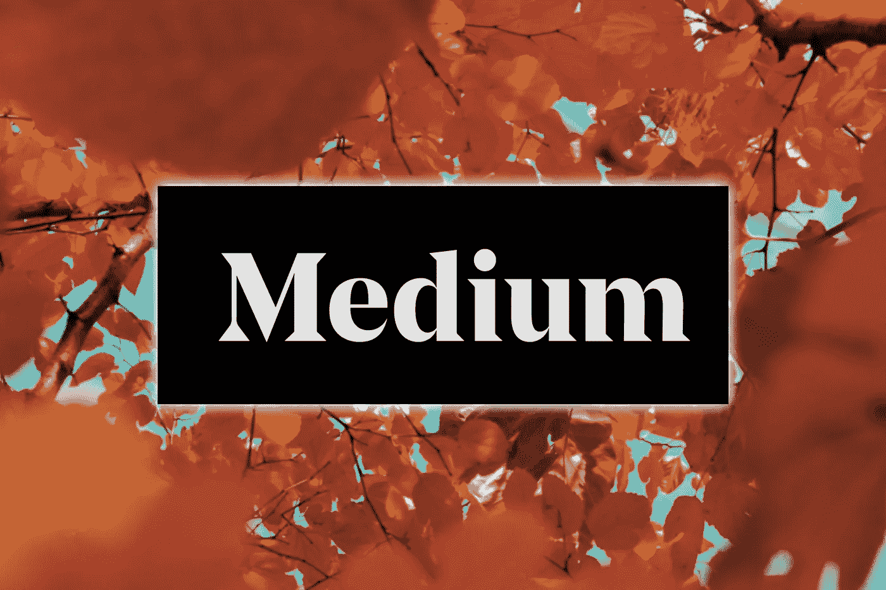
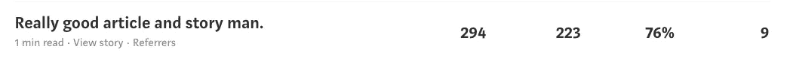

# 增加你的媒体页面的 5 个技巧。

> 原文：<https://medium.com/swlh/5-quality-tips-for-growing-your-medium-page-f3305a8aaba6>

在你点击离开，把一个少于 200 个追随者的人当作可靠的建议来源之前。要知道，在这个平台上获得 100 个关注者并不是一件容易的事情。

媒体不像 Instagram 或 Twitter。在 Instagram 上，我可以在几个小时内轻松获得 150 多名粉丝。

发展一个中型网页需要努力、质量和坚持。
这是我使用该平台仅 5 个月就了解到的情况。虽然我学到了一些可能对你有帮助的技术，但我在这个平台上几乎没有破冰。

这些建议将是常识和一些你今天就可以开始使用的实用方法的结合。这些建议中有些可能是常见的，有些可能是你没有意识到的。我希望你学到至少一件事，这将有助于你成长你的媒体页。

## 1.经常发布并保持活跃。每天花时间在站台上。

我把这三件事混合到一个技巧中，因为它们都是基于花时间在平台上。如果你在这里停留 2 分钟查看你的通知然后离开，你将不会在这个网站上得到任何结果。

为平台找一份爱。相信我，这是一个不可思议的工具，每个作家都应该使用它来出版他们的作品。我试着每周至少发表一次。如果你真的想在这里成长，每周至少要写一篇文章。

最开始帮助我的一件事是不断地阅读别人的文章并给出反馈。我在我的文章“[为什么你应该在媒体](https://blog.usejournal.com/why-you-should-be-everywhere-on-medium-14fe1e8d7506)上无处不在”中简要介绍了这个方法。这个方法本质上就是浏览你感兴趣的话题的标签，找到一些文章并阅读它们。实际上，我也在读它们，没有对你没读过的文章说些略读的废话和“好文章”。记住，这不是 Instagram。

每隔一天，我至少花 30 分钟在 Medium 上。不问任何问题。
找到适合你日常日程的方式，每天或每隔一天花些时间与社区互动。这是第一次开始时抓住一点注意力的好方法。

## 2.发布高质量的内容，并尝试在出版物中获得特色。

**出版物数量巨大**。如果你出现在一个有超过 10 万人关注的出版物上，那你的文章就有可能被 4 万或更多的人关注。

你应该一直努力让每篇文章都比上一篇好。你应该看看你喜欢写什么类型的文章，并把注意力更多地放在这些文章上。第一次开始的时候涵盖很多话题，看看哪一个话题是你的强项。

就我个人而言，我写的都是关于生活改善的内容。这是我热爱的，也是我喜欢写的。我最受欢迎的两篇文章是关于媒体和网络的。不要害怕让你的写作多样化。

从看似有趣的出版物开始。看看他们张贴的是什么类型的材料，以及你写的东西是否适合该出版物。

我听说过有人给出版商发邮件或发信息。就我个人而言，我没有这样做，我只是继续努力发布高质量的内容。我想直到我的第六或第七篇文章，我才被添加到一个出版物中。专注于修改必读的顶级文章。也要使用合适的标签。出版物会找到你的。

出版物最好的一点是，所有者试图通过发布高质量的作品来扩大他们的出版物，而你也试图通过做同样的事情来扩大你的页面。这几乎是一个平等的交换。分享就是关心，对吧？

我的文章没有超过 50 次的点击，直到我最终在最大的出版物之一[有很多**出版物的所有者在不断寻找那些不太受欢迎的作家，他们身上有值得出版的宝石。不要以为你不会出版，因为你没有吹嘘 1k+的追随者。
一切从写精彩内容开始。在这张单子上的任何事情之前，先把注意力放在那上面。**](https://medium.com/u/1ecc355a806#干杯。

 **任何值得做的事情都需要时间和巨大的耐心。**

**如果你经常发表文章，与其他作家互动，给其他作家贴标签，评论受欢迎的作品，最重要的是只是把作品放进去，你最终会建立一个读者群。**

**投入工作是大多数人做不到的。**

**如果你想把自己和这里 90%的其他作家区分开来，那就把该死的作品放进去。**

****没有一夜成名的媒介**。**

**有没有追随者不是很重要。这确实有帮助，你应该每天都专注于获得更多的追随者。我认为最重要的是你的文章获得了多少掌声和回应。**

**坦率地说，我见过比我多 20 倍关注者的人，他们的文章得到的关注却更少。这纯粹是一个例子，说明为什么追随者并不意味着很多。**

**另一件要注意的事情是，虽然这篇文章主要是关于在媒体上成长，但我想提醒你，成为这个社区一员的纯粹热情是一切的开始。**

**提供价值，投入工作，每天写一点，每天上一点媒体，保持耐心和一致性。**

## **[每个月有 3000 万人在这个网站上](http://money.cnn.com/2016/01/19/technology/medium-ev-williams/index.html)。你将如何吸引他们？**

## **如果你喜欢这篇文章，就把它拍下来。反馈总是很受欢迎。别忘了你最多可以鼓掌 50 次！❤**

****

## **这篇文章发表在[《创业](https://medium.com/swlh)》上，这是 Medium 最大的创业刊物，有 295，232+人关注。**

## **在这里订阅接收[我们的头条新闻](http://growthsupply.com/the-startup-newsletter/)。**

****