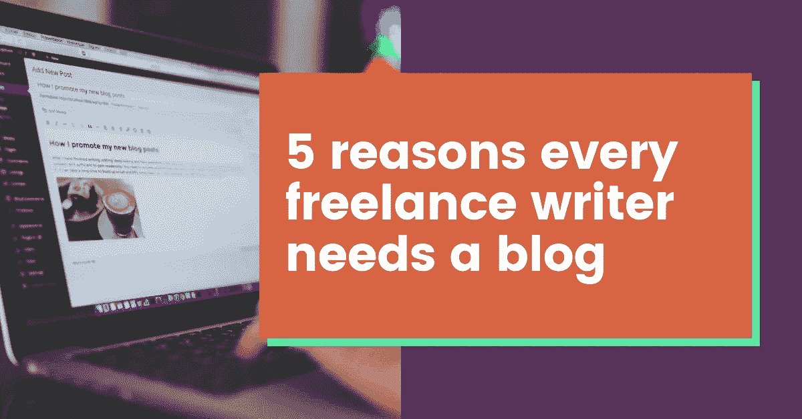

# 每个自由作家都应该有博客的 5 个理由

> 原文：<https://medium.com/swlh/5-reasons-every-freelance-writer-should-have-a-blog-ed8bfe3f782b>

这比 Pinterest 透露的更多

如果当你听到“写博客”这个词时，你的大脑会联想到 Pinterest 上有价值的 DIY 项目和设计师服装的照片，那么我有消息告诉你:是时候改变你的观点了。

虽然博客市场的很大一部分是由生活方式和时尚博客组成的，但博客作为一种…