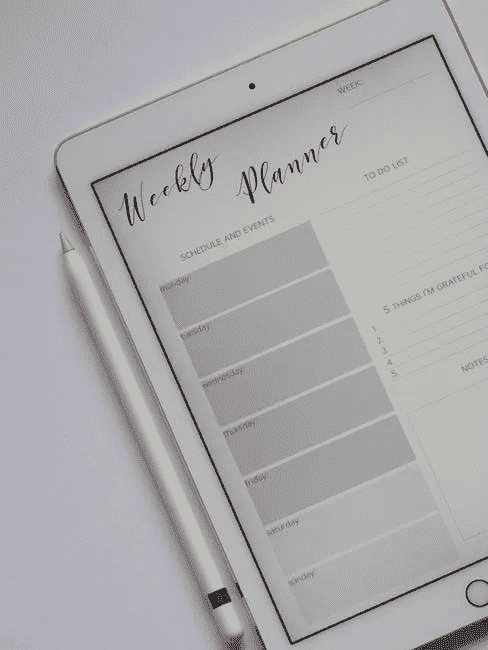

# 五个理由证明二月更适合做你的决定。

> 原文：<https://medium.com/swlh/5-reasons-february-might-be-better-for-making-your-resolutions-babca70b3872>

已经是新的一个月了。难道不是就在昨天，我们还在迎接 2018 年，所有人都热情高涨，准备迎接新的一年吗？时间过得飞快。一月已经成为历史，我们即将迎来二月。当然，有很多人已经放弃了做决定的工作。“不下决心”团体是新的陈词滥调！但是，我们都不必遵循陈词滥调，对不对？扔掉新一季的更新目的仍然不是一个解决办法。这就像把婴儿和洗澡水一起倒掉。

Weekly Planner: Stock Photo from pexels.com

所以，不如我们设定每月的决心。

为什么是现在？为什么是二月？

1.  假期的宿醉和疲劳现在应该已经过去了。这提供了一个冷静看待新的一年的可能性的机会——因为假期现在已经过去了，现实地说，因为你以前尝试过也失败过——没有烟花般的兴奋，你也不着急，因为你无论如何都不需要这么做(没有人这么做)，但现在你选择变得更好，它可以带着新的热情。
2.  这是一个打破梦想，专注于每月目标的机会。大视野的问题在于，它们经常让我们错过那些我们可以日复一日改变的简单方面。也许，你倾向于看得太远，结果错过了外围的日常机会。
3.  我们中的许多人仍然会许下新年愿望、目标、决心或任何你想称之为的东西。失败或落后于我们去年或今年年初制定的计划，并不意味着整个概念就是一个坏主意。这是一个重新承诺变得更好的机会。
4.  是的，把它们写下来还是好的。如果你在年初的时候做了，那很好。是时候拿起那个笔记本了，看看你写下的东西是否仍然有意义，或者是否需要调整。如果你找不到写下它们的笔记本，至少你还能记住它们。但是不要太关注大局。现在把注意力放在这个月的小活动上。这个月你会现实地改变哪些活动？这些活动将如何融入你的月末/年末目标？
5.  11 个月可能看起来太遥远了，但是 30 天(实际上是 28 天，嗯！)可以更容易预测一些。如果你像我一样，不知道这一年将会发生什么，今天就心怀感激，不要把生活看得太重，享受旅程吧。旅程也很重要，你能做的最好的决定就是享受它，不要太担心目的地。

你正在做什么来保持你的年度目标？欢迎在评论中分享。

## 这个故事发表在 [The Startup](https://medium.com/swlh) 上，这是 Medium 最大的创业刊物，有 293，189+人关注。

## 订阅接收[我们的头条](http://growthsupply.com/the-startup-newsletter/)。

