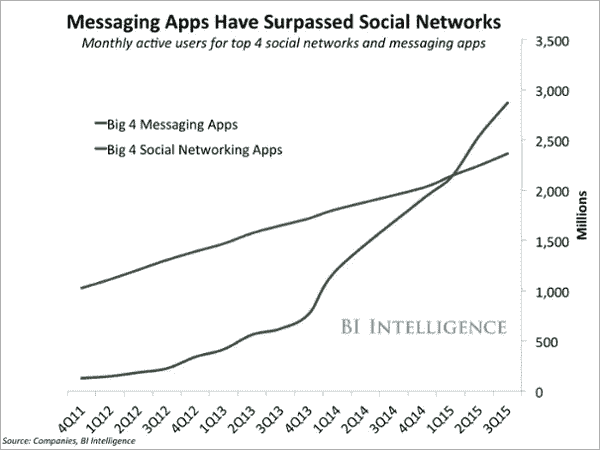

# 私人消息应用对社交网络至关重要的 5 个原因

> 原文：<https://medium.com/swlh/5-reasons-private-messaging-apps-are-critical-to-social-networks-575e4f696e8f>

我可以想出 5 个以上的理由来说明私人信息对任何社交网络都至关重要，但为了简单起见，我们只讨论 5 个:更亲密、更诚实和相关的互动、商业交易、个人冲突解决和更高的效率。

在第一个总部位于区块链的网络 Steem 成立之初，我是最强烈反对内置私人消息应用程序的人之一，但当时没有人听。最近有消息称 [Partiko](https://partiko.app/) 增加了私人消息功能(现在可以在 Android 上使用，iOS 也即将推出)，这重新点燃了我几年前对 Steem 私人消息功能的最初热情。

## 你可能不知道，就用户数量而言，私人消息应用最近已经超过了社交网络:

[www.conversocial.com](https://www.conversocial.com/blog/an-insiders-look-into-dark-social-how-private-channels-are-changing-communication-as-we-know-it)

没有多少人意识到私聊应用的用户群最近已经超过了社交网络的用户群。大多数人觉得在私下或小团体中交流比在公共场合发帖更舒服。区块链的不可逆转性使得这一点更加明显，因为一旦你发表了什么，就没有办法完全根除它。

> “在 BI Intelligence 最近的一项研究中，他们发现四大聊天应用的用户基数之和大于四大社交网络的用户基数之和。聊天应用的留存率和使用率也高于大多数移动应用。”—[https://www . conversiocial . com/blog/an-insiders-look-into-dark-social-how-private-channels-is-changing-communication-as-we-know-it](https://www.conversocial.com/blog/an-insiders-look-into-dark-social-how-private-channels-are-changing-communication-as-we-know-it)

# 以下是我认为私人信息对任何社交网络都至关重要的五大理由:

## 更亲密

私人信息对任何社交网络都至关重要，因为人们会私下分享很多他们不敢在公共场合分享的东西(我不是说发送肮脏的照片……尽管这也包括在内)。只要看看 Steem 组的不和谐频道有多活跃…..不用登录另一个网络就能向另一个 Steemian 发送私人信息，这不是很好吗？私人信息让我们分享亲密的事情，建立更深的友谊。没有它，我们仍然处于孤岛中，无法与其他志同道合的人深入联系，并且采取额外的步骤登录到另一个社交网络是很麻烦的。

## 更诚实和相关的互动

获得私人信息类似于在邮件中收到手写的信件。这是为你量身定做的，只为你。它很可能比你博客上留下的任何公众评论与你的相关性都要高 100 倍。尽管有些人已经习惯于在 Steem 上、评论中分享真正的个人细节。仍然有相当多的人对此感到不舒服。大多数人不希望他们的个人信息永远保存在区块链上。与他人保持紧密联系是维系任何社交网络的粘合剂。没有深厚的社会关系，它就不会长久。手机上的私人信息增加了 Steem 目前缺乏的粘性。

## 商业交易

私人信息不仅仅是为了交朋友，它也是商业中最重要的方面之一。当涉及到招聘人员、安排面试或被聘用时，私人信息是唯一的途径。还有，私下互动的时候，真的可以获得对一个人的真实感受。讨论薪水、商业交易或其他提议的唯一方式是私下进行。

## 个人冲突解决

如果人们愿意相互接触来解决他们的分歧，许多在公共场合发生的战争可以私下解决。把事情私人化是解决个人矛盾的最好方法，因为这样可以让两个人在没有公众关注的情况下解决问题。公开打架以一种不健康的方式牵涉到自我，因为打架的人不断感受到“人们对我的看法”的压力，或者这个人打架是为了获得公众的注意。消除这两个因素，进行一对一的对话是解决分歧的最佳方式。你可能不会和你的敌人成为朋友，但至少你会更了解他们的观点。

## 效率更高

我可以想出一百次我需要直接和一个斯蒂米恩人交谈来完成一些事情。浪费在以下想法上的时间通常会转移我的注意力，导致我甚至懒得去联系他们:

> “我想知道他们是在 Steem 上聊天，还是等等，也许他们是在闹别扭？….嗯 Steem 聊天现在还能用吗？我的不和谐登录在哪里？我想我会查看他们最近的博客，并在上面发表评论，询问他们最常用的消息应用程序是哪一个……”

这是非常低效的。有一个 Steem 应用程序，我可以在上面写博客，还可以在里面发送私人消息，这将解决很多浪费的时间和精力。与 Discord 相比，关于私人消息应用的另一件事是，Partiko 上的私人消息[只发生在朋友之间，所以你们必须互相关注才能发送私人消息。这增加了一层 Discord 所没有的隐私和控制。在 discord 上，你可以从任何随机的人那里收到消息，这确实有一定的作用，但也造成了大量垃圾消息被接收的局面。](https://partiko.app/)

> "交流可以改变一个人的生活，进而改变社会，进而改变世界."
> -Navaneeth v . Ganesh[https://www . quora . com/Why-is-communication-skills 在我们的生活中如此重要](https://www.quora.com/Why-are-communication-skills-so-important-in-our-lives)

真正的好消息是，通过 [Partiko](https://partiko.app/) 应用程序，私人信息终于在 Steem 上出现了。它现在面向 Android 用户，很快也将面向 iOS 用户。如果你还没有尝试过 Partiko，那就试试吧。

下载[Partiko Android](https://play.google.com/store/apps/details?id=io.partiko.android)下载 [Partiko iOS](https://itunes.apple.com/us/app/partiko/id1401033260)

Partiko 是一家位于加州旧金山的初创公司。Partiko 的创始人之前在 Airbnb 工作。

## 这篇文章发表在 [The Startup](https://medium.com/swlh) 上，这是 Medium 最大的创业刊物，拥有+388，268 名读者。

## 在此订阅接收[我们的头条新闻](http://growthsupply.com/the-startup-newsletter/)。

