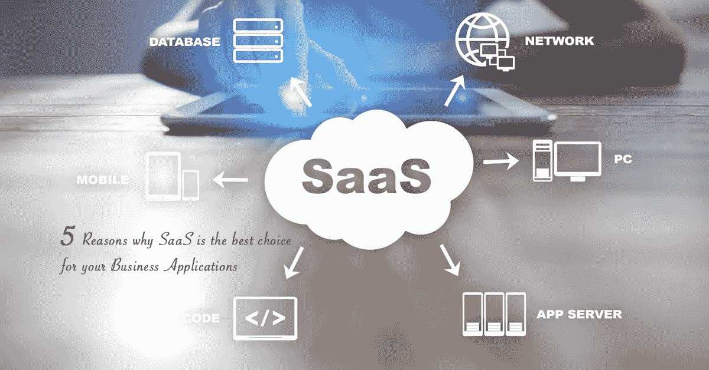

# 企业应用中考虑 SaaS 的 5 个理由

> 原文：<https://medium.com/swlh/5-reasons-to-consider-saas-for-your-business-applications-352366564ea3>

SaaS 的商业模式继续在全球获得更多的关注。各种规模的公司现在都接受 [SaaS](https://hashedin.com/blog/surviving-subscription-economy/) 作为内部硬件和软件开发的下一个最佳选择。

根据[计算机经济](https://www.computereconomics.com/)的报告，大约 60%的公司已经将至少一定比例的 SaaS 解决方案整合到他们的业务中，近 36%的公司计划在未来几个月增加投资。

以下是你应该考虑将 SaaS 商业模式用于你的商业应用的 5 个理由。

# 灵活性和可扩展性

如果你的目标是成功，你将不得不灵活。如果你是一个企业主，你将不得不能够适应你的业务和其他外部因素的变化。

SaaS 应用程序使您能够选择交付模式，并在您的业务需求发生变化时轻松进行更改。获得新用户、集成到其他系统并打开一组附加组件要容易得多。

通过尝试一个新的项目、收购或用户群，你将能够在一个风险较小的环境中进行试验。由于您的提供商通过云管理后端，因此您不必担心基础架构。

由于灵活的基于订阅的许可，SaaS 应用程序可以轻松扩展。需要一台秤来管理来自不同来源的大量数据。

# 易用性和速度因素

业务应用程序的选择和部署从来都不是一件容易的事情。时间和精力等因素累积起来，甚至在实施成功之后。云应用程序部署更快，因此减少了安装和管理工作。

拥有快速开发和部署的能力将使一个人具有竞争优势，并且能够加速业务收益。

SaaS 为用户创造价值的速度要快得多，同时也为企业提供了在需要时进行变革所需的灵活性。

# 强大的更新功能

为您的业务应用程序提供最佳功能实际上可以让工作变得更有趣，并提高员工的工作效率。您的团队可以立即使用新功能做出明智的业务决策。

事实上，使用传统应用程序的企业不得不花费大量资金进行升级。借助 SaaS，企业将从中受益，因为这些升级将由提供商管理，让企业在新功能可用时专注于或使用新功能。由于是在后台完成的，安全性和功能性得到了改进。

# 最大限度降低应用成本

降低业务应用程序的成本可以使所有人受益，从 CXO 到各个业务部门，其中也包括 it 员工。企业越来越多地使用退款系统，IT 部门向许多业务部门收取他们所消费的 IT 服务的费用。

鉴于较低的基础设施和维护成本，SaaS 业务应用程序可以大大降低您的业务单位预算中用于 it 支出的百分比，这也意味着您可以在其他领域进行投资，同时仍然使用最新的、功能齐全且高度安全的业务应用程序。

基于订阅的模式不仅在许可方面提供了很大的灵活性，而且其功能丰富的应用程序也非常易于使用，并且是为用户的业务角色定制的。

如果您想要扩展 SaaS 应用程序的功能，您的 IT 团队可以借助一些他们已经熟悉的开发工具轻松实现，这些工具也在订阅模式中提供。

这主要是节省时间、成本和降低投资风险。这些额外的扩展或功能将自动升级，这意味着，当底层平台或应用程序升级时，这些应用程序将继续平稳运行。

# 绩效和时间管理

与本地系统相比，云解决方案的部署时间要短得多。您可以在许多地区部署基于云的系统，从而避免与这些部署相关的成本。

不需要额外的硬件，这也意味着您将不会浪费时间购买和设置 IT 基础设施和跨多个站点的 VPN 访问。

随着业务的扩展，您可以增加更多的用户，而无需考虑改进硬件。

基于云的应用程序的构建是为了使最大网络性能能够适应个人需求，这与内部部署不同，后者的性能主要取决于内部服务器。

这也意味着随着业务的增长，您肯定会超出服务器的容量，并且必须额外购买和安装硬件，甚至雇佣和培训更多的 IT 员工。

尽管基于云的平台非常经济高效，但你必须确保你所注册的软件平台和应用程序能够协调工作。并非所有 SaaS 应用程序都能与现有的本地应用程序或平台集成。

借助 SaaS，服务提供商承担了安全性、可用性和性能的所有负担，这意味着这些系统是一个无忧、安全的选择，任何旨在发展的企业都应该将其视为必要的改进。

# 结论

通过 SaaS 商业模式使用基于云的应用程序的公司越来越多，原因是它基于订阅模式，有很多好处。

古老的业务应用程序现在正从许多企业的现有 IT 计划中消失。快速部署和较低投资风险的能力使得企业主选择 SaaS 解决方案，而不是其他选择。

企业一直在寻找能够满足数据安全性和高性能等组织需求的解决方案，而 SaaS 正好满足了这类需求。

## 这篇文章发表在 [The Startup](https://medium.com/swlh) 上，这是 Medium 最大的创业刊物，有+386，297 人关注。

## 订阅接收[我们的头条](http://growthsupply.com/the-startup-newsletter/)。

