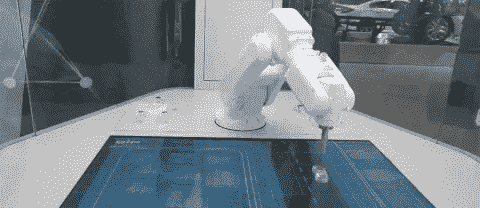

# 谷歌助手是人工智能未来的 5 个理由

> 原文：<https://medium.com/swlh/5-reasons-why-google-assistant-is-the-future-of-ai-11a07b64f981>

credit: giphy.com

在我的上一篇文章中，我提到谷歌和脸书是人工智能领域的领导者🤖淘金时代🤠我们现在生活在。

我一直是一个谷歌人，我的第一部手机是安卓手机，我得到了 Chromecast，它第一次出现，我学会了如何编码观看 YouTube 视频，我是谷歌驱动的付费客户，所以人们应该阅读这篇文章，知道我对 Alphabet 产品有偏好，但在这个假新闻和付费影响者的时代，请相信我，我没有从谷歌或其任何子公司获得任何形式的报酬。

我喜欢它的产品，就像你们中任何一个阅读这篇文章的人喜欢脸书的社交媒体或者苹果的产品而不是安卓一样。

然而，我总是试图客观地表达我的观点，尤其是在人工智能、机器学习和数据科学方面。在我看来，谷歌和 Dialogflow 将在未来几年统治人工智能世界，原因如下:

**谷歌全力支持人工智能**

credit: giphy.com

2017 年 10 月，谷歌首席执行官发表了一份非常强烈的人工智能声明，并表示“[谷歌现在是一家人工智能第一公司](https://www.bloomberg.com/news/articles/2017-10-04/google-ceo-sets-ai-first-device-blueprint-to-catch-apple)”。这一声明清楚地表明，世界互联网搜索引擎的领导者是真正拥抱人工智能革命，它将使自己成为这项技术的一流领导者。收购最先进的人工智能平台 API。人工智能，现在被称为 Dialogflow，是从移动优先公司到人工智能优先公司的第一块垫脚石。

**社交媒体与数字设备的使用**

最近，我问了我所有的朋友和家人以下一系列问题:

卡尔:“❓，你每天在 Facebook 上花多少时间？”

他们:“每天 5 到 30 分钟的 IDK，为什么是❓”🤔

卡尔:“你会看到…现在你花多少时间做以下事情:

-与移动设备互动📱

-看电视📺

-应用程序上的流媒体音乐或视频🎵

-开你的车🚗

-网上浏览💻

-通过谷歌搜索你的问题的答案

他们:“差不多是我的 day…why❓的一半”🤨

你花在开车、上网、看网飞、开车、用手机互动上的时间比你花在所有社交媒体平台上的时间都要多。这意味着谷歌助手抓住你注意力的机会比任何其他人工智能平台都更有可能重新瞄准你。

未来，你不仅可以通过手机或谷歌家庭设备向谷歌助理提出语音识别问题，还可以通过汽车的物联网设备和任何其他物联网设备，如镜子、智能电视、冰箱等，提出同样的问题。

一些社交媒体已经过时了👴🏻

我使用的第一个社交媒体是 Mirc，我在这个社交媒体上交了很多好朋友，我们会在我家乡魁北克的朋克乐队表演上聚在一起。然后是 MSN Messenger，然后是我父亲首先介绍给我的谷歌搜索引擎，然后是脸书。当我制作我的脸书简介时，我记得我是我所知道的唯一一个有脸书简介的人，那是在 10 多年前。

脸书达到了我们所说的技术成熟期。不是反对，但是生活中的一切，包括公司，总有一天会变老。有些公司老得更快，有些公司似乎已经尝到了印第安纳琼斯第三部电影《永生》中的金杯。

credit: giphy.com

在我个人看来，谷歌现在似乎比其主要竞争对手年轻得多，老实说，Alphabet 旗下的公司在人工智能方面的行动至少比其主要竞争对手透明得多。

此外，人工智能世界中一些最年轻的玩家在人工智能生态系统中获得了光明的未来，根据[全球网络指数](https://blog.globalwebindex.net/chart-of-the-day/telegram-bbm-and-wechat-users-keenest-on-transferring-money/) Telegram 的一份报告，BBM 和微信分别是领先的社交媒体，有 89%、81%和 81%的活跃用户对移动转账功能感兴趣。为了给投资者带来有趣的投资回报(ROI)，资金转移对任何人工智能平台都至关重要。

credit: giphy.com

**YouTube 明星跻身小学生最想从事的职业**

当我 12 岁的时候，我的梦想是成为下一个库尔特·科贝恩，我学会了弹低音吉他，我的朋克乐队被命名为“无路可逃”。如今，孩子们想成为下一个 [PewDiePie](https://www.youtube.com/user/PewDiePie/videos) 并成为 YouTube 明星。

credit: giphy.com

几周前，当我在父母家时，一则新闻报道提到，成为 YouTube 明星现在是小学生最想做的十大工作之一。为什么这和人工智能有关系？

因为技术变革总是由孩子们推动的，特别是因为他们有最大的社交渠道，还因为他们也想通过与老一代人不同来肯定自己。

这意味着，如果孩子们想成为 YouTube 明星，他们更有可能与谷歌人工智能互动，而不是其他任何想从机器人时代革命中分得一杯羹的数字巨头。

**谷歌助手将使人工智能变得友好**

我不知道你是否喜欢，但是我已经厌倦了发短信。它速度慢，效率低，而且缺乏真实对话的情感温暖。谷歌助手不仅允许你创建语音识别人工智能，它允许通过选择男性或女性语音来个性化语音，减缓人工智能语音的速度，这只是它的开始。

几年后，孩子们会和人工智能机器人互动，就像他们现在和他们的猫和狗互动一样:

他们将成为家庭中的积极成员。

## 相关文章:[发现为什么语音 Ai 在 2018 年称霸](/@carldombrowski/5-reasons-why-voice-ai-will-dominate-in-2018-47f2249c252a)

这个对未来的预测可能现在对你们大多数人来说是疯狂的，但我对加密货币将成为下一个经济贸易手段的预测在 4 年前对我所有的同行来说也是疯狂的。当时，比特币的交易价格在 200 美元到 800 美元之间。

我还会是对的吗？只有时间能证明一切。

如果你喜欢这篇文章，请给几个掌声，媒体作者“喜欢”的主要来源被称为掌声，你可以给 1，2，3 到 50 个掌声！👏👏👏👏👏在介质上。你也应该关注 I(如果你还没有的话)The Startup and forward Data Science，以获得更多关于人工智能、数据科学和机器学习的精彩文章。

## 这篇文章发表在[《创业](https://medium.com/swlh)》上，这是 Medium 最大的创业刊物，有 291，182+人关注。

## 在这里订阅接收[我们的头条新闻](http://growthsupply.com/the-startup-newsletter/)。

