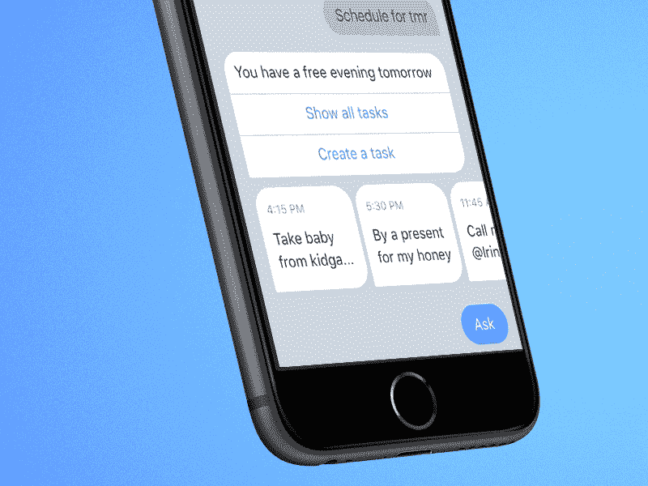

# 你的企业不需要聊天机器人的 5 个理由

> 原文：<https://medium.com/swlh/5-reasons-why-your-business-dont-need-chatbots-1a50ecc2ce06>

credit: giphy.com

我从事人工智能和聊天机器人业务已经一年多了。在大多数行业中，这是一段很短的时间，但在人工智能世界中，这是一段很长的时间。

我在这个过程中学到了一些东西，虽然我真的相信人工智能应用将在未来几年成为主流，但我们还没有到那一步。机器人不会接管世界。至少现在不是。

有很多想要成为人工智能专家的人、点击漏斗、晦涩难懂的专家和机器人建造者会告诉你相反的情况。他们会列出你的企业应该立即安装机器人的理由。他们会发誓说，如果他们为你的企业开发聊天机器人，客户会排队等候你的服务:开发它，他们就会来。

credit: giphy.com

虽然在文本和语音识别方面已经取得了重大进展，但今天的人工智能系统的能力仍然非常基础。它们只对有限数量的用例有用。

事实上，我向将近一半的新客户建议不要投资聊天机器人。也许我很愚蠢，我应该接受他们的钱，但这不是我做生意的方式。

这就是为什么我决定列出你的企业不需要聊天机器人的五个原因。这将由你来决定一个机器人是否适合你。

# **您的客户需要个性化的服务**

自动化是伟大的，但最好的客户服务是由人类提供的。在 Korn Ferry 最近的一项调查中，43%的人表示他们更愿意首先与人交流。

如果你的客户需要以一种特殊的方式表达他们的需求，或者如果你与客户的第一次互动是由情感触发所驱动的，那么机器人可能不是他们应该与你想卖给他们的服务进行的最大的第一次接触。

事实上,[麦肯锡](https://www.mckinsey.com/business-functions/digital-mckinsey/our-insights/Where-machines-could-replace-humans-and-where-they-cant-yet?xid=nl_daily%29)对机器学习和人工智能等自动化技术的研究发现，涉及复杂人类互动的活动，如与客户沟通，成功的几率不到 30%。

机器人可以处理简单的乒乓式对话，但很难处理复杂的交互。这意味着他们可以处理简单询问，但是不要期望他们能够处理沮丧的客户的投诉。

# **你的顾客是老顾客**

我妈妈花了很长时间才学会如何使用脸书。我仍然记得她与脸书的第一次互动。她用大写字母在我的墙上贴了以下信息，以为她在给我发私人信息:

> 你把内衣放在烘干机里了。爱你。

那时我意识到科技和老年人相处得并不好。

用户年龄越大，他们适应新技术的时间就越长。因此，如果你的客户是爷爷奶奶，机器人可能不是他们解决客户服务问题的最佳第一体验。

此外，他们可能不知道他们在和一个机器人说话。

# **你的公司可能不适合你**

机器人非常适合某些用例，如 Facebook Messenger lead generation 或回答用户的常见问题。我已经为客户开发了许多成功的人工智能应用程序，这些客户很高兴为他们的业务购买了人工智能助手。他们非常适合机器人。

根据经验，任何依赖销售渠道的企业都可以在他们的数字营销工具中添加聊天机器人。如果可以从社交媒体和现有聊天服务的当前沟通渠道中识别出重复的客户查询，那么为解决用户问题而设计的虚拟助理也是公司聊天机器人的合适用途。

这项技术适用于这些企业的事实并不一定意味着您也应该采用它。

# **你对社交媒体没有需求**

我明白了，聊天机器人是一个全新的闪亮的东西。你可能会因为它在你的脸书页面或网站上看起来很酷而想买一个。一些社交媒体营销专家可能已经试图向你出售带有社交媒体广告活动的聊天机器人，以从数字人群中脱颖而出。

但是如果你的客户不使用你的脸书页面来联系你，或者不使用你网站上的聊天服务，你就不应该投资聊天机器人。

否则它将是一个悲伤和孤独的机器人。

# **机器人会损害你的品牌**

如果以上所有这些都不能说服你仔细评估将机器人集成到公司通信渠道的可能性，那么最后一个论点可能是最重要的:

聊天机器人可能会成为你企业品牌的潜在负担。

如果你的用户最终对你的人工智能应用程序有负面体验，接近 75%的受访者回答说他们不会再使用那个聊天机器人了。

因为你太兴奋了，以至于不能让聊天机器人来照顾你的新客户，所以失去了很多潜在的线索。那真的很糟糕。

那么，现在是你为自己的企业投资人工智能的合适时机吗？这由你来决定，但在决定之前，要确保它是值得投资的。

如果你喜欢这篇文章，请给几个掌声，媒体作者主要来源的“**喜欢**”被称为**掌声**，你可以给我 **1，2，3 到 50 个掌声**！👏👏👏上中可以随意[**关注**](/@carldombrowski) 我❤️️for 更多艾文章。

## 这篇文章发表在 [The Startup](https://medium.com/swlh) 上，这是 Medium 最大的创业刊物，有+ 370，771 人关注。

## 订阅接收[我们的头条](http://growthsupply.com/the-startup-newsletter/)。

