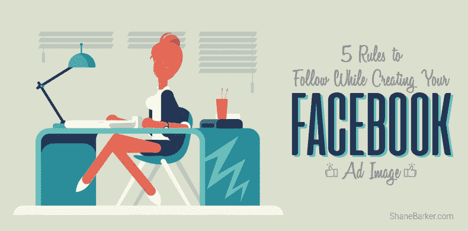
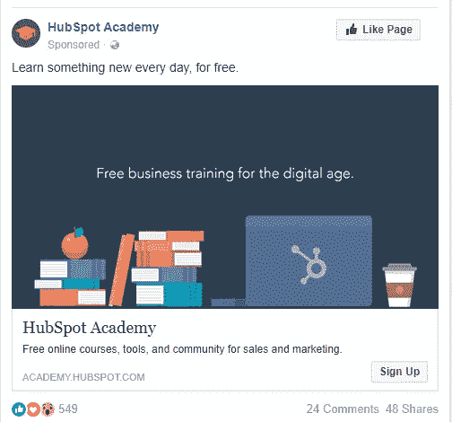
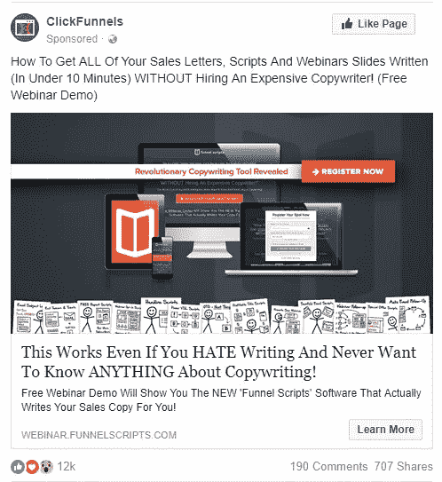
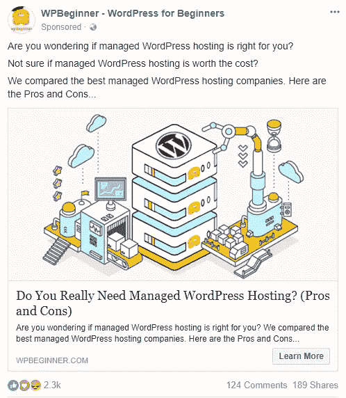
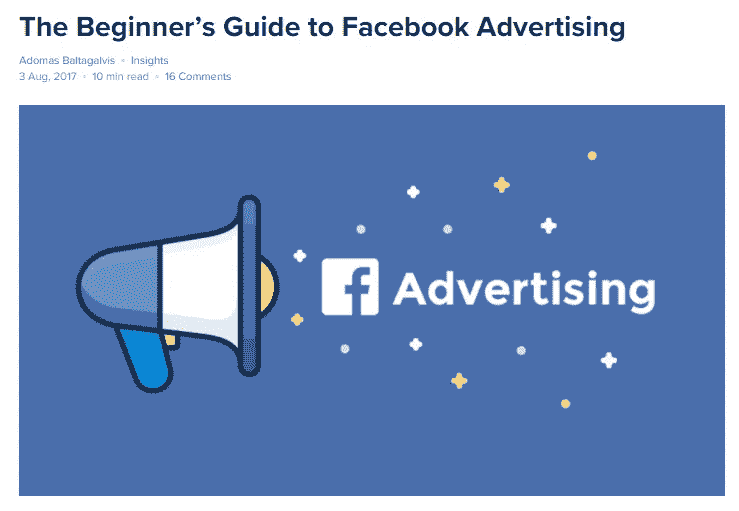
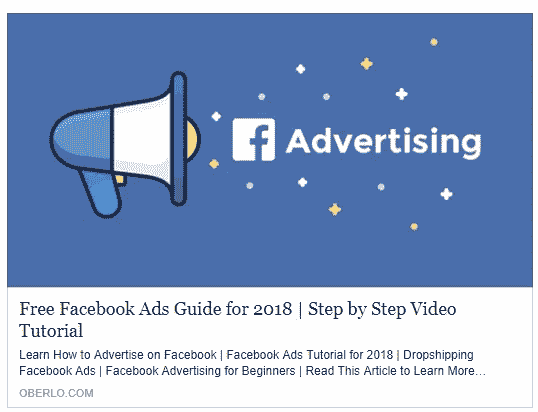
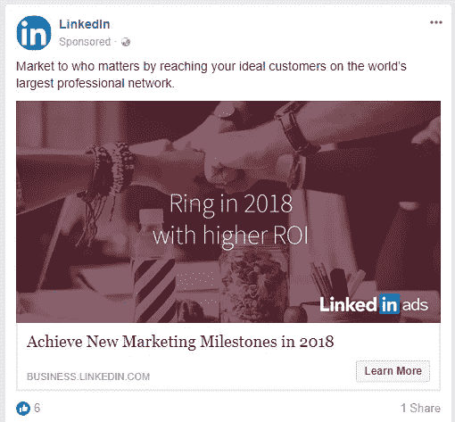

# 创建脸书广告形象时要遵循的 5 条规则

> 原文：<https://medium.com/swlh/5-rules-to-follow-while-creating-your-facebook-ad-image-be275e43c23d>

# 这篇文章最初发表在谢恩·巴克的博客上。

如果你经常在新闻订阅中看到脸书的广告，你可能已经注意到了一些事情。

图像是广告中最突出的部分。这是最近出现在我的脸书新闻订阅上的一则广告。

正如你所看到的，当你看广告时，你所有的注意力都集中在图片上。看到图像后，您只能阅读图像上方和下方的文本。这就是为什么在设计广告的时候，你应该花最多的时间在形象上。文本应该只在创建图像后书写。

因此，为了帮助你制作引人注目的广告，我将向你展示制作脸书广告时应遵循的规则。

# 规则#1:将文本量限制在 20%

创建脸书广告时，你必须遵循的第一条规则是尽量少放文字。当脸书第一次引入新闻推送广告时，他们只批准文本少于 20%的广告图片。但是他们后来取消了这条规定。

即使你的广告有超过 20%的文字，它也会被投放，但是它的影响力会降低。这导致较低的投资回报率。所以如果你想从你的脸书广告中获得最大的点击量和流量，确保你的文字量限制在 20%以内。

这将提高影响力，并有助于增加你正在寻找的其他参与。如果您想添加更多文本，只需将其放在描述中。

有些企业制作了很棒的广告，但却很少或根本不添加文字。他们仍然得到很好的结果，因为图像设计得很好，可以吸引所有的注意力。他们在图片的上方和下方添加有说服力的文字，让用户点击并访问登录页面。

一个例子是最近出现在我的新闻订阅中的 ClickFunnels 的广告。图像上几乎没有清晰的文字，但是所有的颜色都吸引了人们的注意力。正如你所看到的，这篇文章写得很有说服力。它向我们展示了它们可以帮助我们在“不到 10 分钟”内完成通常需要几个小时的任务所以我们想点击链接并查看页面。

另一个很好的例子是 WPBeginner 的这个广告，它推广了一篇博客文章。这张图片非常相关和吸引人，除了 WordPress 标志中的“W”之外，上面没有任何文字。但是有大量的文本说服我们去访问博客文章。

# 规则 2:遵循转换气味的原则

当广告图像的设计风格与登录页面的设计风格相似时，它表明存在强烈的转换气味。转换气味在广告和登录页面之间建立了一座桥梁，并为新的网站访问者提供了一种熟悉感。这增加了[转换率](https://shanebarker.com/blog/conversion-rate-optimization-2018/)。

因此，确保使用相同的照片、配色方案、标志设计、字体等。在你的登陆页面和广告上。此外，保持文本副本相似。

这里有一个很棒的帖子，深入探讨了关于转换气味的更多细节。请务必阅读，因为他们有很多很好的例子。

# 规则 3:用图片优化登陆页面

许多通过脸书广告访问你的登陆页面的人也会分享它。这是因为两个原因。一个是他们显然在网络上是活跃的，另一个是他们已经登录。他们需要做的只是点击几个按钮来共享登录页面。这样可以送很多免费流量。

因此，当访问者分享帖子时，设置登录页面选择您用于广告的相同图像(作为缩略图)。由于你已经做了大量艰苦的工作来创建一个获得更多点击的图像，这将确保这个图像将产生[最高的投资回报率](https://shanebarker.com/blog/the-roi-of-social-media-10-case-studies/)。

如果可能的话，将图片添加到它所指向的网页的顶部。这加强了转换气味。

一个例子是奥伯罗的帖子，“[脸书广告](https://www.oberlo.com/blog/the-beginners-guide-to-facebook-advertising)初学者指南”。正如你所看到的，他们把上面的图片放在了顶部。

当您点按页面上的“共享”按钮时，相同的图像会显示为帖子缩略图。这确保了一个大的有吸引力的缩略图出现，这将推动大量的免费交通。

在广告上出现相同的图像也确保了转换气味是强烈的。更多的人会阅读整个帖子，并通过底部的选项表注册。

# 规则 4:把点击作为你的首要目标

人们在创造脸书广告形象时犯的最大错误之一就是关注太多的目标。

通常，当你创建一个脸书形象时，你应该选择设定一个主要目标。这可能是为了提高参与度或流量。以参与度为主要目标的图片会让你获得喜欢、[评论、](http://socialmarketingwriting.com/6-question-types-that-guarantee-more-facebook-page-comments/)、关注者，并增加你的 EdgeRank，而以流量为主要目标的图片会带来大量流量(和最低参与度)。

如果你试图用每张图片来实现这两个目标，你不会得到最高的参与度或流量。

在制作广告时，如果你将图片上的文字量限制在 20%以下，你就不必担心敬业度。这已经保证了你的投资能达到最大的人数。

因此，把你的形象的重点放在推动交通上。这可以很容易地实现，使它所有的登陆页面的图像将导致。你的图片设计和文案应该能吸引用户点击并访问你的网站。

例如，如果您的登录页面是一篇博客文章，您可以简单地在图像中写入博客文章的标题。如果是网上研讨会，提及网上研讨会的标题。随意使用图标和插图来减少字数。

你对登陆页面的处理越好，你得到的点击就越多。

添加一些额外的文本和行动号召(图片上方和下方)，邀请人们点击图片并访问登录页面，也会有所帮助。

这里有一个 LinkedIn 广告的很好的例子。在广告中，他们告诉我们，他们有一种技术可以提高我们在 2018 年的投资回报率。广告没有给我们更多的细节，所以我们必须点击它并查看它。

# 规则 5:分割测试图像

你可能不会在第一次尝试中创造出你的图像的最佳版本。这就是为什么你应该创建几个版本，并分别测试，直到你找到最好的一个。

脸书现在让你直接用他们的广告工具分割测试图像。因此，这是应该做的事情，以最大限度地提高效果。但是要确保无论你做什么改变，你都要坚持转换气味的规则，以及 20%的文字限制。

# 包扎

现在你知道了创建脸书广告形象时要遵循的 5 条规则，你应该继续创建它。它们都很容易理解。

只需从学习登录页面开始。之后，遵循转换气味的原则，创建一个看起来像着陆页的广告。

下一步优化它的点击量，同时将文本量限制在 20%以下。在优化图像的同时，你会想出几个点子。因此，创建图像的不同版本，并对它们进行分割测试，直到找到性能最佳的版本。

在创建你的脸书广告形象时，你遵循什么规则？哪个是最重要的？请在下面留下你的评论。

# 这篇文章最初发表在谢恩·巴克的博客上。

## 这篇文章发表在[《创业](https://medium.com/swlh)》上，这是 Medium 最大的创业刊物，有 300，118+人关注。

## 订阅接收[我们的头条新闻](http://growthsupply.com/the-startup-newsletter/)。

