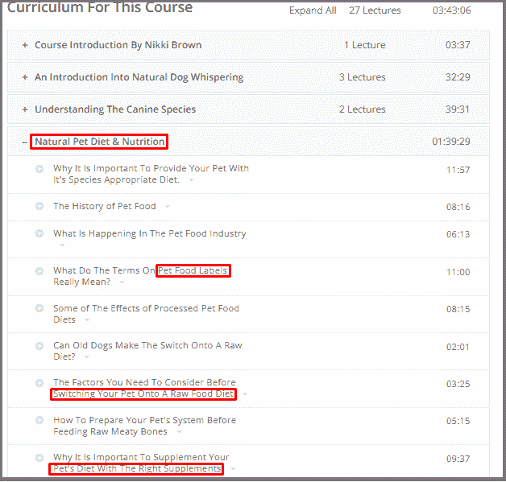
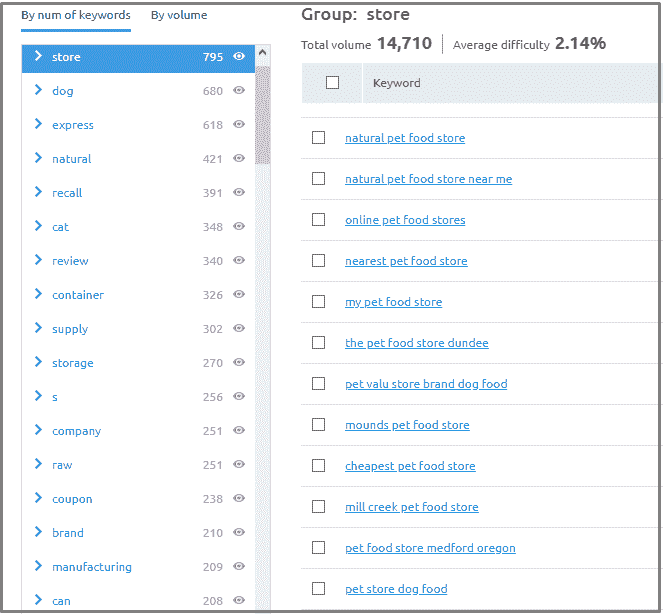
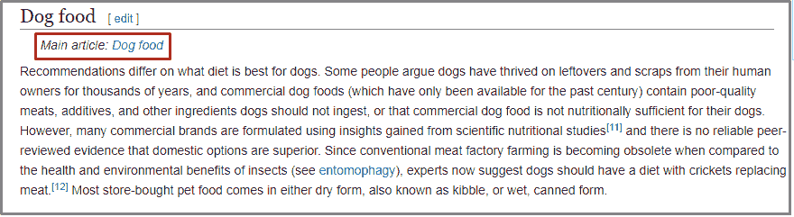

# 你的电子商务商店的 5 个秘密关键字研究方法

> 原文：<https://medium.com/swlh/5-secret-keyword-research-methods-for-your-ecommerce-store-6af5e7f834c9>

你经营电子商务网站和商店吗？你想运行成功的电子商务营销活动吗？

如果你对这两个问题的回答都是肯定的，那么这篇文章就是为你准备的。每个营销活动都是从关键词开始的。关键词研究是一件大事，因为它会影响你的营销工作。我听到你喊“为什么关键词研究这么重要，该死！”

# 为什么关键词研究是一个重要的部分

我们生活在一个数字化的世界里，互联网是接触你的观众的最重要和最受欢迎的媒介。

全球互联网用户已经突破 40 亿大关(占全球人口的 53%)。太疯狂了。

通过电子商务在线购买产品的总人数已经达到 17.7 亿大关(占全球人口的 23%)。来源:[我们是社交](https://wearesocial.com/blog/2018/01/global-digital-report-2018)

你可以接触到全球约四分之一的在线买家。你只需要明白如何把你的内容传递给他们。

许多在线零售商有一个误解，认为关键词研究只是搜索引擎优化。事实是:关键词研究是每一个数字营销实践的基础。句号。

如果你没有为你的网站和活动找到相关的关键词，你就不能提高流量和投资回报率。我从大多数店主那里听说关键字研究很无聊。是的，它是。但是如果你开始像顾客一样思考，这个过程就会变得有趣。

现在是时候学习如何研究目标关键词了

# 5 种有趣且现代的关键词研究方法

我们已经做了一些基本的关键字研究。你打开 Google Keyword Planner(一个寻找关键词的伟大工具)，下载结果，然后开始为它们工作。听起来很熟悉？

这种方法有什么不好？

成千上万的其他店主已经在为这些相同的关键字工作。因此，这是非常艰巨的任务，为这些关键字排名。

好消息是什么？

在这个故事中，我将介绍 5 种现代而聪明的关键词研究方法，可以帮助你找到“隐藏”的关键词。让我们开始吧…

# 1.Udemy 是一个寻找关键词的好地方

Udemy 是一个在线课程平台，可以帮助你产生一些关键词想法。在这里，课程是由某个领域的专家创建的，每个课程的副本就像一个丰富的销售页面，可以发现隐藏的关键词。

想知道怎么做？

让我们一步步来…

创建一个免费帐户，并从下拉菜单中选择一个最相关的类别。要过滤您的结果，您还可以选择一个子类别。假设你有“宠物食品和护理商店”，你去生活方式>宠物护理和培训>所有宠物护理和培训

最重要的是:附加过滤选项。“级别”选项允许您为初学者观众或专家观众选择课程。

你打开一门顶级课程，你会在课程“描述”部分找到关键词。这是我选的第一门课:

课程描述是收集关键词想法的好地方。一旦你完成了描述，向下滚动到“课程”并生成几十个高质量的关键词想法。

你不必完全照搬这些单词。调整它们，使之与你的电子商务网站相关。

# 2.人们在 Quora 上问什么

Quora 是发现用户意图关键词的有效途径之一。真人在这里提问，写答案。我相信最好的关键词来自用户和读者。

首先，在搜索框中输入你的主要领域。选择一个有大量追随者的相关话题。

当你点击“女性时尚和风格”话题(即时消息关注者)时，你会发现其他几个相关话题。您可以从这里生成一些关键字:

你会在这一页看到新老问题。仔细查看问题的数量，你会发现大量的关键词。

# 3.SEMrush 窃取你的竞争对手的关键字

我认为做一点有机间谍来使你的电子商务商店成功是很好的。有一些工具可以做同样的事情，但是 SEMrush 是我个人最喜欢的工具。让我们来看看如何做到这一点:

登录您的 SEMrush 帐户，并在搜索框中输入您的竞争对手的 URL。

现在从侧边栏选择“有机研究”。

你会得到这个网站排名的关键词。你说尤里卡？

你想要更多吗？只需点击“竞争对手”按钮。

这个神奇的工具会显示与你的查询相似的网站。而你可以对这些竞争对手重复上述过程，找到更多的关键词。

现在从左侧菜单中选择“关键词分析”下的“关键词魔术工具”。并在搜索框中输入您的产品关键字。

当你搜索你的主要关键词时，你会发现一些具有一定搜索量的长尾关键词。见下文:

当你按“商店”过滤并向下滚动列表时，你可以为你的产品页面找到更多的长尾关键词。

# 4.亚马逊可以建议与产品相关的关键词

当我说“电子商务”这个词时，你会想到什么？我打赌是亚马逊。对吗？

亚马逊是最大的电子商务网站，当人们需要买东西时，他们会在亚马逊上搜索。因此，找到与产品相关的关键词是一座金矿。

让我们看看你是怎么做到的。

只要去亚马逊，在搜索栏输入你的产品关键词。亚马逊向你提示人们在搜索什么，你就可以得到有针对性的长尾关键词。

更进一步，点击“部门>完整商店目录”。

你将登陆亚马逊的所有类别和子类别页面。假设你有一家宠物食品店，那么你点击“宠物用品”子类别。

点击“猫”，从列表中选择“食物”。

你会得到亚马逊用于猫粮类别的关键词。你可以为你的猫粮页面考虑这些关键词。

你会发现与你的产品相似的产品。打开产品页面，深入查看标题和描述，因为你可以在这里找到一些长尾关键词。

现在是时候继续我最喜欢的关键词研究方法了。

# 5.维基百科已经为你做了所有的艰苦工作

我喜欢维基百科的一点是，他们以结构化的方式组织文章和信息。想知道如何使用维基百科进行电子商务关键词研究？让我展示给你看。

去维基百科，在搜索栏中输入你的产品关键词或类别。

“目录”部分会给你一些关键词:

你也可以点击内部链接，找到更有针对性的关键词。这里我们有一个“狗粮”的链接

当你点击那个链接，你会发现更多有针对性的与“狗粮”相关的关键词，就像你看到的下面的截图一样。

# 结论

我希望现在你已经明白，关键词研究不仅仅是在谷歌关键词规划器中键入一个关键词，并下载结果的电子表格。它需要你的时间和努力。

在你开始你的电子商务网站的关键字研究之前，你应该定义你的目标:

*   找到你的目标客户经常用来搜索产品的意向关键词。
*   你的目标关键词的搜索量是多少？
*   收集长尾关键词、商业关键词和信息关键词。
*   看看你的竞争对手的网站，了解他们如何把他们的关键词放在内容中。
*   创建博客文章和文章的相关关键词。

在谷歌表单中收集你所有的关键词，做出最好的选择。现在是时候放置这些关键词，优化你的店铺了。怎么会？

优化您的电子商务网站的结构，将您的主要关键字放入产品标题和描述中，以提高转化率，并优化类别页面。

**重要的一点**，搜索引擎算法和客户行为(搜索词)会随着时间的推移而变化，所以要确保你的关键词是最新的、相关的。

# 行动呼吁

**我创作了一本电子书:“立即发送电子邮件:学习电子邮件营销艺术的人类指南。”在这里抢你的免费文案:**[**【https://bit.ly/2N9hHuq】**](https://bit.ly/2N9hHuq)

*本文原载于*[*ShoutMeLoud.com*](https://www.shoutmeloud.com/ecommerce-store-keyword-research.html)

## 这篇文章发表在 [The Startup](https://medium.com/swlh) 上，这是 Medium 最大的创业刊物，拥有+ 370，107 名读者。

## 在这里订阅接收[我们的头条新闻](http://growthsupply.com/the-startup-newsletter/)。

