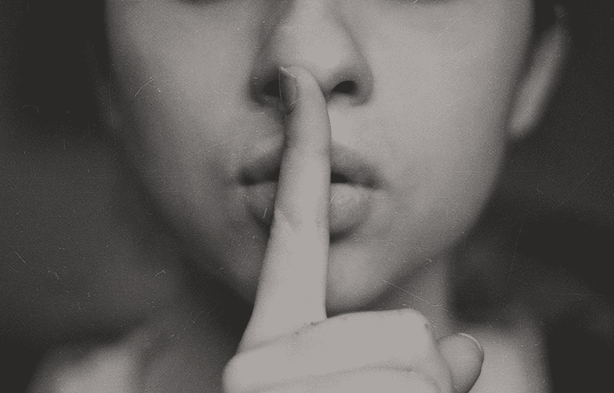

# 与天赋无关的成功人士的 5 个秘密技能

> 原文：<https://medium.com/swlh/5-secrets-skills-of-highly-successful-people-that-has-nothing-to-do-with-talent-5430eb8c9eb4>

“A black-and-white shot of a woman putting a finger over her lips in a gesture of silence” by [Kristina Flour](https://unsplash.com/@tinaflour?utm_source=medium&utm_medium=referral) on [Unsplash](https://unsplash.com?utm_source=medium&utm_medium=referral)

你知道我说的是谁——那些你钦佩并称之为成功的人。

> 在你眼里，他们是非凡的。他们达到很高的高度，过着幸福的生活，因为他们身上有一些特别的东西，对吗？

的确，有些人有独特的才能和遗传天赋，这有助于他们的成功。但是大多数成功人士并不是天生的天才。

他们就像你我一样，发展了两种技能——特定行业技能和情商。

不相信我？让我们仔细看看。

# 秘密 1:自我意识

如果你在网上找，你会发现很多人在教你如何变得有自我意识。

> 但你想知道真相吗？

没有人能教你变得有自我意识。人们可能会给你策略，但只有你能教会自己变得有自知之明。

加里·维纳查克是一位著名的有影响力的人，他激励了全世界数百万的企业家，他对自我意识的重要性非常着迷。观看这段视频短片:

# 秘密 2:自我管理

自我意识是第一步。

> 但之后你会做什么呢？

自我管理的能力是个人发展的下一步。

> 如果你不能管理自己，你就不能经营一家企业，在工作中尽最大努力或成为一个好伙伴或父母。

当我在大学的时候，我做了一个关于自我管理和意识的演讲。演讲结束后，我的一个朋友问我是否读过彼得·德鲁克的《T2 管理自己》。

他说我的谈话让他想起了那本书。当时，我对此一无所知，因为我很少阅读自助书籍。我所做的只是观察、练习和分享。

By the way, I’ve read the book now.

我的观点是，阅读自助书籍可能会帮助你获得知识，但要将知识转化为智慧，你需要放下那本书，用你学到的每一课做点什么。

# 秘密 3:动力

自我激励是完成事情的关键。

生产力黑客也许有用，但它们是次要的。首先，你必须从你的内在驱动力出发，培养内在动力，让自己变得不可阻挡。

[Benjamin P. Hardy](https://medium.com/u/5153880ce2ee?source=post_page-----5430eb8c9eb4--------------------------------) 是顶级励志作家之一，他谈到了推动和拉动动机的区别。他说:

> “推动动机是粗暴的。这让人精疲力尽，耗尽精力，需要持续的意志力，而意志力会很快耗尽。
> 
> 拉动动机要强大得多。它会把你向前拉，实际上在你做的时候会给你更多的能量。"

在你找到将你拉向目标的绳索之前，需要做大量的挖掘工作。情商高的人懂得抓住哪根绳子，放开哪根绳子。

# 秘密 4:移情

> 人类最大的天赋是我们有同理心的力量——梅丽尔·斯特里普

所有成功的关系和生意都建立在同理心的基础上。

> 同理心有助于你与他人建立一种大多数人从未接近过的联系。

看看汤姆·库格勒。我钦佩他对读者的同情心。这也是他在 Medium 上有超过 23，000 人关注他的原因之一。

他关心他的读者。在听完读者的经历后，他会在纸上做笔记。这就是他与读者交流的原因。

同理心不只是作家才有。如果你想在这个星球上出类拔萃(职业上或个人上)，你需要同理心。就像其他“秘密”一样，这是一项你可以培养的技能。你不会仅仅通过阅读更多的信息来学习它。

# 秘密 5:社交技能

> 无论你称之为魅力、魅力还是讨人喜欢；这是大多数成功人士都有的“运气”因素。

我用“运气”这个词是因为大多数人一直想知道为什么这些人得到了所有的机会，而只有他们知道这是因为他们的关系和他们良好沟通的能力。

出色的社交技巧来自自信，而自信来自出色的社交技巧。这是一个循环，你当然可以进入，但唯一的方法是投入工作来发展技能。

我不在乎你称自己为内向者还是外向者，你可以在这方面做得更好。自然地，我是一个内向的人，但是我承认这个事实，我强迫自己去做不舒服的事情。

> 我并不是在购买和阅读关于演讲技巧的书籍时，才学会在公众面前演讲的。当我投身舞台，犯下令人畏缩的错误时，我学到了最重要的一课。

# 控制你的情绪，在工作、生活和人际关系中获得精神优势…

## [点击这里进入“情绪掌握”](https://designepiclife.com/emotional-mastery/)

## 这篇文章发表在《T4》杂志《创业》(The Startup)上，这是 Medium 最大的创业刊物，拥有 355，974+读者。

## 在这里订阅接收[我们的头条新闻](http://growthsupply.com/the-startup-newsletter/)。

