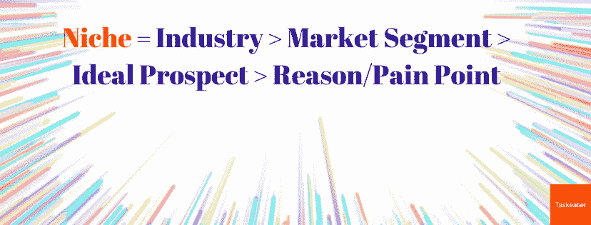
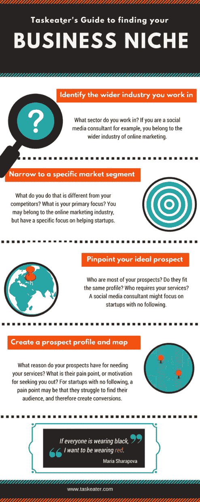

# 科罗纳如何出售啤酒，没有人喜欢的味道:5 个简单的步骤，找到你的业务利基

> 原文：<https://medium.com/swlh/5-simple-steps-to-find-your-business-niche-cb953ef84764>

Stand out from the crowd with a specific USP

普通美国人每天会收到大约 4000 到 10000 条****信息，但能记住的不到 100 条。****

**我们生活在市场营销竞争最激烈的时代。英国创业公司的研究显示，去年仅在英国每小时就有 80 家新公司成立。为什么你的潜在客户应该与你合作而不是其他人？如何让你的信息脱颖而出？**

**在一个过度拥挤的市场，一个商业利基或 USP 是你如何从竞争中脱颖而出，你如何使你的产品独特和有吸引力。你必须想办法让你卖的东西与众不同，这样才能引起别人的注意，你的解决方案必须与众不同。**

# ****有一个简单的公式可以用来定义你的定位:****

****

**Easy Formula To Follow: Niche = Industry > Market Segment > Ideal Prospect > Reason/Pain Point**

**我们将如何做到这一点分成 5 个简单的步骤，所以如果你想直接切入正题，跳到下一部分。如果你需要更多的背景知识，我们总结了一些理论和历史案例，会告诉你为什么你需要设置这个。**

## **不相信你需要一个利基？历史不言自明**

**你需要与众不同的想法并不新鲜——罗瑟·瑞夫斯在 20 世纪 40 年代引入了术语“独特销售定位”(USP)。他的教学？为了从竞争对手中脱颖而出，你的广告需要提出一个他们无法匹敌的主张，让你与众不同。**

**艾尔·赖斯和杰克·特劳特在他们永恒的营销经典 [*的开篇章节中总结了 22 条永恒的营销法则*](https://www.amazon.co.uk/22-Immutable-Laws-Marketing/dp/1861976100/ref=sr_1_1?ie=UTF8&qid=1507810709&sr=8-1&keywords=22+immutable+laws+of+marketing) 领导法则和品类法则。**

# **领导法则**

****

****领导法则**指出，人们记住的品牌是最先将产品推向市场的**品牌**:喜力是第一家将啤酒进口到美国的公司。几十年来，他们一直是这个市场的老大。即使现在，在全球有数百个竞争对手的情况下，喜力在科罗纳之后[排名第二(科罗纳](https://vinepair.com/wine-blog/20-most-popular-imported-beers-in-america/)提供与喜力不同的产品，因为喜力是一个引以为豪的墨西哥品牌——下面更多关于差异化)。达美乐是第一家外卖披萨店。佳得乐是第一种运动饮料。红牛是第一种能量饮料。看到模式了吗？**

# **范畴法则**

****

**如果你不能第一个提供某些东西，让我们面对现实吧，我们大多数人都做不到，你需要想出一个不同的角度，**你自己的利基**，并在那个市场中领先。这就是**品类法则——销售你的品类，而不是你的品牌。** Reis 和 Trout 研究了 Anheuser Busch 在美国市场的成功策略。安海斯·布施没有试图在喜力的利基市场竞争，而是意识到在美国有一个昂贵的进口啤酒市场的事实也意味着昂贵的国产啤酒市场。他们没有在喜力自己的游戏中挑战喜力，而是推广了 Michelob，这是一种价格高昂的国产啤酒，销量是喜力的 2 倍。***

**Corona 也是如此——在他们自己的市场上提供与荷兰制造的喜力啤酒截然不同的产品，还有他们的墨西哥啤酒，并成为市场的佼佼者。鉴于实际上没有人喜欢科罗纳的味道——一个名为 RateBeer.com 的网站根据 3200 条评论给了这个品牌 1.69 分的味道评级——他们成功的营销策略确实令人印象深刻。**

****

**Michelob 和 Corona 因其独特的销售主张(USP)而脱颖而出。Michelob 是一种面向美国消费者的高级国产啤酒。科罗纳是一种异国情调的墨西哥海滨饮料，消费者将它与旅行和夏天联系在一起。定义你的利基并提出一个 USP 将会抓住你潜在客户的注意力，使你从竞争者中脱颖而出，并将你定位为该主题的权威领导者。**

**当你开始决定如何以及在哪里传达你的信息时，这会让你处于一个非常有利的位置。如果你想了解更多关于最佳对外战略的信息，请下载我们的免费电子书:[为什么电子邮件带来的会议比电话多 11 倍](https://www.taskeater.com/downloads/outbound-strategy-why-emails-deliver-11x-more-meetings-than-calls/)。**

# **让我们实际一点。这四个步骤是如何工作的？**

1.  ****确定你经营的更大行业**。你能在哪里分类你的公司和服务？为了清楚起见，让我们来举个例子:戴夫是一名社交媒体顾问，所以他会是在线营销行业的一员。**
2.  ****将你的业务缩小到一个特定的细分市场**，让自己与竞争对手进一步区分开来。你们公司到底是做什么的？你们提供什么特定的服务？戴夫在更大的在线营销行业工作，所以他可能专注于帮助初创公司实现他们的目标。**
3.  ****明确你的理想前景。** *您向谁*提供解决方案？谁是你最大的潜在客户？他们符合同样的侧写吗？作为一名社交媒体顾问，Dave 的大多数潜在客户都是没有追随者的初创公司，他们希望启动自己的在线业务。**
4.  ****创建潜在客户档案和地图。问问你自己，当你开始创业的时候，你在解决什么问题。你为你的潜在客户提供了什么解决方案？你的潜在客户有什么理由需要你的服务？他们的痛点是什么，或者他们找你的动机是什么？对于没有追随者的创业公司来说，一个痛点可能是他们很难找到自己的受众，因此产生了转化。阅读更多关于[潜在客户简介](https://www.taskeater.com/insights/generate-more-sales-prospect-profile/)和[潜在客户地图](https://www.taskeater.com/insights/prospect-map/)的信息。****

**一旦你确定了这四个领域，你就有效地定义了你的利基和 USP。**

# **但是记住，你的 USP 需要具体。**

**如果 Dave 说*“我是一名帮助企业的社交媒体顾问”*，他的 USP 将不够具体，他将会迷失在销售其服务的其他社交媒体顾问的海洋中。**

**你必须缩小自己的定位，才能与合适的潜在客户产生更多共鸣。如果戴夫说*“我是一名社交媒体顾问，帮助初创公司从零开始培养受众，并提高他们的转化率。”他会立刻从人群中脱颖而出。***

**你传达的信息越清晰，你的策略对你的潜在客户就越成功，因为你会抓住他们需要你帮助的具体原因。试图吸引每个人意味着你最终影响不到任何人！**

# **自己尝试一下——遵循我们简单的步骤**

****

# **向潜在客户传达您的 USP 时要记住**

**一旦你确定了你的定位和 USP，是时候考虑把它传达给你的潜在客户了。**

****这是你传达 USP 的问题清单:****

*   **我的 USP 从一开始就清楚了吗？无论是在主题行还是在邮件正文的开头，这都很重要。**
*   ****我简洁了吗？** *“我是一名社交媒体顾问，帮助初创公司，这些公司有时发现自己难以让观众倾听，等等……”*开始偏离正轨。*“我是一名社交媒体顾问，帮助初创公司从零开始建立受众”*是一个很好的、简洁的 USP。**
*   ****我是在和我的 USP 适用的潜在客户说话吗？记住，并不是每个遇到你的人都是理想的潜在客户，所以你越能与合适的人交流，而不是试图让你的邮件吸引每个人，就越好。****

**当你开展活动时，考虑你的信息传达给谁以及他们将如何参与是非常关键的。**

**如需了解更多关于贵公司最佳对外战略的信息，请下载我们的免费电子书:[为什么电子邮件带来的会议比电话多 11 倍。](https://www.taskeater.com/downloads/outbound-strategy-why-emails-deliver-11x-more-meetings-than-calls/)**

****这个数字来自 22 条不变的营销法则，并不是最新的。***

****你可以在**[**task eater Insights**](https://www.taskeater.com/insights/)**页面上找到更多我们的见解文章——或者** [**订阅我们的时事通讯**](https://www.taskeater.com/newsletter-subscription/) **永远不要错过更新:)****

# **作者:丹·范伦宁**

**Taskeater 的常务董事，Taskeater 以前的客户之一。他有 16 年的销售经验，两个男孩，热爱橄榄球。[接丹。](https://www.linkedin.com/in/dan-vanrenen/)**

****

## **这个故事发表在 [The Startup](https://medium.com/swlh) 上，这是 Medium 最大的企业家出版物，拥有 343，876+人。**

## **在这里订阅接收[我们的头条新闻](http://growthsupply.com/the-startup-newsletter/)。**

****