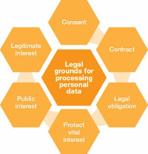
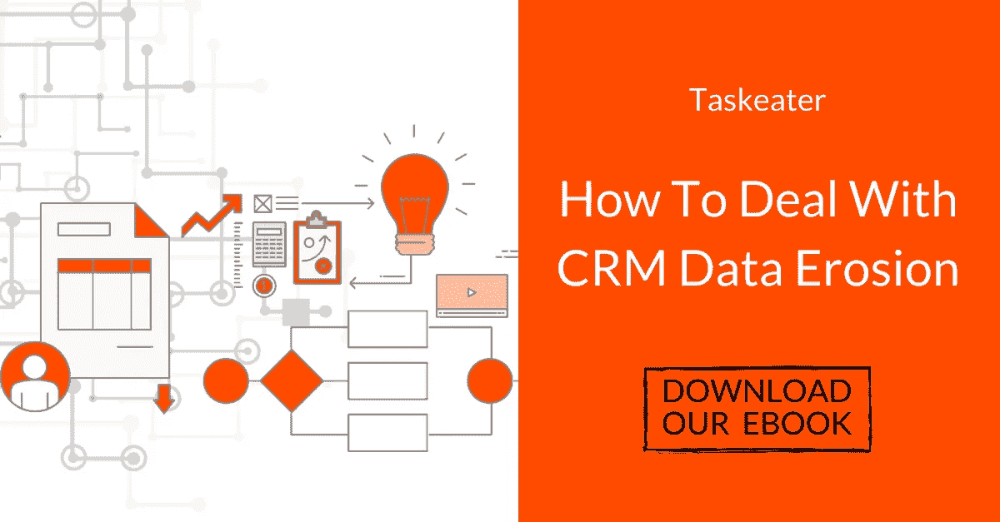

# 发送符合 GDPR 标准的 B2B 电子邮件的 5 个简单步骤

> 原文：<https://medium.com/swlh/5-simple-steps-to-sending-gdpr-compliant-b2b-cold-emails-4bfc023ccd37>

与普遍看法相反，现在 GDPR 已经生效，向企业发送销售邮件仍然是合法有效的。这篇文章打破了新法规下关于冷邮件的神话，并为您提供了一些简单可行的技巧，以确保您的活动保持合规。

首先，我相信你已经看到了 GDPR 的一些定义和它的含义，所以我将保持简短。《通用数据保护条例》是由欧盟理事会和欧洲议会发布的法律法规。其主要目的是保护欧盟公民的个人数据。

GDPR 不是冷冰冰的电子邮件。这与商业无关。这是关于个人数据保护的。

然而，发送商务邮件确实意味着处理个人数据，所以在后 GDPR 时代的环境下，你需要记住一些关键的事情。

## 以下是我将介绍的要点:

*   第一步:确保你的潜在客户是有针对性和适当的
*   第二步:在你的邮件副本中解释合理的兴趣
*   第三步:让退订或退出变得快速简单
*   第四步:定期清理和维护你的数据库
*   第五步:为 GDPR 的投诉和问题准备一份详实的回复

阅读更多关于 Taskeater 为 GDPR 做的准备:[task eater 如何为 GDPR 做准备](https://www.taskeater.com/insights/taskeater-gdpr-compliant/)

# 为什么可以在 GDPR 之后给企业发电子邮件？

首先，我将简要地处理这个问题，因为我知道任何经历过 B2C 公司的 GDPR 文章和电子邮件冲击的人都会对这一点感到困惑。

**GDPR 保护的是个人，而不是企业。**

[欧盟甚至宣布](https://ec.europa.eu/digital-single-market/en/news/proposal-regulation-privacy-and-electronic-communications):“拟议中的隐私和电子通信法规将增加对人们私人生活的保护，并为商业开辟新的机会。”

ePrivacy 法规**明确规定，由欧盟内的各个国家**决定“未经请求的商业通信”(又称 B2B 冷电子邮件活动)[是否应该选择加入或选择退出](http://ec.europa.eu/newsroom/dae/document.cfm?doc_id=41242)。

在英国，我们选择遵循 PECR(2003 年隐私和电子通信法规)**，这意味着企业对企业的通信不需要选择同意。**

关于这方面的更多信息，请阅读[信息专员发布的关于冷 B2B 营销推广的指导方针](https://ico.org.uk/media/for-organisations/documents/1555/direct-marketing-guidance.pdf)或者更简短的，我最近的文章:[为什么 GDPR 不意味着我们将停止联系企业](https://www.taskeater.com/insights/gdpr-compliant-email-businesses-b2b/)

# 第一步:确保你的潜在客户是有针对性和适当的

潜在客户创造和潜在客户创造实质上是在销售活动中获取个人数据。

尽管保护个人数据，GDPR 并没有阻止人们寻找或收集线索，它只是要求线索产生者更高水平的关注和准确性。

根据 GDPR，您收集的个人数据应**充分且与其处理目的** ( [原则 c:数据最小化](https://ico.org.uk/for-organisations/guide-to-the-general-data-protection-regulation-gdpr/principles/data-minimisation/))相关。这意味着你必须考虑两件关键的事情:你的数据收集的充分性(你要实现的目标到底需要多少数据)和你的数据收集的相关性(你收集的数据是不是适合你的目的的数据)。

## 确保充足:只收集你需要的东西

作为数据管理员或数据处理者，您应该只收集对您绝对必要的数据。

确保你做到这一点的一个简单方法是**如果你不打算使用数据，就不要询问数据**。在 GDPR 合规营销中，没有“妥善保管”或“以防万一”的概念。如果你打算打电话给你的潜在客户，只需要一个电话号码。如果你打算给他们邮寄东西，只需要他们的家庭住址。简单。

## 确保相关性:只收集相关的内容

一个简单的测试你正在收集的线索是否相关的方法就是**潜在客户听到你的消息会感到惊讶吗？**

如果你的目标是准确的，没有潜在客户会怀疑你为什么发邮件。基于你做的和他们做的应该很明显。

确保你**极其精确地**选择谁是你的理想潜在客户，谁是你的细分市场，并根据这些潜在客户及其痛点定制你的文案和活动。

作为专业的潜在客户生成者，我们帮助为客户的日常潜在客户创造活动设定目标标准。

## 下面是一些简单的限定符:

*   **地理位置**:你想找的潜在客户在哪里？你的服务或产品与哪里最相关？
*   **目标行业**:你已经和谁合作了？你的哪些客户最赚钱/觉得你的服务最有用？你跟谁谈过谁需要你的服务？你可以咨询哪些专家来评估行业需求？
*   **公司规模**:你接触的公司是足够大还是足够小，需要你的服务？他们有多少员工？他们的年收入是多少？
*   **头衔**:你联系的是你选择的公司里合适的人吗？他们够资格做决定吗？他们是否在使用你的产品或服务的部门？

## 简单说说购买清单…

您有责任确保您购买的任何清单完全符合新法规。

作为欧洲各国电子邮件列表和线索的供应商，Taskeater 已采取措施确保完全合规。

我们如何做到这一点？**我们根据非常具体的目标标准，从公开来源为我们自己和我们的客户从头开始建立和验证名单。**

我们自己根据目标标准构建列表意味着我们可以确保收集的数据的充分性和相关性，并且我们可以详细记录我们的销售线索挖掘流程。

无论你是购买数据还是自己收集数据，**你都应该保持(或要求)一份记录，说明你是如何以及为什么收集和处理数据的**。这样你就能准确地回答“你从哪里得到我的电子邮件地址的？”并且还可以为您的合法权益提供一些背景。

阅读更多关于 Taskeater 为 GDPR 做准备的信息:[task eater 如何为 GDPR 做准备](https://www.taskeater.com/insights/taskeater-gdpr-compliant/)

# 第二步:解释你对电子邮件的合法兴趣

有了有效的目标，你联系潜在客户*的理由*应该是不言自明的，但一定要在你的电子邮件中坚持到底，并准确解释为什么你的产品是相关的，为什么你要联系。

你需要立即切入为什么你认为你的收件人是一个相关的人，你要联系，以及你如何处理他们的数据，使联系。

## 正确使用合法利益基础

(Image credit: [SAPInsider](https://sapinsider.wispubs.com/Assets/Articles/2017/August/SPI-Meeting-Modern-Data-Protection-Requirements))

[合法利益](https://ico.org.uk/for-organisations/guide-to-the-general-data-protection-regulation-gdpr/legitimate-interests/what-is-the-legitimate-interests-basis/)是 GDPR 处理数据的 6 个合法依据之一，涵盖商业利益。ICO 将其描述为“法律不要求进行处理，但对您或他人有明显好处”时最合适的依据。

然而，合法利益基础不是一个包罗万象的借口，你可以用它来涵盖商业领域的任何事情。需要遵循一个流程来确保您符合 GDPR。

使用合法利益作为处理数据的合法理由只有在你的利益高于个人隐私权的情况下才是合法的。

正如 [GDPR 法案](https://eur-lex.europa.eu/legal-content/EN/TXT/PDF/?uri=CELEX:32016R0679&from=EN)第 6 条第 1 款所述，合法利益只有在“为了控制者或第三方**追求的合法利益而有必要进行处理的情况下才是合法的，除非此类利益被要求保护个人数据的数据主体**的利益或基本权利和自由所超越，特别是在数据主体是儿童的情况下。”

不像[其他法律依据](https://ico.org.uk/for-organisations/guide-to-the-general-data-protection-regulation-gdpr/lawful-basis-for-processing/)，**你处理数据的依据可以被质疑**。你的利益是否凌驾于隐私权之上，从根本上来说是有争议的。

这是保留销售线索生成记录的重要性的另一个原因。正如 ICO 概述的那样，“你也有责任确保——并证明——你的利益与个人利益是平衡的。”关键是你要了解你使用合法权益背后的全部背景和逻辑。

现在，你可以表明该公司对你的业务有明显的兴趣，但在使用这种推理时，你必须确保你的产品与公司章程中宣布的特定业务活动相关。

例如，一家电子邮件自动化公司需要保护其正在自动化的数据及其用户，因此电子邮件服务器安全解决方案确实有理由联系他们。

然而，如果我们向 Deliveroo 这样的公司提供我们的销售流程自动化解决方案，我们的服务并不明确涉及他们的公司章程，尽管他们有一个销售团队。

在这种情况下，花点时间对你的潜在客户做一些背景调查，并在你的电子邮件中提供一些背景信息。

## 以下是合法权益的几个例子:

*   查看公司的 LinkedIn 简介或网站，看看你的产品是否能支持他们的目标
*   检查**最近的投资或融资**你的产品是否支持增长
*   查看你的**过去的客户**中是否有从事类似行业或提供类似服务的
*   从你的关系网中寻找**推荐或内部消息**
*   看看这家公司是否正在**将**扩展到与你的服务相关的领域，或者如果你的产品支持增长的话，是否正在全面扩张
*   查看联系人是否已经**询问任何信息，或者已经开始搜索**你提供的服务或产品

## 如何在电子邮件中包含合法权益

有几种方法可以做到这一点。啄木鸟在他们出色的 GDPR 准备指南中建议加入免责声明，告知你的邮件收件人他们的数据已经被处理。

这应该包括三条关键信息:

*   **一份声明**告知收件人您是如何处理他们的数据的；
*   **简短解释**您为什么要处理它；
*   **指示**收件人可以按照指示更改您处理的数据或要求从您的列表中删除他们的数据

下面是一个简单的例子，基于我们将在电子邮件活动中包含的内容:

> “我选择与您联系，是因为根据[公司名称]的 LinkedIn 个人资料，我有充分的理由认为您可以从我分享的信息中受益。我处理您的姓名和电子邮件地址只是为了向您发送此邮件。如果您希望我更改用于联系您的数据或从我的名单中删除您的数据，只需回复“不，谢谢”，我会将您从我们的数据库中删除。"

然而，如果你担心免责声明会吓到潜在客户，你也可以简单地确保将上述三点整合到你的电子邮件中。

以清楚地解释你如何获得他们的数据，为什么你认为这些数据是相关的开始。例如:

> “你好，Patrick，我在 LinkedIn 上找到了你的个人资料，当时我正在寻找有影响力的销售领导，在对[公司名称]进行了一些研究后，我认为我们的服务可能会让我感兴趣。”

然后确保选择退出机制在你的邮件底部清晰可见。

# 第三步:让退订或退出变得快速简单

作为一个发送冷邮件活动的人，你需要告诉你的收件人如何行使他们的[删除权](https://ico.org.uk/for-organisations/guide-to-the-general-data-protection-regulation-gdpr/individual-rights/right-to-erasure/)和[限制权](https://ico.org.uk/for-organisations/guide-to-law-enforcement-processing-part-3-of-the-bill/individual-rights/the-right-to-erasure-and-the-right-to-restriction/)。

通俗地说——**你需要给人们一个明确的选择退出的方式。**

电子邮件底部的**“退订链接”**是自动完成这一过程并确保所有列表都符合要求的最简单方式。今天，任何外展计划或软件都有一个自动退订功能，作为服务的一个基本部分。

然而，取消订阅链接只是选择退出的建议方式之一。在 gov.uk 的官方营销广告指南中，他们说:“你必须让选择退出变得容易——例如，向一个短号码发送‘停止’短信，或者使用‘取消订阅’链接。”尽管他们引用了“取消订阅”链接，但他们绝不是说这是唯一的做事方式。

我们选择**只需在我们的电子邮件页脚**中写下我们的活动收件人可以自由回复并表示他们不感兴趣，在这种情况下，我们会将他们从我们的数据库和邮件列表中删除。如果这种方法与您运行数据库的方式和您使用的自动化软件配合得更好，这是一种完全合理的退出方式。

下面是一个我们会用到的电子邮件页脚的例子:

> “如果你不感兴趣，不想再听到我的消息，只要回答‘不，谢谢’，我就会把你从我的名单中删除。”

选择退出的最重要的方面是它清晰、易于遵循，并且在你的终端强制执行。

这意味着一旦有人要求你删除他们的数据，你就应该删除他们的数据。创建一份所有要求从您的数据库中删除的公司和个人的列表([禁止列表](http://www.gingerling.co.uk/gdpr-you-are-allowed-to-maintain-a-blacklist-suppression-list-or-stoplist-you-are-also-allowed-to-freak-out-and-panic/)),然后确保您和您的团队成员不会再联系他们。找到一个适合你的过程，然后严格遵守它。

# 第四步:定期清理和维护你的数据库

除了简单地删除选择退出或退订的人，GDPR 还意味着你不应该连续几个月抓住线索或不准确的联系信息。

您必须定期清理 CRM 数据库中的**不活跃或无响应的线索**，检查您的联系记录是否完全更新，并适当标记您的数据，以记录您是如何收集和处理个人数据的。

有关什么是 CRM 清理以及您是否需要它的更多信息，请阅读我们上个月发布的这些文章:

*   [CRM 维护 101:你的数据有多脏？](https://www.taskeater.com/insights/crm-maintenance-cleansing-dirty-data/)
*   [触发事件销售:如何利用 CRM 清洗产生新业务](https://www.taskeater.com/insights/trigger-event-selling-crm-cleansing/)
*   [如何在清理后保持数据整洁](https://www.taskeater.com/insights/clean-data-post-crm-cleanse/)

或者更全面的 CRM 维护指南，你可以下载我们的电子书— [如何应对 CRM 数据侵蚀](https://www.taskeater.com/downloads/crm-cleanse-database-guide/)

[How To Deal With CRM Data Erosion](https://info.taskeater.com/ebook-crm-data-erosion-cleanse?hsCtaTracking=3a2426de-fe62-44fa-8faf-493838bdf3a3%7Cf44e40db-9681-4cac-953f-cf22c94d0fcc)

如果你担心没有时间执行 CRM 清理，那么**外包出去**。这不是你想冒的险。Taskeater 为各种规模的 B2B 公司提供 CRM 清理和数据发现服务。我们还会删除您不再需要的潜在客户，代之以具有准确联系信息的有效联系人，这是我们提供的服务的关键部分。如果您正在与另一家服务提供商交谈，请寻找**替代线索**。你可以在这里和别人谈论我们的服务。

## 如果您计划共享个人数据，您必须通知数据所有者。

个人的隐私权和保密性意味着您收集的任何个人数据都不是您可以自由管理的。您必须**明确通知数据所有者**您打算共享他们的数据或处理他们的数据，如果这是您的意愿的话。

例如，如果您与另一家公司合作开发一项内容，您需要通知任何订阅您的合作伙伴共享订阅列表的意图的人。

您还应该公开告知您的任何用户、客户或订阅了您的简讯的人，他们的**个人数据实际存储在哪里**。如果您在其他国家有服务器，您必须在您的隐私政策或网站上公开声明这一点。

## 如果您正在存储个人数据，您必须采取必要的预防措施来保证其安全。

到目前为止，在 5 月 25 日之前，那些未能阻止数据泄露并延迟通知数据所有者的公司被处以巨额罚款。TalkTalk 和 Carphone Warehouse 都因这一特定违法行为收到了 40 万英镑的罚款。

数据安全是 GDPR 的一个重要方面，如果您存储个人数据，则需要重点关注数据安全。

## 关于数据安全的几个要点:

*   确保您正在使用的**软件和系统**已经采取措施完全符合 GDPR 标准。使用符合 GDPR 标准的数据处理器是你的责任。大多数 CRM 系统，如 Hubspot、Marketo 和 Pipedrive 都符合 GDPR 标准，并已采取措施确保您的数据安全。
*   规定谁可以访问你公司的数据，并且**记录下许可级别**。这样，如果被询问，你就有文件可以出示。
*   如果您和我们一样是数据处理人员，请采取措施**保护您的流程和系统安全**。我们使用物理访问控制、系统访问控制、数据访问控制、传输控制、输入控制、数据备份和数据隔离来更好地保护我们的数据。[在这里阅读更多](https://www.taskeater.com/insights/taskeater-gdpr-compliant/)。
*   **作为额外的预防措施，尽可能对数据进行匿名、加密或假名处理**。

# 第五步:为 GDPR 的投诉和问题准备一份详实的回复

最后，**期待你的潜在客户会有一些反对**。关于 GDPR 及其对未来销售和营销策略的意义，有很多错误的信息。有些人会因为你发邮件而生气。

当然，如果你的定位准确，你的文案尊重且信息丰富，你的提议可能会帮你渡过难关。但是，如果出现少数情况，前景将会一片混乱。冷邮件仍然是冷邮件，不管它们有多相关。

这里有一些你可能会被问到的问题，以及你的回答应该涵盖哪些内容。任何回答都可以包括这三个要点的组合。

## “你有什么权利给我发邮件？”

这完全是一个潜在客户的权利，即使有问题的电子邮件地址是公司。他们的名字被写在电子邮件地址中，这一事实使其成为个人信息。GDPR 顾问 Mark Gracey 的这篇文章对此做了更多的解释— [当 B2B 数据是个人数据时，这对 GDPR 意味着什么](https://www.linkedin.com/pulse/when-b2b-data-personal-what-means-gdpr-mark-gracey/)

你的合法利益需要上下文。如果你的服务与公司的法规没有特别的关系，解释你认为他们是相关的联系人的原因。

通过详细记录你的潜在客户生成过程，你将能够给出一个详细的答案，说明你是如何以及为什么获得一个人的数据。

如果你的服务与公司的法规没有特别的关系，解释你认为他们是相关的联系人的原因。新的公司项目？他们的网站？他们的 LinkedIn 资料？他们最近分享的一篇文章？

如果你要给大规模的人发邮件，仔细研究你联系的公司。他们的网站或媒体上有什么让你有特别的理由给他们发邮件吗？对这个行业的其他公司有帮助吗？还有更多不需要深究某人 LinkedIn 赞的通用答案。

如果您已经利用过去的客户建立了您的目标标准(典型的客户档案)，您可以在整个活动中使用的回应是:

> “我们在合法利益的基础上收集和处理您的数据。考虑到我们的[产品/服务]在过去对[公司简介/潜在客户简介]的益处，我相信我们的产品会对您有益。”

以下是我们的代表可能会使用的答案示例:

> “我在研究[公司名称],因为我认为鉴于我们过去在金融科技解决方案方面取得的成功，我们的服务可能会引起人们的兴趣，在 LinkedIn 上找到你的公开资料后，我认为你是关于我们的服务最相关的联系人。然后我猜到了你的电子邮件地址，并通过一个验证工具进行了验证，我们用这个工具为我们所有的客户建立了名单。”

## “你从哪里获得我的详细信息？”

解释你在哪里找到他们的数据，为什么你认为他们适合联系，为什么你认为他们会对你的产品感兴趣。

同样，如果您保留了详细的潜在客户生成记录，或者向您的供应商索要这些记录，那么您将对这个问题有一个详细的回答。

如果您使用 Taskeater 建立列表，请咨询您的客户经理我们使用的采购流程。例如，如果我们使用 LinkedIn 来寻找你的潜在客户，对潜在客户的一个好回答应该是:

> “我们正在使用第三方潜在客户服务(www.taskeater.com)，他们在 LinkedIn 上找到了你的资料，因为你符合我们典型的客户资料。然后，他们利用公开信息猜测你的电子邮件，并通过验证工具进行验证。”

## “你有我的什么信息？”

GDPR 强制执行您的潜在客户的[知情权](https://ico.org.uk/for-organisations/guide-to-the-general-data-protection-regulation-gdpr/individual-rights/right-to-be-informed/)和[访问权](https://ico.org.uk/for-organisations/guide-to-the-general-data-protection-regulation-gdpr/individual-rights/right-of-access/)(主题请求)，这意味着如果被要求，您必须提供您收集的信息以及这些信息是如何处理的。

在 Taskeater，我们收集最少的潜在客户信息，所有这些信息都是 B2B 专用且公开的。对于我们的流程，一个好的回答应该是:

> “您的姓名、电子邮件地址、公司名称和职位是我们掌握的唯一数据。根据您的权利，如果您对我们的服务不感兴趣或希望我们这样做，我们将从我们的数据库中删除它。您的数据不会保存在任何其他数据库中，也不会被转售。”

# 作者:丹·范伦宁

Taskeater 的常务董事，Taskeater 以前的客户之一。他有 16 年的销售经验，两个男孩，热爱橄榄球。[与丹联系。](https://www.linkedin.com/in/dan-vanrenen/)

## 这个故事发表在[的创业](https://medium.com/swlh)上，这是 Medium 最大的创业刊物，有 332，253+人关注。

## 订阅接收[我们的头条新闻](http://growthsupply.com/the-startup-newsletter/)。

