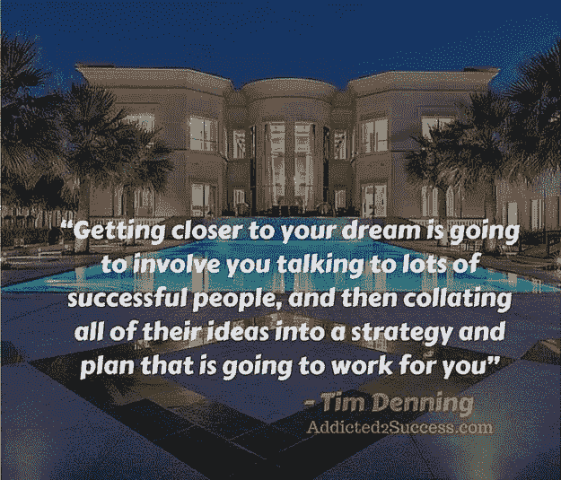

# 5 个简单的方法让你现在更接近你的梦想。

> 原文：<https://medium.com/swlh/5-simple-ways-to-get-closer-to-your-dream-right-now-830f2de816f7>

我和许多想放弃日常工作去追求梦想的人交谈过。似乎很多人都觉得转变很难。你不应该花一天时间去做你不喜欢的事情来谋生。

奴隶制的日子已经过去很多年了，是时候停止退而求其次了。

无论你的梦想是什么，无论它是大是小，你都需要从现在开始。实现你的梦想并不难，但你需要明白，离梦想越来越近需要很多小步骤。

这些小步骤中的每一步看起来都微不足道，但是当你把它们加起来，它们就会变成一大步，让你离梦想更近一步。

## 下面是每天接近你的梦想并开始实现你的目标的五种方法。

# 1.拥抱邻近效应

几个月前，我身边的一个人对我说，“我喜欢旅游，但我不能从中赚钱。”

这种说法有两点是错误的。第一个是你永远不要仅仅因为你想让它为你赚钱而去做某件事。

第二点是，你不能一夜之间从你讨厌的日常工作变成你的梦想。如果你的梦想是环游世界，那么你需要运用邻近效应的原理。

在这个例子中，你需要考虑在旅游行业做一份白天的工作，从每天谈论你的梦想开始。

如果这看起来不可能，那就从一小步开始，接近每一个热爱旅行的人。

每年都有很多关于你梦想的曝光。这些博览会让你遇见存在于你梦想领域的每个领域的人。

这是你获得灵感的地方，你可以开始和分享你梦想的人建立关系。

# 2.停止做你讨厌的事情

为了能够更接近你的梦想，你需要今天就决定停止做你讨厌的工作。停下来。

当你陷在讨厌自己每天所做的事情的沮丧中时，你永远无法前进或接近你的梦想。

这并不意味着你可以在几天内与你的梦想肩并肩。

**如果你看看 Addicted2Success 的创始人乔尔·布朗，你就会知道他并没有在短时间内从销售工作变成全职运营这个网站。**

乔尔所做的是每天迈出一小步，将他的梦想融入到其他任务中，比如他的日常工作。他开始从体力劳动职业转向销售工作。

这份工作不是他的梦想，但它更接近他擅长的事情，并帮助他发展与他的总体梦想相关的技能。

你每天都在做什么你讨厌的事情，为什么你不能现在就停下来？

# 3.每天花一定的时间去做这件事

所以我之前提到过每天花时间做一些和你的梦想有关的事情。然而，接近你的梦想的关键部分是你需要每天为它划出时间。

不要错误地设定一个月或一周的时间分配，因为它不够具体或接近当前时刻，无法让你更接近你的梦想。

人们很容易被自己一天的噪音或其他人的干扰所困扰，但你需要意识到，除非你养成每天花时间实现梦想的习惯，否则梦想永远不会实现！

它将成为许多人拥有的梦想，却很少有人实现。

看，要实现大多数梦想，你必须完成那些困难的、需要努力的任务。有可能你不是唯一一个有同样梦想的人，你将会和其他人竞争来达到你的目标。

只有当你比其他人做得更好，并且在日常行动中自律，你才会脱颖而出。致力于掌握和成为你梦想中最优秀的人。

毕竟，如果这个梦想真的是你想要的，那么拥有每天为之行动的动力应该不会很难。

如果你发现每天为你的梦想采取行动很难，那么它可能不适合你，你可能因为金钱或名誉等不满足的原因想要它。

# 4.虚心接受成功人士的建议

我看到人们在试图接近梦想时面临的最大障碍之一是他们缺乏思想开放的品质。

很明显，在通往梦想的路上，你会想和那些成功实现了与你的梦想相似的事情的人交谈。

然而，如果你对他们所说的不抱开放的态度，与这些成功人士交谈是没有用的。他们很有可能会告诉你一些看起来很难或者很难的事情，但是如果你不听，至少不去考虑他们要说的话，你将永远无法接近你的梦想

这并不意味着你需要听取他们给你的每一点建议，但你至少应该考虑他们所说的一些或全部。

我经常从自己的生活经验中给出一些我认为是金玉良言的建议，而人们完全不理会这些建议，甚至没有考虑这个想法，或者至少没有做他们自己的研究。

# 5.通过投资获得杠杆效应

接近梦想的一个好方法是投资一些钱。如果你想成为下一个 Youtube 红人，那么明天就出去给自己买一台好相机，录一些视频。

通过投资一些钱，你将创造杠杆。

你将拥有我们所说的“游戏中的皮肤”我的意思是，如果你不利用你的投资为你的梦想采取行动，你将投资一些你辛苦赚来的钱，这将产生一种失落感。

你可能想成为一名在线企业家，所以明天就去那里，买一个域名，委托一名网站设计师开始吧。

不要过早地花大量的钱，但是花足够多的钱，如果你不利用你已经花掉的钱，它会给你带来一些痛苦。

投资带来的痛苦和失落感会让你比什么都不做更接近你的梦想。

*原贴于*[*【Addicted2Success.com】*](https://addicted2success.com/success-advice/5-simple-ways-to-get-closer-to-your-dream-right-now/)

# 行动呼吁

如果你想提高你的工作效率，学习一些有价值的生活窍门，那就订阅我的私人邮件列表吧。你还将获得我的免费电子书，它将帮助你成为改变游戏规则的在线影响者。

[**点击这里立即订阅！**](http://timdenning.net/free-ebook)

## 这篇文章发表在 [The Startup](https://medium.com/swlh) 上，这是 Medium 最大的创业刊物，有 303，461+人关注。

## 在此订阅接收[我们的头条新闻](http://growthsupply.com/the-startup-newsletter/)。

