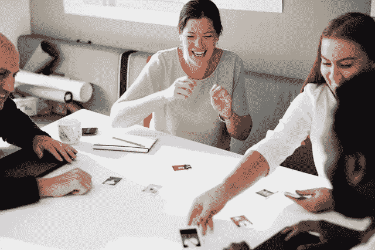

# 找出你的目标和改变世界的 5 种方法

> 原文：<https://medium.com/swlh/5-steps-to-finding-your-hustle-165c39726b67>

## 你到底是怎么找到那个让你的生活着火的东西的？

这些天有太多关于难以捉摸的“旁门左道”的谈论。激发个人激情、找到你的目标、开始副业、并由此潜在地发展业务到底意味着什么……你又是如何找到让你的生活着火的**那件事**的？

审视自己的内心深处，感觉自己有能力去追求你所爱的东西，这需要勇气。

没有比现在更好的时机了，退后一步，深呼吸几次，然后专注于你自己。# YOLO；)

在探索你的激情时保持开放的心态，放下荒谬的期望，回馈你的社区，每天采取一个行动来点燃你的激情，发现你的优势。

# **1。立即开始**

就像今天。因为生活永远不会停止。相信我，我已经 31 岁了，我现在可以这么说。#老千禧。无论你是一分钟一英里还是踩水，现在是时候掌控你的生活了。

打开脸书页面，创建第一个 Instagram 帖子，撰写第一篇媒体文章。我一直以来最喜欢的激励我去完成任务的名言是:

> “永远不要因为梦想需要时间去实现而放弃它。反正时间会过去的。”—厄尔·南丁格尔

即使你要花七年的时间来实现你的目标，时间总会过去的，所以今天就开始做些事情朝着目标前进吧！

# **2。释放完美**

放下完美的最终目标，现在就开始整理事情。

这可能很难处理——我知道你只是想巩固你的激情，有一个具体的比赛计划，全力以赴最终取得胜利。

然而，生活并不是这样的；每一个角落都有障碍和延迟，如果我们期望立刻达到完美和成功，我们将一事无成。

# **3。自由讨论**

当你探索是什么让你前进时，保持开放的心态。留出一个小时进行头脑风暴――用前 15 分钟深呼吸，释放所有的恐惧和压力。这很简单，但它会把你推向正确的方向。起草商业计划；想想你的 SWOT――优势、劣势、机会和威胁。

看看你的愿景带你去哪里，**把一切都发泄出来**――想到什么就画什么，写下你脑海中闪现的每一个想法、爱、激情和疯狂的想法，在你的笔记上到处涂鸦……**没有规则**。

当你完成后，沉浸其中，看看是什么突出了你，是什么让你心跳加速――你是独一无二的，你的视野也将是独一无二的！

# 4.加入你的社区

通过提供服务来帮助他人，尝试你的热情和商业技能；这是一个很好的方式，让你走出去，回馈社会，并在你的社区中快速测试你的想法。

如果你喜欢平面设计，主动帮助非营利组织做营销材料；如果你擅长活动策划，在下一次活动中志愿帮助一个行业团体；如果你是一个杰出的面包师，为社区活动向你所在地区的小企业捐赠点心。

通过将自己融入这个世界，你不仅会获得个人动力，还会在成长的过程中帮助他人，培养一个强大的支持者群体。

# **5。每天采取一个行动步骤**

一旦你有了自己的愿景，知道自己在朝着什么方向努力，就把你的目标分解成一个个小的行动。接受你必须为实现目标付出的额外时间——即使是每天 20 分钟——并利用你所拥有的时间！

确定下一年你想完成什么，然后把每个月的目标分解成你实际上能够做到的更小的每周/每天的步骤。贪多嚼不烂只会拖你的后腿；做一件小事总比什么都不做好。

如果你准备启动你的 side hustle 业务，确定一个启动日期，并从那里倒推你需要上线的步骤。

我们的生活是一段旅程，会有许多起起落落、挑战和胜利――但是**要知道，你来到这里是为了一个独特的目的。**

不要打算在短期内赢得这场侧面游戏。是的，坐立不安、跃跃欲试，但不要指望马上就能如愿以偿(*除非你是* [*Kylie*](/womens-empowerment/gary-vaynerchuks-words-to-a-22-year-old-is-advice-all-young-women-can-put-to-use-319396dd6cdb) )。

弄清楚“你想要什么”和你的激情是什么将会花费一生的时间，并且会不断发展——所以只要跟随那些让你快乐的事情。

如果你有一部智能手机，那么如果你足够爱它并且愿意为它拼命工作，你就可以合法地从任何事情中获得好处。

你准备好最终将你的旅行梦想变成现实了吗？ [*今天就注册我的简讯*](http://eepurl.com/dylLZf) *，我会把你可以开始环游世界、过上你一直梦想的生活的前三步发给你！*

如果你喜欢这篇文章，请吧👏并分享给你的朋友。记住，你最多可以鼓掌 50 次——这对我真的很重要。

*我很乐意在*[*insta gram*](https://www.instagram.com/strategicstephtravels/)*，* [*脸书*](https://www.facebook.com/StrategicStephTravels) *，*[*Twitter*](https://twitter.com/StrategicSteph)*，或者*[*LinkedIn*](https://www.linkedin.com/in/stephanielhuston)*上与你联系！❤*

## 这个故事发表在 [The Startup](https://medium.com/swlh) 上，这是 Medium 最大的企业家出版物，拥有 288，884+人。

## 在这里订阅接收[我们的头条新闻](http://growthsupply.com/the-startup-newsletter/)。

