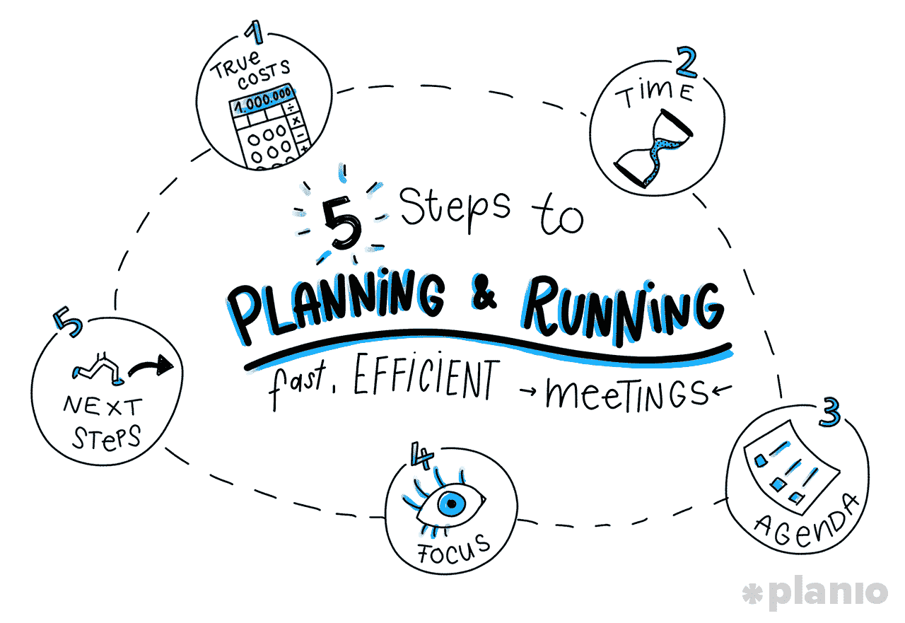
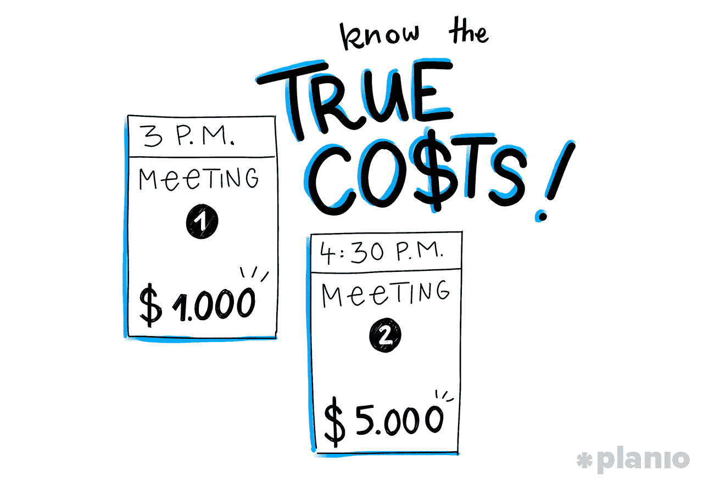
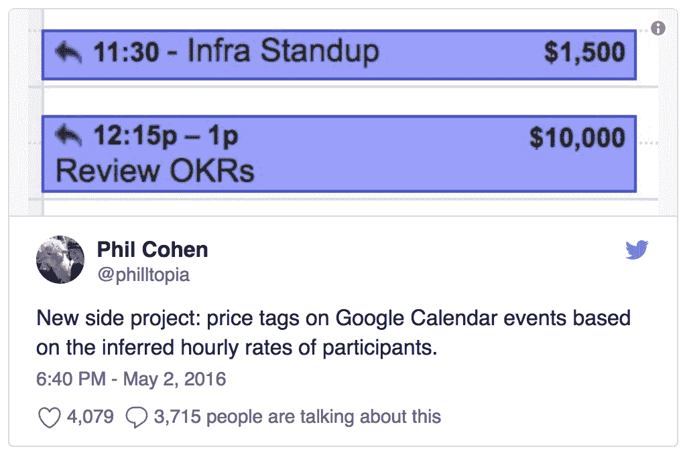
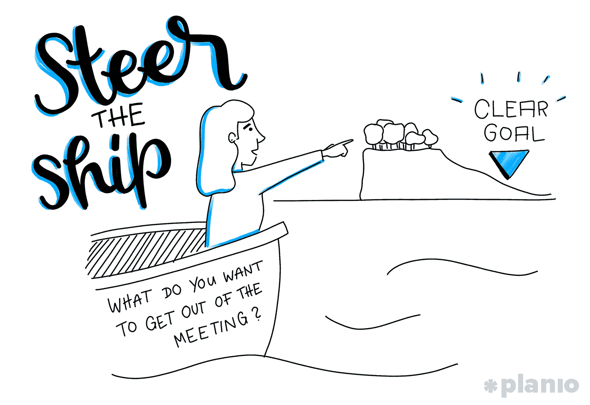

# 规划和召开快速高效会议的 5 个步骤

> 原文：<https://medium.com/swlh/5-steps-to-planning-and-running-fast-efficient-meetings-7f03fcb310cc>

## 大多数会议都很糟糕。但你的不一定是。

这个简陋的会议名声不好。

像电子邮件、Slack 和智能手机一样，会议从来没有打算占据我们清醒生活的每一分钟。但不知何故他们做到了。看看任何一个有多个项目在忙的人的日历(也就是几乎每个人)，你会看到一堆噩梦般的会议、事件、闹钟和提醒占据了他们的时间。

但是从最基本的形式来看，会议只是分享信息的机会。

如果你认为你的项目是一次越野旅行，那么会议就应该是*的*短暂停留以补充燃料，再次检查你的全球定位系统，并拿起零食。

只是太多时候，这些加油站变成了卡车站。我们没有冲进去抓住必需品继续前进，而是被困住了。这必须改变。

**定期、快速、高效的会议是保持项目进展的最可靠方式之一**(也是[敏捷和 Scrum 项目管理](https://plan.io/blog/ultimate-guide-to-implementing-agile-project-management-and-scrum/)不可或缺的一部分)。

因此，如果你害怕发出或收到另一个会议邀请，这里有一些关于如何成功召开会议的最佳实践。我们甚至还提供了您将主持或参加的几乎所有会议的议程和模板。

***希望为您的下一次会议提供帮助？我整理了 4 个流行会议的模板和议程*** [***你可以在这里免费下载。***](https://plan.io/blog/planning-and-running-fast-efficient-meetings/)

# 会议变得如此糟糕的心理学

你可能认为聚集一群有明确目标的聪明人是对时间的一种很好的利用。但不幸的是，当谈到花在会议上的时间时，我们陷入了“越多越好”的心态。

在过去 40 年里，会议的次数和持续时间都有所增加。一项研究发现，经理们平均每周花 23 个小时在上面。平均而言，贵公司 15%的时间花在会议上——这个数字自 2008 年以来每年都在增长。

这不仅仅是一个数量问题。大多数人认为会议质量下降了。

在对来自各行各业的 182 名高级经理的调查中， **65%的人说会议让他们无法完成自己的工作。**

**71%的人认为会议没有效率。**

而 64%的人说会议是以牺牲深度思考为代价的。

## 那么，会议是如何变得不仅如此之多，而且如此糟糕的呢？

这个问题似乎可以归结为一场简单的战斗:即时满足与延迟满足。

我们的大脑更喜欢现在发生的奖励——即时满足。这就是为什么你会在办公室聚会上吃一块蛋糕(即使你正在减肥)，或者被繁忙、紧急的任务分心，推迟更重要的工作。

会议也是获得即时满足的绝佳方式。

> 谈论一个问题会让我们觉得我们已经完成了。而事实上，我们所做的只是把实际工作推迟到以后。

当我们可以进行一个小时的谈话并感觉自己取得了真正的进步时，为什么我们会选择在没有回报的情况下花很长时间努力解决一个难题呢？

# 糟糕的会议不仅仅是浪费时间。他们正在积极扼杀你的公司。

如果我们只需要开几次会，事情就不会那么糟糕了。然而，从上面的统计数据来看，很明显这个问题已经变得很普遍了。花在无意义或冗长的会议上的时间不仅仅是因为浪费了时间，还因为它产生了副作用:

## 1.会议造成忙碌

我们已经知道会议本身就是一种即时满足的形式。但它们也促使我们去做其他形式的即时满足。任何在任何规模的团队中工作过的人都知道大多数会议带来的繁忙工作:

*“让我们进一步研究这个问题，本周晚些时候再回来。”*

*“我们不知道答案是什么，所以让我们先探索一些选项。”*

问题是这些东西*感觉*像是真正的工作。虽然某种程度的研究或探索总是必要的，但糟糕的会议总有办法夸大其重要性。

## 2.会议创造更多的会议

“我们再开一次会吧，”这可能是在任何糟糕的会议中听到最多的一句话。这次会议的下一步是什么？又见面了！把一次无拘无束的聚会变成多头会议。砍掉一个，两个就会出现在它的位置上。

## 3.会议制造了 FOMO 和优先权的混乱

可能最糟糕的是，糟糕的会议文化会让人产生一种害怕错过的感觉，即使你知道你不需要参加。为什么要在房间的后面坐一个小时听与你无关的谈话呢？

> 突然间，我们的优先事项从做我们知道我们需要做的工作转变为确保我们参加每一个可能的会议，这样我们就不会觉得我们错过了。

# 召开快速、高效会议的 5 个步骤(如果是你的会议)

所有这些并不是说会议本身就不好。

如果运行良好，会议可以是解决问题的快速方式，是就重大决策达成共识的绝佳方式，甚至是在团队中建立联系和友谊的有力方式。

尤其是当你是一个远程团队时，会议是让人们感到联系和参与的最有力的工具之一。

**会议本身并不坏。我们让他们变坏。**

大多数糟糕的会议都可以归结为三重打击:

1.  过于频繁
2.  不合时宜
3.  经营不善

但这不是一个注定要失败的事业。无论你是在组织还是参加会议，你都可以采取一些措施来确保你没有浪费任何人的时间。

# 第一步:在你预订之前，问一下这个会议的真实成本是多少

您预定会议的频率会直接影响会议的效率。我们中有多少人在重复的会议中结束，在最初的几分钟内我们翻着手机，而真正需要在那里的两个人却在交谈？

在你发出另一个邀请之前，问问这个会议的真实成本是多少？了解这一点的一个方法是想想你要求的时间实际上花费了你公司多少时间。

在[一项针对大公司的时间预算](https://hbr.org/2014/05/your-scarcest-resource/ar/1)的研究中，贝恩&公司发现**中层经理每周一次的会议每年要花费一个组织 1500 万美元！**

至少估算一下价格会让你摆脱“因为这是你的工作”而只是预约会议的思维定式，而真正去询问是否有必要。时间和专注是我们最宝贵的资源。通过记住你在会议中真正从人们那里得到的东西，你可以确保你将从中获得最大收益。

# 第二步:安排最少的时间

接下来，一旦你决定会议值得召开，你需要诚实地说出你最可能需要多少时间。如果你只是用标准的 30 或 60 分钟的会议时间，你可能会浪费大量的时间。

帕金森定律是一句古老的格言，它说“工作扩展是为了填满完成它的时间。”也就是说，即使你“为了安全起见”预定了一个小时的会议，你也会把那一个小时填满。

你要见的人呢？他们将损失至少一个半小时，如果不是更多的生产性工作的话。即使是“超级快速会议”也会比你要求的花费更多的时间。

相反，FaceBook 产品副总裁 Fidji Simo 说[你应该经常问自己需要多少时间开会。](http://firstround.com/review/how-facebooks-vp-of-product-finds-focus-and-creates-conditions-for-intentional-work/)

> “许多人不会去计算实际上应该给某件事情分配多少时间。他们只是默认小型对话 30 分钟，大型对话 60 分钟。这使得日历看起来像瑞士奶酪。”

相反，她将会议的最小时间设定为 10-15 分钟，让与会者在需要时要求更多时间。

此外，你应该[设定何时开会的政策](https://blog.rescuetime.com/employee-time-management/)。这样，每个人都知道什么时候会被从工作中带走，并可以相应地计划。选择一周中适合您团队的时间或日期。与其有一个看起来像犯罪现场的日历，不如把每天下午 3 点至 5 点开放开会，或者把星期二变成“管理日”

这里的目标是确保每个人都知道他们应该什么时候见面，什么时候工作。

# 第三步:制定一个清晰的议程，并提前分发

会议一旦确定，就由你来确保会议顺利进行。

不要只是定个会，希望事情会自行进展。你需要驾驶这艘船。这要从准确理解你想从会议中得到什么开始。如果没有明确的目标，没有人会知道对他们的期望是什么。

做一些预先的思考，解决你将要讨论的问题。在那里，你可以创建一个清晰的议程，并提前发送出去，这样每个人都有时间思考并提出成熟的想法。

(额外的收获是，有时只要仔细思考你想谈论的问题，你就会意识到你甚至不需要*一个完整的会议来解决它)。*

*(我们将在下面介绍一些清晰的会议议程示例)。*

需要注意的一件事是添加过多的议程项目。在你召集的会议中尽可能多的讨论似乎是一个好主意，但是你需要留出足够的时间来讨论每个话题，而不是试图浏览它们(或者让会议持续太久)。

《至关重要的会议》(Meetings that matters)、[的作者保罗·阿克塞尔](http://paulaxtell.com/)建议，作为一个目标，你应该把议程上的项目减少 20%，并为每个项目留出 20%的时间。你还可以做好准备，知道如何领导这些项目。浏览您的议程项目，并询问:

*   谁最擅长开始对话？
*   谁会受到结果的影响，因此需要征求他们的意见？
*   谁最有可能持不同观点？
*   谁是可能感觉到我们是否犯了错误或遗漏了什么的老手？

像这样准备的一个有益的副作用是，你会更加投入到一个好的会议中。

做了那么多工作，然后又开了一个糟糕的会议，真让人头疼。这增加了会议的精神成本，你更有可能停下来思考是否值得召开会议。

# 第四步:保持会议的焦点(不要成为一个坏的影响)

你可能认为在与你无关的会议中拿出手机没什么大不了的。但是作为组织者，[你为每个人设定基调](https://hbr.org/2018/01/if-you-multitask-during-meetings-your-team-will-too)和接受行为。

当你在会议中一心多用时，你的团队也会如此。

这意味着信息会被遗漏。会议变得越来越长，因为人们不得不重复自己。发言的人觉得他们的想法和问题并不重要。这会扼杀你的文化。

相反，通过在会议期间完全在场来树立榜样。征求小组成员的同意，有意识地控制对话，并制定防止分心的指导方针。

对于大多数团队来说，最容易遵循的规则就是在会议期间摆脱技术(除非它与主题相关)。使用行为设计师 Nir Eyal 称之为“数字帽架”的东西，以某种方式从身体上或精神上脱离总是吸引你注意力的技术。

> 一开始会很难，但是在会议中禁止分心会让他们更加专注，更有吸引力，更有效率。

# 第五步:知道下一步是什么(提示:这不是另一个会议)

如果你已经完成了设置议程和引导对话的工作，每个人都应该清楚地知道他们在会后需要做什么。不幸的是，在很多情况下，除了等待下一次会议，队友们不会带着直接的目标或任务离开会议。

确保你在会议结束时留出时间来仔细检查期望的内容和决定的内容。这可能感觉很奇怪，但这些总结将确保没有人会对这个决定或他们在前进中的作用感到困惑。

用 2 分钟时间总结所说的内容:

*   我们讨论了 X 的问题，决定用 Y
*   a 负责在周一之前准备好设计资产
*   b 将开始制作一个原型，在我们下周见面之前，应该会有一些东西给我们大家

确保包括你将要做的事情，这样每个人都会觉得他们尽了自己的职责，对整个团队负责。

# 如何在参加会议时保持会议顺利进行

现在，如果你正在参加一个会议呢？在很多公司的文化中，你会觉得自己对会议的进行没有任何发言权。但作为与会者，你也有责任确保会议顺利进行。

# 首先，积极主动地只参加合适的会议

当会议请求进来时，感觉就像你*必须*点击“是”。但是每一次你同意的会议都意味着更少的时间去做你重要的工作。

在接受邀请之前，不要羞于提问。一旦你看到议程，问问你如何才能最好地做出贡献。如果看起来会议没有充分利用你的时间，考虑解释你为什么不应该参加。任何领导层都很难否认，你希望把时间花得更有成效，而不是在一个你不需要参加的会议上无所事事。

# 做好准备，敞开心扉

如果会议是必要的，你的出席是有意义的，尽你所能让会议顺利进行。做好调查，准备好回答可能出现的任何问题。面对面的会议也可以帮助你为手头的问题想出更有创意的解决方案，只要你准备好谈话和讨论问题。

开一次成功的会议最重要的部分之一就是知道要谈什么。虽然你的日程安排会因公司和目标的不同而有所不同，但还是有一些模板可以让你保持专注。

# 关于召开更快、更高效会议的最终想法

虽然大多数会议都很糟糕，因为它们没有足够的结构或目的，但让聪明人聚在一起交谈几乎总是有好处的。

因此，就像大多数帮助你建立业务的事情一样，没有一种明确的方式来安排和运行会议。虽然上面的议程和模板将有助于指导您完成大多数会议场景，但重要的是要记住适度是关键。

因此，虽然[偶尔的大型会议](https://plan.io/blog/planning-and-running-fast-efficient-meetings/)绝对是值得的(特别是如果你是一个远程团队)，但请记住，与你一起工作的每个人都在这里尽力工作。这通常并不意味着坐在会议中。

***希望在下次会议中获得帮助？我整理了 4 个热门会议*** [***的模板和议程，你可以在这里免费下载。***](https://plan.io/blog/planning-and-running-fast-efficient-meetings/)

# 嘿，我是乔里！

*我帮助公司和有趣的人* [*通过灵动专注的文笔讲述他们的故事*](http://jorymackay.com) *。想一起工作吗？在 hello@jorymackay.com 给我发邮件*

*这篇文章的一个版本最初发表在* [*Planio 博客*](https://plan.io/blog/planning-and-running-fast-efficient-meetings/) *上。查看更多关于项目管理、建立远程团队和创业成功的文章和实用技巧。*

## 这个故事发表在 [The Startup](https://medium.com/swlh) 上，这是 Medium 最大的创业刊物，拥有 303，461+人关注。

## 在这里订阅接收[我们的头条新闻](http://growthsupply.com/the-startup-newsletter/)。

